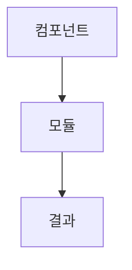
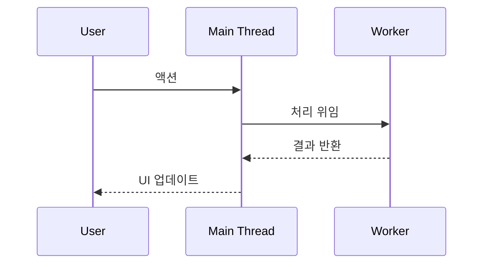

# Portfolio Convention

성능 개선, 아키텍처 변경, 주요 기능 구현 시 포트폴리오 문서를 작성한다.

## 공통 금지 조항

- 포트폴리오 문서에 에이전트 이름, 도구명, 생성 서명을 기재하지 않는다
- 예: `Made with Cursor`, `Created by Claude`, `AI assistant` 표기 금지

## 파일 위치

같은 주제는 동일 `<scope>-<slug>` 로 묶고, 역할에 따라 디렉터리와 접미사를 구분한다.

```
docs/work-log/blog/<scope>-<slug>-blog.md           # 내러티브·가독성 위주
docs/work-log/Portfolio/<scope>-<slug>-portfolio.md # 본 문서의 구조화된 포트폴리오
```

예시:

- `docs/work-log/blog/waveform-peak-worker-blog.md`
- `docs/work-log/Portfolio/waveform-peak-worker-portfolio.md`

## 문서 구조

````markdown
# <제목>

## 1. 문제 정의

### 현상

- 사용자 관점에서 관찰된 문제

### 원인 분석

- 코드/아키텍처 레벨에서의 근본 원인
- 프로파일링, 로그 등 근거 데이터

## 2. 측정 (Before) (필요한경우만)

| 지표          | 값    | 측정 방법                   |
| ------------- | ----- | --------------------------- |
| 예: FPS       | 12fps | Chrome DevTools Performance |
| 예: 렌더 시간 | 340ms | console.time                |
| 예: 번들 크기 | 1.2MB | webpack-bundle-analyzer     |

> 스크린샷, 프로파일링 결과 첨부 권장

## 3. 시도 과정

### 시도 1: <접근법>

- **가설**: 왜 이 방법이 효과가 있을 거라 생각했는지
- **구현**: 무엇을 했는지
- **결과**: ✅ 성공 / ❌ 실패 / ⚠️ 부분 성공
- **배운 점**: 성공이든 실패든 얻은 인사이트

### 시도 2: <접근법>

- ...

> 실패한 시도도 반드시 기록한다. 왜 실패했는지가 최종 해결책의 근거가 된다.

## 4. 최종 해결

### 생각 흐름

문제 인식 → 가설 수립 → 검증 → 피봇/확정 순서로 의사결정 과정을 서술한다.

### 아키텍처


````

### 데이터 플로우



> 다이어그램은 Mermaid 문법을 사용한다. 필요에 따라 아래 유형을 조합:
>
> - `graph TD/LR` — 아키텍처, 의존 관계
> - `sequenceDiagram` — 데이터 플로우, 호출 순서
> - `flowchart` — 분기 로직, 의사결정 트리
> - `classDiagram` — 모듈/클래스 구조

## 5. 측정 (After)

| 지표    | Before | After | 개선율 | 측정 방법       |
| ------- | ------ | ----- | ------ | --------------- |
| 예: FPS | 12fps  | 58fps | +383%  | Chrome DevTools |

> Before와 동일한 조건에서 측정한다.

## 6. 회고

### 잘한 점

- ...

### 아쉬운 점

- ...

### 다음에 적용할 것

- ...

```

## 작성 규칙

1. **실측 기반** — 모든 수치는 실제로 측정한 결과만 기록한다. 임의로 추정하거나 지어낸 숫자를 절대 쓰지 않는다. 측정하지 않았으면 비워두고, 측정 후 채운다
2. **사실 근거** — 문서의 모든 내용(문제 현상, 원인 분석, 시도 결과, 회고)은 실제 관찰과 사실에 근거해서 작성한다. 추측이나 희망적 해석을 사실처럼 서술하지 않는다
3. **측정 필수** — Before/After 수치 없는 포트폴리오는 작성하지 않는다
4. **실패 기록** — 실패한 시도를 생략하지 않는다. 시행착오가 문제 해결 역량의 증거다
5. **생각 흐름** — "무엇을 했다"가 아니라 "왜 그렇게 판단했다"를 중심으로 서술
6. **다이어그램** — 아키텍처/데이터 플로우는 반드시 Mermaid 다이어그램으로 시각화
7. **재현 가능** — 측정 방법을 명시하여 누구든 같은 조건에서 검증할 수 있게 한다
8. **커밋 연결** — 관련 커밋 해시나 PR 번호를 문서 하단에 기록한다
```
