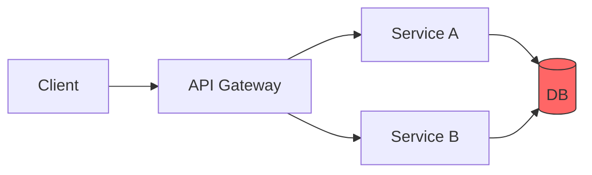
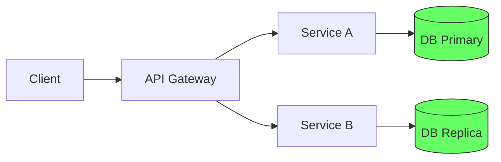

# Blog Writing Guidelines

description: 블로그 글 작성 가이드라인
globs: docs/work-log/blog/**/*.md, docs/work-log/Portfolio/**/*.md, **/blog/**/*.md, **/posts/**/*.md

---

## 파일 위치

작업·성과 기록용 블로그 글의 **기본 저장 위치는 `docs/work-log/blog/`** 이다. 파일명은 `<scope>-<slug>-blog.md` 형식을 따른다. 같은 주제의 포트폴리오 문서는 **`docs/work-log/Portfolio/<scope>-<slug>-portfolio.md`** 에 둔다. 상세 규칙은 [PORTFOLIO_CONVENTION.md](./PORTFOLIO_CONVENTION.md)의 「파일 위치」를 참고한다.

## 공통 금지 조항

- 문서 본문, 메타데이터, 하단 서명에 에이전트 이름이나 도구명을 작성하지 않는다
- 예: `Made with Cursor`, `Written by Claude`, `Generated by AI` 금지

# 블로그 글 작성 방식

## 핵심 철학: 사고의 흐름으로 쓴다

블로그 글은 **결과의 나열이 아니라 사고의 여정**이다.
독자가 "왜 이 선택을 했는가"를 따라갈 수 있어야 한다.

- **What(무엇)보다 Why(왜)와 How(어떻게 생각했는가)** 에 집중한다
- 선택지가 여러 개 있었다면, 각 선택지를 비교하고 **왜 그것을 골랐는지** 밝힌다
- 독자가 같은 상황에서 스스로 판단할 수 있는 **사고 프레임워크**를 제공한다
- "이렇게 했다"가 아니라 "이런 상황에서 이런 제약 조건이 있었고, 이런 이유로 이 방향을 선택했다"


- **핵심 메시지는 하나** — 여러 주제를 섞지 않고 한 가지 메시지에 집중한다

## 2. 글 구조: 사고 흐름 기반

### 기본 뼈대

```
제목
├── 도입 (Hook + 맥락)
├── 문제 인식
│   ├── 어떤 상황이었는가
│   ├── 왜 문제라고 판단했는가
│   └── [다이어그램] 문제 상태의 아키텍처/데이터 플로우
├── 선택지 탐색
│   ├── 어떤 대안들을 검토했는가
│   ├── 각 대안의 트레이드오프
│   └── 왜 이 방향을 선택했는가 (판단 근거)
├── 해결 과정
│   ├── 구현 단계별 사고 흐름
│   ├── [다이어그램] 해결 후 아키텍처/데이터 플로우
│   └── 예상과 달랐던 부분, 추가 판단
├── 결과
│   ├── Before/After 비교 (수치, 구조)
│   ├── [다이어그램] 변화 비교
│   └── 남은 과제, 한계점
└── 마무리 (배운 점 + 독자의 다음 행동)
```

### 도입부 (Hook)

- 첫 2~3문장 안에 독자의 관심을 잡는다
- 사용 가능한 Hook 패턴:
  - **문제 제기**: "X를 구현하다가 Y 문제를 만났다"
  - **결과 먼저**: "성능을 3배 개선한 방법을 공유한다"
  - **공감 유도**: "이런 경험 해본 적 있는가?"
  - **반직관적 주장**: "흔히 X라고 알려졌지만, 실제로는 Y다"

### 문제 인식 — "왜 문제인가"

- 단순히 "문제가 있었다"가 아니라 **어떤 맥락에서 왜 문제라고 인식했는지** 설명한다
- 증상(symptom)과 원인(cause)을 구분한다
- **현재 상태의 아키텍처 또는 데이터 플로우 다이어그램**을 포함한다

### 선택지 탐색 — "왜 이걸 골랐는가"

- 검토한 대안들을 나열하고 각각의 장단점을 비교한다
- 표(table)로 트레이드오프를 정리하면 효과적이다
- **판단 기준**을 명시한다 (성능? 유지보수성? 팀 상황? 일정?)
- 버린 선택지도 왜 버렸는지 한 줄로 밝힌다

```md
| 대안 | 장점 | 단점 | 판단 |
|------|------|------|------|
| A 방식 | 구현 빠름 | 확장 어려움 | X |
| B 방식 | 유연함 | 학습 비용 | O (채택) |
| C 방식 | 성능 최고 | 복잡도 과다 | X |
```

### 해결 과정 — "어떻게 생각하며 만들었는가"

- 코드를 나열하지 말고, **각 단계에서 왜 이렇게 구현했는지** 설명한다
- 구현 중 예상과 달랐던 부분, 추가로 내린 판단을 기록한다
- **해결 후 아키텍처 다이어그램**으로 변화를 시각화한다

### 결과 — "실제로 어떻게 변했는가"

- Before/After를 **수치와 다이어그램** 모두로 보여준다
- 한계점이나 남은 과제도 솔직하게 쓴다
- 완벽하지 않아도 된다 — 과정에서 배운 점이 핵심이다

### 마무리

- 본문 내용을 1~2문장으로 요약한다
- 독자가 다음에 할 수 있는 행동을 제시한다
- 불필요한 인사말이나 감사 표현을 넣지 않는다

## 3. 다이어그램 활용법

블로그 글에서 다이어그램은 **사고의 흐름을 시각화하는 도구**다.

### 필수 사용 시점

| 시점 | 다이어그램 유형 | 목적 |
|------|----------------|------|
| 문제 인식 | 현재 아키텍처 / 데이터 플로우 | 문제의 구조를 보여준다 |
| 해결 후 | 변경된 아키텍처 / 데이터 플로우 | 해결의 구조를 보여준다 |
| Before/After | 비교 다이어그램 | 변화를 한눈에 보여준다 |
| 복잡한 흐름 | 시퀀스 다이어그램 | 컴포넌트 간 상호작용을 보여준다 |

### 다이어그램 도구

- **Mermaid** — 마크다운 내 인라인으로 작성 가능, 버전 관리 용이
- **Excalidraw** — 손그림 느낌, 빠른 프로토타이핑
- **draw.io** — 정교한 아키텍처 다이어그램

### Mermaid 예시

문제 상태의 데이터 플로우:



해결 후 데이터 플로우:



### 다이어그램 작성 원칙

- 하나의 다이어그램은 **하나의 포인트**만 전달한다
- 불필요한 디테일을 제거한다 — 논점과 관련된 부분만 표현한다
- 다이어그램 전후에 **무엇을 보여주는 그림인지** 한 줄로 설명한다
- Before/After는 같은 형식으로 그려서 비교를 쉽게 한다

## 4. 문체 원칙

- **간결체** 사용: "~다", "~한다" (경어체 "~합니다"도 가능하나 글 내에서 통일)
- 한 문장은 **40자 이내**를 목표로 한다
- 한 문단은 **3~5문장** 이내로 유지한다
- 접속사 남용을 피한다 — "그리고", "또한", "그래서"를 연속 사용하지 않는다
- 수동태보다 **능동태**를 사용한다
- 불필요한 수식어를 제거한다 — "매우", "정말", "사실"
- 전문 용어는 첫 등장 시 간단히 설명한다

## 5. 기술 블로그 특화 규칙

### 코드 블록

- 언어 태그를 반드시 명시한다 (```typescript, ```bash 등)
- 코드 블록 전에 **무엇을 보여주는 코드인지** 한 줄로 설명한다
- 긴 코드는 단계별로 나누어 설명한다
- 코드 내 주석은 핵심 포인트에만 사용한다

### 코드 스타일 (블로그 내 예시 코드)

- 들여쓰기 2 spaces, 줄 너비 120자
- 작은따옴표, 세미콜론 필수, 후행 콤마 ES5 스타일
- 변수: camelCase / UPPER_CASE, 함수: camelCase / PascalCase
- 인터페이스, 타입 별칭: PascalCase
- `any` 사용 지양, strict 모드 기준으로 작성
- 배열 타입: 단순 `T[]`, 복합 `Array<T | U>`

### 비교/변화 표현

- Before/After 패턴으로 개선점을 명확히 보여준다
- 수치가 있다면 반드시 포함한다 (응답 시간, 번들 크기 등)
- **코드 + 다이어그램 + 수치** 세 가지를 조합하면 가장 설득력 있다

### 시각 자료

- 아키텍처나 흐름이 복잡할 때는 다이어그램을 사용한다 (제안이 아니라 필수)
- 표(table)로 비교하면 명확한 경우 표를 사용한다

## 8. 작성 프로세스

1. **사고 정리** — 문제-선택-해결-결과의 흐름을 먼저 정리한다
2. **다이어그램 스케치** — 핵심 포인트를 시각화한다
3. **아웃라인 작성** — 소제목 단위로 뼈대를 잡는다
4. **초고 작성** — 완벽하지 않아도 빠르게 전체를 채운다
5. **퇴고** — 불필요한 문장 삭제, 논리 흐름 점검
6. **코드 검증** — 예시 코드가 실제로 동작하는지 확인한다
7. **최종 검토** — 오탈자, 링크, 다이어그램, 이미지 확인

## 템플릿

```md
# [구체적이고 독자 이익이 담긴 제목]

[Hook: 문제 제기 또는 결과 먼저 제시. 2~3문장.]

## 문제: 무엇이 문제였는가

[상황 맥락 + 왜 문제라고 판단했는지.]

[현재 상태 아키텍처/데이터 플로우 다이어그램]

## 선택: 어떤 대안을 검토했는가

[검토한 선택지 + 트레이드오프 비교표]

[왜 이 방향을 선택했는지 판단 근거.]

## 해결: 어떻게 구현했는가

[단계별 사고 흐름 + 코드 예시.]

### [세부 구현 1]

[왜 이렇게 했는지 + 코드]

### [세부 구현 2]

[왜 이렇게 했는지 + 코드]

[해결 후 아키텍처/데이터 플로우 다이어그램]

## 결과: 실제로 어떻게 변했는가

[Before/After 비교 — 수치 + 다이어그램.]

[한계점, 남은 과제.]

## 마무리

[1~2문장 요약 + 배운 점 + 독자의 다음 행동.]
```

## 체크리스트

- [ ] 제목이 구체적이고 독자 이익을 담고 있는가?
- [ ] 도입부가 3문장 안에 관심을 잡는가?
- [ ] **왜 이 선택을 했는지** 판단 근거가 명확한가?
- [ ] 검토한 대안과 트레이드오프가 정리되어 있는가?
- [ ] 문제 상태의 다이어그램이 있는가?
- [ ] 해결 후 다이어그램이 있는가?
- [ ] Before/After가 수치와 함께 비교되는가?
- [ ] 각 섹션이 하나의 소주제만 다루는가?
- [ ] 주장에 근거(코드, 데이터)가 있는가?
- [ ] 코드 예시가 최소한으로 동작하는가?
- [ ] 문장이 간결한가? (40자 이내 목표)
- [ ] 문체가 글 전체에서 통일되어 있는가?
