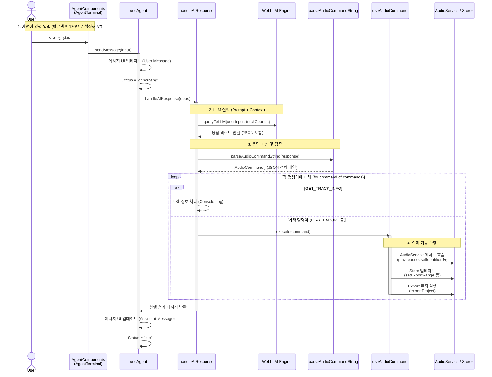
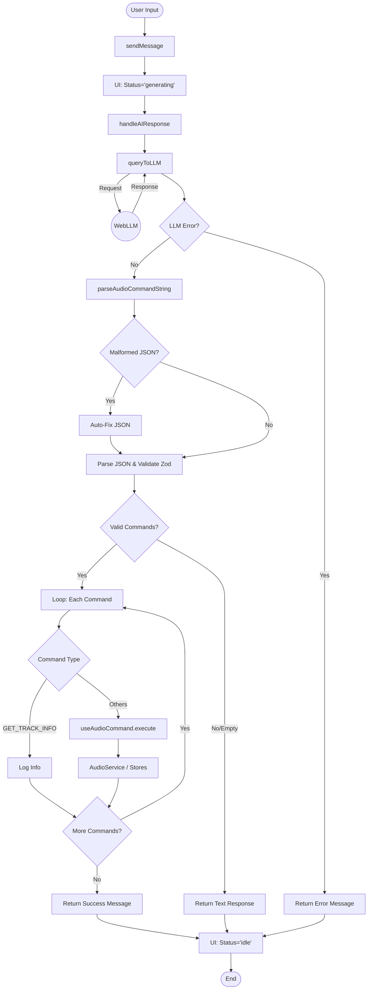

# Audio Command Processing Architecture

이 문서는 프로젝트의 핵심 오디오 제어 시스템인 **Audio Command Processing** 구조를 설명합니다. 모든 오디오 관련 작업(재생, 정지, 구간 설정, 내보내기 등)은 `execute`라는 단일 진입점을 통해 중앙화되어 처리됩니다.

---

## 🏗️ Architecture Overview

모든 입력 소스(터미널, 버튼 등)는 직접 비즈니스 로직을 호출하지 않고, **Command Pattern**을 사용하여 `useAudioCommand` 훅의 `execute` 함수로 명령 객체를 전달합니다.

### Data Flow Diagram

```mermaid
graph TD
    subgraph Inputs ["Input Sources (UI Layer)"]
        Agent[🤖 Agent Terminal]
        CLI[💻 CLI Terminal]
        Btn[🔘 Export Button]
    end

    subgraph Controller ["Command Controller"]
        Execute[⚡ useAudioCommand.execute()]
    end

    subgraph Handlers ["Handlers & Logic"]
        Service[🎵 AudioService]
        Store[💾 usePlaybackStore]
        Exporter[📦 exportProject]
    end

    Agent -->|"{ type: PLAY }"| Execute
    CLI -->|"{ type: EXPORT_AUDIO }"| Execute
    Btn -->|"{ type: EXPORT_AUDIO }"| Execute

    Execute -->|Switch Command Type| Handlers

    Service -->|PLAY, PAUSE, STOP...| Tone[Tone.js Engine]
    Store -->|SET_EXPORT_RANGE...| UI[UI State Update]
    Exporter -->|EXPORT_AUDIO| File[File Download]
```

---

## 🔄 Process Details

### 1. Input Layer (명령 발생)
모든 UI 컴포넌트는 `AudioCommand` 객체를 생성하여 `execute` 함수를 호출합니다.

- **Agent Terminal**: AI가 생성한 JSON 응답을 파싱하여 명령 전달
- **CLI Terminal**: 사용자가 입력한 텍스트 명령을 JSON으로 파싱하 전달
- **Export Button**: 버튼 클릭 시 `EXPORT_AUDIO` 명령 객체 생성 후 전달

**Example (Agent Terminal Logic):**
```typescript
// aiResponseHandler.ts
for (const command of commands) {
  await execute(command); // 모든 명령을 execute 하나로 통합 처리
}
```

### 2. Command Controller (명령 분배)
`src/logics/audio/useAudioCommand.ts`에 위치한 `execute` 함수는 들어온 명령의 `type`을 확인하고 적절한 핸들러로 라우팅합니다.

**Key Logic:**
```typescript
const execute = useCallback(async (command: AudioCommand) => {
  switch (command.type) {
    // 1. Core Audio Control -> AudioService
    case 'PLAY': await service.play(); break;
    case 'LOAD_REGION': await service.addRegion(...); break;

    // 2. Global State Control -> usePlaybackStore
    case 'SET_EXPORT_RANGE': 
      setExportRange(command.startTime, command.endTime); 
      break;

    // 3. Complex Operations -> Dedicated Logic Hooks
    case 'EXPORT_AUDIO': 
      await exportProject({ filename: command.filename }); 
      break;
  }
}, []);
```

### 3. Execution Layer (실제 수행)

| Command Type | Handler | Description |
|---|---|---|
| `PLAY`, `PAUSE`, `STOP` | **AudioService** | Tone.js Transport 제어 및 오디오 엔진 동기화 |
| `LOAD_REGION` | **AudioService** | Tone.Player 생성 및 트랙에 오디오 로드 |
| `SET_VOLUME/PAN` | **AudioService** | 트랙별 볼륨/팬 조절 (실시간 반영) |
| `SET_EXPORT_RANGE` | **usePlaybackStore** | UI에 내보내기 구간 표시 (TimeRuler 하이라이트) |
| `EXPORT_AUDIO` | **useProjectExport** | 현재 트랙 상태를 기반으로 오프라인 렌더링 후 WAV 다운로드 |

---

## ✅ Benefits of This Structure

1.  **단일 진실 공급원 (Single Source of Truth)**
    *   오디오 제어 로직이 `useAudioCommand` 한 곳에 모여 있어 로직 파편화를 방지합니다.
    *   "어디서는 되고 어디서는 안 되는" 버그를 원천 차단합니다.

2.  **확장성 (Extensibility)**
    *   새로운 기능을 추가할 때 `AudioCommandType`과 `execute` 내부의 `switch` 문만 확장하면, Agent와 CLI에서 즉시 해당 기능을 사용할 수 있습니다.

3.  **유지보수성 (Maintainability)**
    *   UI 컴포넌트(`ExportButton` 등)는 단순히 명령을 "요청"하는 역할만 하며, 복잡한 비즈니스 로직(파일 생성, 엔진 제어 등)을 알 필요가 없습니다.

4.  **일관된 사용자 경험 (Consistent UX)**
    *   버튼을 누르든, 채팅으로 시키든, 명령어로 치든 똑같은 코드가 실행되어 동일한 결과를 보장합니다.

---

## 🧠 Detail: Agent Command Execution Flow

다음은 사용자가 **AgentTerminal**을 통해 자연어로 명령을 내렸을 때, 내부적으로 어떤 과정을 거쳐 실행되는지 보여주는 **시퀀스 다이어그램**입니다.



### 단계별 상세 설명

1.  **입력 및 전송 (`AgentTerminal` -> `useAgent`)**
    *   사용자가 터미널에 텍스트를 입력하면 `sendMessage`가 호출되어 UI에 즉시 반영되고 로딩 상태가 됩니다.

2.  **LLM 질의 (`handleAIResponse` -> `WebLLM`)**
    *   `queryToLLM`을 통해 현재 프로젝트 상태(트랙 수 등)와 사용자 입력을 LLM에 전달합니다.
    *   LLM은 실행 가능한 JSON 포맷의 명령어를 문자열로 반환합니다.

3.  **파싱 및 검증 (`parseAudioCommandString`)**
    *   응답 문자열에서 JSON을 추출하고 `zod` 스키마로 유효성을 검사합니다.
    *   잘못된 포맷은 자동으로 수정(Auto-fix)하여 안정성을 확보합니다.

4.  **명령어 실행 (`useAudioCommand` -> `AudioService`)**
    *   추출된 명령어를 순차적으로 `execute` 함수에 전달하여 실제 오디오 엔진이나 스토어를 제어합니다.

---

### 🔀 Logic Flowchart (Decision Process)

위 시퀀스 다이어그램이 **객체 간의 상호작용**을 보여준다면, 아래 플로우차트는 **에러 처리 및 분기 로직**을 중점으로 보여줍니다.



---

## 🔍 Code Execution Path

다음은 실제 코드가 호출되는 순서대로 파일과 핵심 함수를 나열한 목록입니다. 각 단계는 데이터가 어떻게 변환되어 다음 단계로 넘어가는지 보여줍니다.

### Phase 1: User Interaction
**File:** `src/components/Daw/components/Terminals/AgentTerminal/AgentTerminal.tsx`
*   **Trigger:** 사용자가 입력창에서 Enter 키 입력.
*   **Function:** `handleSend()`
*   **Action:** `sendMessage(input)` 호출.

### Phase 2: State Management & Orchestration
**File:** `src/hooks/agent/useAgent/useAgent.ts`
*   **Function:** `sendMessage(content)`
*   **Action:**
    1.  UI 목록에 사용자 메시지 추가 (`addMessage`).
    2.  `status`를 `'generating'`으로 변경.
    3.  `handleAIResponse()` 호출하여 비동기 처리 시작.

### Phase 3: AI Logic Handling
**File:** `src/hooks/agent/useAgent/utils/aiResponseHandler.ts`
*   **Function:** `handleAIResponse(deps)`
*   **Action:**
    1.  `queryToLLM()`을 호출하여 LLM 응답 획득.
    2.  에러 발생 시 즉시 에러 상태 반환.
    3.  성공 시 `parseAudioCommandString()` 호출.
    4.  파싱된 `commands` 배열을 순회하며 `execute()` 호출.

**File:** `src/hooks/agent/useAgent/utils/queryToLLM.ts`
*   **Function:** `queryToLLM({ engine, trackCount, userInput })`
*   **Action:** System Prompt와 User Input을 결합하여 `engine.chat.completions.create` 호출.

### Phase 4: Parsing & Validation
**File:** `src/types/audioCommand.schema.ts`
*   **Function:** `parseAudioCommandString({ commandString })`
*   **Action:**
    1.  문자열 내 JSON 패턴(`[]` or `{}`) 검색.
    2.  `JSON.parse()` 수행.
    3.  잘못된 형태(Malformed) 감지 시 정규식으로 Auto-fix.
    4.  `AudioCommandSchema.safeParse()` (Zod)를 통해 타입 검증.
    5.  유효한 `AudioCommand` 배열 반환.

### Phase 5: Command Execution
**File:** `src/logics/audio/useAudioCommand.ts`
*   **Function:** `execute(command)`
*   **Action:** `command.type`에 따라 분기 처리.
    *   `PLAY`, `PAUSE` 등: `AudioService` 호출.
    *   `SET_EXPORT_RANGE` 등: `usePlaybackStore` 호출.
    *   `EXPORT_AUDIO`: `exportProject` 로직 호출.

### Phase 6: System Action (Example: Playback)
**File:** `src/core/audio/AudioService.ts`
*   **Function:** `play()`, `pause()`, etc.
*   **Action:** Tone.js의 Transport나 Player 객체를 직접 제어하여 소리 출력.

---

## 🗺️ Visual Flow (ASCII Style)

```text
[ USER INPUT ]
│
│ "내보내기 해줘" (Message)
▼
[ AgentTerminal Component ]
│
│ sendMessage()
▼
[ useAgent Hook ]
│
│ 1. LLM에게 질의 (WebLLM)
│ 2. 응답 수신: {"type": "EXPORT_AUDIO"}
│ 3. handleAIResponse() 호출
│
▼
[ aiResponseHandler.ts ]
│
│ Command List 파싱
│ execute() 호출
│
▼
[ useAudioCommand.ts ] 🚦 (The Controller)
│
│ execute() 내부 switch 분기
│
◇── Command Type 확인 ──◇
│                        │
│ [EXPORT_AUDIO]         │ [PLAY / PAUSE / ETC]
│                        │
▼                        ▼
[ exportProject() ]      [ AudioService ]
(in useProjectExport)    (Singleton Class)
│                        │
│ 1. 렌더링 결과(Blob)    │ 1. Tone.js 제어
│    반환                │    (소리 재생/중지)
│                        │
▼                        ▼
[ downloadBlob() ]       [ Audio Output ]
(Browser Download)       (Speakers)
```
