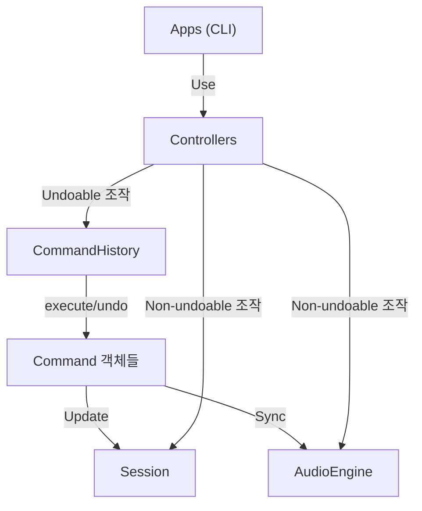
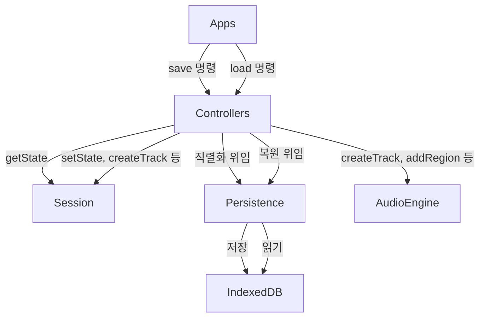

# CLI-first DAW 구현 (discipline 유지)

## 아키텍처 원칙 (변경 없음)

현재 `src/layers/discipline.md`의 5가지 규칙을 그대로 따른다:

```
Apps (CLI, Web, Agent)
  └── Controllers (AppController Facade)
        ├── Session (Zustand Vanilla Store) - 쓰기
        └── AudioEngine - 사용
              └── Tone.js / WebAudio

createApp = Composition Root (조립)
```

1. audio-engine은 controllers에서만 접근
2. session 쓰기는 controllers에서만
3. apps는 session 읽기만, 쓰기는 controller 경유
4. apps는 controllers만 사용
5. tone.js는 audio-engine에서만

### Command 패턴의 위치

Command는 **Controllers 내부의 실행 전략**이다. 새 레이어가 아니라 Controllers가 조작을 실행하는 방식을 Command 객체로 감싸는 것이다.



**핵심: discipline의 계층 규칙은 깨지지 않는다.** Command는 Controller가 Session/Engine을 조작하는 내부 도구일 뿐이다.

---

## 현재 구현 상태

### 이미 동작하는 것

| 파일 | 기능 |
|------|------|
| `src/layers/audio-engine/audio-engine.ts` | play/stop/pause/seek, track CRUD, region CRUD/move, volume/mute/solo/pan, loop, bpm, export |
| `src/layers/session/session.ts` | 단일 Zustand vanilla store (tracks Map, regions, transport 상태) |
| `src/layers/controllers/track-controller.ts` | addTrack, addRegion, moveRegion, splitRegion, resizeRegion, removeRegion/Track, volume/mute/solo/pan |
| `src/layers/controllers/playback-controller.ts` | play/stop/pause/seek, loop, bpm, masterVolume |
| `src/layers/controllers/index.ts` | AppController facade (playback + track + export) |
| `src/layers/apps/cli/index.ts` | CLI 커맨드 전체 (play/stop/track/upload/region/volume/mute/solo/pan/seek/loop/bpm/export/status/debug) |

### 빌드해야 할 것

| 기능 | 현재 상태 |
|------|-----------|
| **Command 패턴 (Undo/Redo)** | 전혀 없음 |
| **파일 관리 구조** | Object URL 직접 사용, 체계적 관리 없음 |
| **트랙 focus** | 미구현 |
| **트랙 Send 인터페이스** | 미구현 (Channel -> Destination 직통) |
| **저장 / 불러오기** | 전혀 없음 (영속성 없음) |
| **리전 mute** | 미구현 |
| **리전 focus** | 미구현 |
| **리전 waveform CLI 표시** | 미구현 |
| **플러그인 인터페이스** | 미구현 (volume/pan은 Channel 직접) |
| **타임라인 CLI 표시** | 미구현 |
| **시간-px 연동** | 미구현 |
| **플레이헤드** | `getCurrentTime()`은 있으나 표시 없음 |
| **줌** | 미구현 |

---

## 구현 순서 (8 Sprint)

### Sprint 1: Command 패턴 + Undo/Redo

**목표**: Controllers 내부에 CommandHistory를 도입하고, 되돌릴 수 있는 조작을 Command로 감싼다.

**신규 파일:**
- `src/layers/controllers/commands/types.ts` — Command / CompositeCommand 인터페이스
- `src/layers/controllers/commands/CommandHistory.ts` — execute/undo/redo 스택
- `src/layers/controllers/commands/track/AddTrackCommand.ts`
- `src/layers/controllers/commands/track/RemoveTrackCommand.ts`
- `src/layers/controllers/commands/region/AddRegionCommand.ts`
- `src/layers/controllers/commands/region/RemoveRegionCommand.ts`
- `src/layers/controllers/commands/region/MoveRegionCommand.ts`
- `src/layers/controllers/commands/region/SplitRegionCommand.ts`
- `src/layers/controllers/commands/region/ResizeRegionCommand.ts`

**변경 파일:**
- `src/layers/controllers/track-controller.ts` — 기존 메서드 내부에서 Command를 생성하고 `history.execute()` 호출로 전환
- `src/layers/controllers/index.ts` — CommandHistory를 AppController에 주입, `undo()`/`redo()` 메서드 추가
- `src/layers/apps/create-app.ts` — CommandHistory 인스턴스 생성
- `src/layers/apps/cli/index.ts` — `undo`, `redo` CLI 커맨드 추가
- `src/layers/apps/cli/constants.ts` — CommandsType에 undo/redo 추가
- `src/layers/session/session.ts` — historyState 추가 (canUndo, canRedo, undoLabel, redoLabel)

**Command 인터페이스:**

```typescript
interface Command {
  readonly label: string;
  execute(): void;
  undo(): void;
}

interface CompositeCommand extends Command {
  readonly children: ReadonlyArray<Command>;
}
```

**Controller 전환 예시:**

```typescript
// Before: 직접 조작
async addTrack() {
  this.audioEngine.createTrack(id);
  this.sessionStore.getState().addTrack({ ... });
}

// After: Command 경유
async addTrack() {
  const cmd = new AddTrackCommand(id, track, this.sessionStore, this.audioEngine);
  this.history.execute(cmd);
}
```

**테스트:**
- [ ] Command execute → Session + Engine 동기 변경
- [ ] undo → 원래 상태 복원
- [ ] redo → 재실행
- [ ] CompositeCommand 역순 undo (예: removeTrack = removeRegions + removeTrack)

---

### Sprint 2: 파일 관리 구조 + Import 개선

**목표**: Object URL 직접 사용 대신, AudioEngine 내부에 체계적 버퍼/소스 캐시를 구축한다.

**신규 파일:**
- `src/layers/audio-engine/audio-buffer-cache.ts` — sourceId → buffer + metadata 캐시

**변경 파일:**
- `src/layers/audio-engine/audio-engine.ts` — 버퍼 관리를 AudioBufferCache로 분리, `getSourceInfo()` 메서드 추가
- `src/layers/audio-engine/i-audio-engine.ts` — 인터페이스 확장
- `src/layers/session/session.ts` — `sources: Map<string, AudioSourceMeta>` 추가
- `src/layers/controllers/track-controller.ts` — import 시 source 등록
- `src/layers/apps/cli/index.ts` — `files` 커맨드 추가

**데이터 모델:**

```typescript
interface AudioSourceMeta {
  id: string;
  fileName: string;
  duration: number;
  sampleRate: number;
  channels: number;
}
```

**테스트:**
- [ ] 파일 import → source 등록 → 메타데이터 조회
- [ ] source 삭제 시 Object URL revoke 확인
- [ ] 중복 import 방지

---

### Sprint 3: 트랙 확장 (focus, N개 관리)

**변경 파일:**
- `src/layers/session/session.ts` — `focusedTrackId: string | null` 추가
- `src/layers/controllers/track-controller.ts` — `focusTrack(id)`, `getFocusedTrack()` 추가
- `src/layers/apps/cli/index.ts` — focus 기반 단축 커맨드 구현

**CLI 커맨드:**
- `track focus <id>` — 현재 포커스 트랙 설정
- `track list` — 전체 트랙 목록 (포커스된 트랙 하이라이트)
- `track info [id]` — 트랙 상세 (id 생략 시 포커스 트랙)
- trackId 생략 시 포커스 트랙 자동 사용 (`upload`, `volume`, `mute` 등)

**테스트:**
- [ ] focus 설정/변경 검증
- [ ] 포커스 트랙 기준 단축 커맨드 동작
- [ ] 트랙 삭제 시 focus 자동 이동

---

### Sprint 4: 리전 확장 (focus, mute, waveform 표시)

**변경 파일:**
- `src/layers/session/session.ts` — RegionState에 `isMuted` 추가, `focusedRegionId` 추가
- `src/layers/audio-engine/audio-engine.ts` — 리전 mute 구현 (player.mute)
- `src/layers/controllers/track-controller.ts` — `muteRegion()`, `focusRegion()` 추가
- `src/layers/controllers/commands/region/MuteRegionCommand.ts` — Undo/Redo 대상

**신규 파일:**
- `src/layers/audio-engine/waveform-analyzer.ts` — AudioBuffer → peak 데이터 추출

**CLI 웨이브폼 표시:**

```
drop-ai > region waveform abc123
Region [abc123] - 4.2s
▁▂▃▅▇█▇▅▃▂▁▁▂▄▆█▇▅▃▁▁▂▃▅▇█▆▄▂▁
|0s         |1s         |2s         |3s         |4s
```

**테스트:**
- [ ] region mute → 오디오 무음 확인
- [ ] region mute undo/redo
- [ ] waveform 생성 정확성 (피크 계산)

---

### Sprint 5: 저장 / 불러오기

**신규 파일:**
- `src/layers/persistence/session-serializer.ts` — Session ↔ JSON 변환
- `src/layers/persistence/indexeddb-adapter.ts` — IndexedDB 읽기/쓰기

**discipline 관점:** persistence는 Controllers와 같은 레벨에서 Session을 **읽기**만 한다 (직렬화). 복원 시에는 Controller를 통해 Session/Engine을 재구성한다.



**CLI 커맨드:** `save [name]`, `load [name]`, `sessions`, `delete-session <name>`

**테스트:**
- [ ] save → load → 상태 일치 검증
- [ ] 오디오 파일 포함 복원 검증
- [ ] autosave debounce + 변경 없음 skip

---

### Sprint 6: Send 인터페이스 + 플러그인 인터페이스

**Send:**

- `src/layers/audio-engine/audio-engine.ts` — `createSendBus()`, `connectSend()`, `disconnectSend()` 추가
- `src/layers/session/session.ts` — `SendState` 모델 추가
- `src/layers/controllers/track-controller.ts` — send 관련 메서드
- CLI: `send add <trackId> <busId> [gain]`, `send remove <trackId> <busId>`, `send list`

**플러그인:**

- `src/layers/audio-engine/plugins/i-plugin.ts` — 인터페이스
- `src/layers/audio-engine/plugins/plugin-chain.ts` — 트랙별 체인
- `src/layers/audio-engine/plugins/gain-plugin.ts`, `pan-plugin.ts`
- 기존 volume/pan을 plugin chain 경유로 전환
- CLI: `plugin add <trackId> <type>`, `plugin remove <trackId> <index>`, `plugin list <trackId>`, `plugin param <trackId> <index> <param> <value>`

**테스트:**
- [ ] send 연결 → 오디오 신호 경로 확인
- [ ] plugin chain 순서 변경 검증
- [ ] volume/pan이 plugin 인터페이스로 동작하는지 확인

---

### Sprint 7: 타임라인 CLI 표시 + 플레이헤드 + 줌

**신규 파일:**
- 타임라인 상태를 `session.ts`에 inline 추가 (pxPerSec, scrollOffsetSec)

**CLI 표시 예시:**

```
drop-ai > timeline
[0s       5s       10s      15s      20s      25s]
T1: ■■■■■■■■■■■■■              ■■■■■■
T2:      ■■■■■■■■■■■■■■■
         ▼ 7.5s
Zoom: 10px/s | View: 0s - 30s
```

**CLI 커맨드:** `timeline`, `timeline zoom <level>`, `timeline scroll <sec>`

**테스트:**
- [ ] 시간-px 변환 정확성
- [ ] 타임라인 렌더링이 리전 위치를 정확히 반영하는지
- [ ] 줌 변경 시 표시 업데이트

---

### Sprint 8: 통합 테스트 + 안정화

- [ ] 전체 시나리오 통합 테스트 (import → track → region → play → split → undo → save → load → play)
- [ ] 에러 처리 정비
- [ ] discipline.md 업데이트 (Command, Persistence 규칙 추가)
- [ ] CLI help 전체 갱신
- [ ] 불필요한 레거시 코드 판단

---

## 최종 디렉토리 구조

```
src/layers/
├── audio-engine/                    # (확장)
│   ├── audio-engine.ts
│   ├── i-audio-engine.ts
│   ├── audio-buffer-cache.ts        # 신규
│   ├── waveform-analyzer.ts         # 신규
│   └── plugins/                     # 신규
│       ├── i-plugin.ts
│       ├── plugin-chain.ts
│       ├── gain-plugin.ts
│       └── pan-plugin.ts
│
├── session/                         # (확장)
│   ├── session.ts                   # + sources, focus, sends, plugins, timeline
│   └── session.test.ts
│
├── controllers/                     # (확장)
│   ├── index.ts                     # + CommandHistory, undo/redo
│   ├── playback-controller.ts
│   ├── track-controller.ts          # Command 경유로 전환
│   └── commands/                    # 신규 (Controllers 하위)
│       ├── types.ts
│       ├── CommandHistory.ts
│       ├── track/
│       │   ├── AddTrackCommand.ts
│       │   └── RemoveTrackCommand.ts
│       └── region/
│           ├── AddRegionCommand.ts
│           ├── RemoveRegionCommand.ts
│           ├── MoveRegionCommand.ts
│           ├── SplitRegionCommand.ts
│           ├── ResizeRegionCommand.ts
│           └── MuteRegionCommand.ts
│
├── persistence/                     # 신규
│   ├── session-serializer.ts
│   └── indexeddb-adapter.ts
│
├── apps/
│   ├── create-app.ts                # + CommandHistory 생성
│   ├── context/LayerContext.tsx
│   ├── cli/                         # 대폭 확장
│   │   ├── index.ts
│   │   ├── constants.ts
│   │   └── ui/CliTerminal.tsx
│   └── web/                         # 이번에 안 건드림
│
├── integration.test.ts
└── discipline.md                    # 업데이트
```

**핵심: discipline의 레이어 규칙(5가지)은 그대로 유지된다.** 새로 추가되는 `commands/`는 controllers 하위, `persistence/`는 controllers와 동등 레벨에서 session 읽기 + controller 경유 쓰기로 동작한다.
