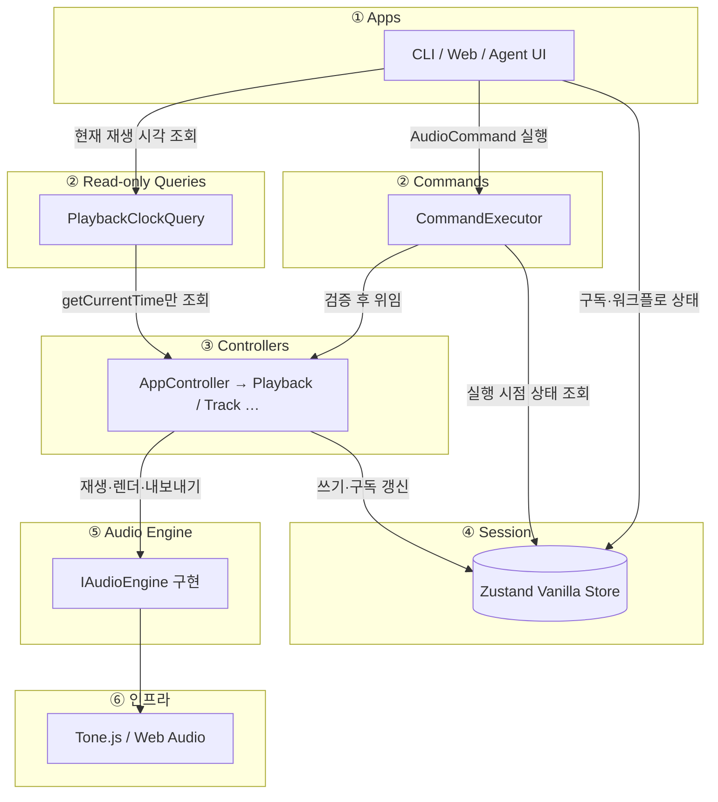
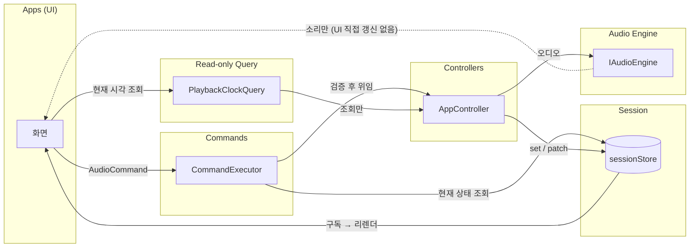
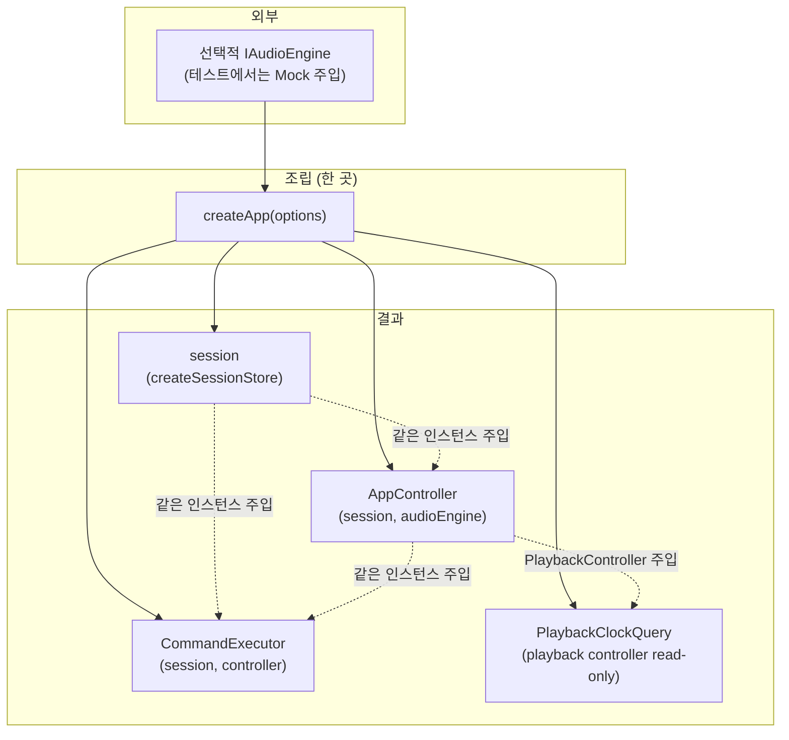
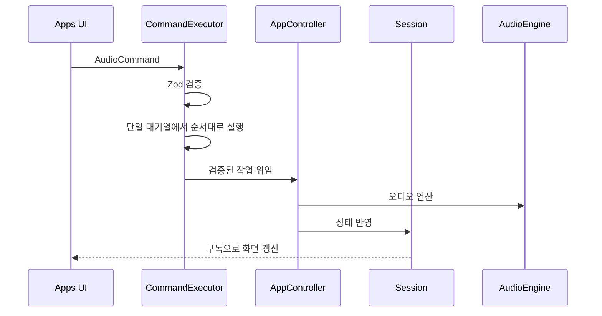

# drop-ai 아키텍처

## 개요

레이어 의존성과 상태·오디오 흐름을 한눈에 본다. 규칙의 단일 출처는
[`src/layers/architecture.md`](../src/layers/architecture.md)이다.

---

## 1. 레이어 한 장 요약

AudioCommand 실행 방향은 아래와 같다.

**Apps → CommandExecutor → Controllers → Session / AudioEngine → Tone.js**

아래 그림은 **실행 시점** 레이어만 보여 준다. 객체 조립(`createApp`)은 **§3**에서 따로 그린다.

재생 중 현재 시각은 상태 변경이 아니라 조회이므로 `PlaybackClockQuery`가 PlaybackController의 조회 메서드만 호출한다.
Apps에는 Controller와 AudioEngine 객체를 노출하지 않는다.

---

## 2. 상태와 오디오 흐름

UI는 **Session을 읽어** 그리고, AudioCommand는 **CommandExecutor**에 전달한다.
CommandExecutor는 명령을 검증하고 Controller에 실행을 위임한다.
Agent 메시지와 업로드 파일 같은 앱 워크플로 상태는 Session Action으로 갱신한다.

검증된 명령은 CommandExecutor의 단일 대기열에서 접수 순서대로 하나씩 실행한다. `executeMany`는 묶음 전체를
먼저 검증한 후, 다른 요청이 끼어들지 않게 순서대로 실행한다. 실행 중 첫 오류가 나면 남은 명령은 실행하지
않는다. 이미 완료된 변경은 되돌리지 않으므로 묶음 실행은 원자적 트랜잭션이 아니다. 실패한 실행이 있어도 그
오류는 0부터 시작하는 실패 위치, 실패 명령, 앞선 실행 결과와 원인을 보존한다. 뒤에 대기 중인 요청은 계속
실행한다.
`EXPORT_AUDIO`는 현재 완료될 때까지 대기열을 점유한다. 별도 작업 모델을 도입하기 전의 알려진 제한이다.

Agent 응답은 JSON 배열 전체를 엄격하게 검증한다. 빈 배열은 명령 없음으로 허용한다. 알 수 없는 명령, 잘못된
필드, 누락·추가 필드, JSON 밖의 텍스트가 하나라도 있으면 전체를 실행하지 않는다. Agent 응답에 없는 명령을
실행 단계에서 추가하지 않는다. 검증된 배열은 `executeMany` 한 번으로 실행하며, 중간 실패 뒤 남은 명령은
실행하지 않는다.

Agent Prompt는 AudioCommand 전체의 정확한 필드와 범위를 안내한다. 현재 Session의 실제 Track·Region ID, 시간
범위, 오디오 소스 사용 가능 여부도 함께 전달하며, Prompt 예시는 엄격한 Agent Schema를 통과해야 한다. 아직 앱이
예약한 새 ID와 허용 파일 목록을 제공하지 않으므로 Agent의 `ADD_TRACK` 생성은 막는다. `LOAD_REGION`은 기존
Track의 첫 Region 소스를 재사용하는 경우에만 제한적으로 허용한다.
프로젝트 컨텍스트는 모델 입력 한도를 넘길 위험을 줄이도록 길이를 제한하고 잘림 여부를 표시한다.

점선: 엔진 출력은 스피커로 나가지만, **표시용 state는 Session 경로**로 맞춘다.

현재 Region의 시작·끝 위치는 **절대 초**로 저장한다. 음악 시간(musical time) 모델을 도입하기 전까지 tempo는
Session의 프로젝트 값이며, AudioEngine의 Transport BPM이나 Region 예약 시각을 변경하지 않는다.

---

## 3. 조립: `createApp`

**Composition Root** — §1과 달리 **부팅·테스트 진입점**에서 한 번 객체 그래프를 만드는 흐름이다.

`createApp`이 **Session**, **AudioEngine**, **AppController**, **CommandExecutor**, **PlaybackClockQuery**를 한 번 조립한다.
AppController 자체는 Apps에 노출하지 않는다. CommandExecutor에는 AppController를, PlaybackClockQuery에는
PlaybackController의 읽기 전용 계약을 주입한다.

구현: [`src/layers/apps/create-app.ts`](../src/layers/apps/create-app.ts)  
웹 진입점은 `createApp()` 결과를 `LayerProvider`에 전달한다.

---

## 4. 시간 순서(요약)

---

## 5. `src/` 디렉터리 역할

| 경로                         | 역할                                  |
| ---------------------------- | ------------------------------------- |
| `layers/apps/`               | Web, Agent, 내부 CLI 진입점           |
| `layers/commands/`           | 명령 검증과 실행 순서 관리            |
| `layers/controllers/`        | Session과 AudioEngine 작업 조정       |
| `layers/queries/`            | Controller의 명시된 값만 읽는 Query   |
| `layers/project-repository/` | 프로젝트 snapshot 저장 계약과 Adapter |
| `layers/session/`            | 화면에 표시할 상태 저장               |
| `layers/audio-engine/`       | Tone.js와 Web Audio 기반 오디오 처리  |

---

## 6. 자동 경계 검사

[`src/layers/architecture.test.ts`](../src/layers/architecture.test.ts)는 Apps의 Controller 직접 import, Command·Query의
AudioEngine import, 계층의 역방향 참조, AudioEngine 밖의 Tone.js import와 대표 Web Audio 생성자·팩토리의 직접 호출을
검사한다. 간접 별칭이나 동적 프로퍼티 접근은 코드 리뷰에서도 확인한다.

---

## 7. Cross-Origin Isolation 배포 헤더

Vite 개발·Preview, Netlify의 `public/_headers`, Docker nginx는 아래 값을 동일하게 설정한다.

- `Cross-Origin-Opener-Policy: same-origin`
- `Cross-Origin-Embedder-Policy: require-corp`

nginx의 정적 파일 `location`은 자체 `add_header`를 사용하므로 두 격리 헤더도 해당 블록에 직접 선언한다.
[`src/layers/deployment-isolation-headers.test.ts`](../src/layers/deployment-isolation-headers.test.ts)는 설정 파일의 계약을
검사한다. 실제 배포 응답과 `crossOriginIsolated` 값은 런타임 검사에서 별도로 확인한다.

Docker nginx의 HTML 응답은 `script-src`에 `'wasm-unsafe-eval'`을 선언한다. 이 토큰은 WebAssembly 컴파일·인스턴스화를
허용하며 JavaScript 문자열 실행을 허용하는 `'unsafe-eval'`은 추가하지 않는다.
[`src/layers/nginx-wasm-csp.test.ts`](../src/layers/nginx-wasm-csp.test.ts)는 이 설정 계약을 검사한다. 실제 브라우저의
WebAssembly 실행 여부는 배포 환경에서 별도로 확인한다.

---

## 8. 브라우저 오디오 런타임 전제조건

`createApp()`은 시작할 때 브라우저 환경을 한 번 읽고 기능별 정적 전제조건을 계산한다.

| 기능                    | 정적 전제조건                                                |
| ----------------------- | ------------------------------------------------------------ |
| AudioWorklet            | 보안 컨텍스트이고 AudioWorklet API가 노출됨                  |
| 단일 스레드 WebAssembly | WebAssembly API가 노출됨                                     |
| 공유 메모리             | 보안 컨텍스트, Cross-Origin Isolation, SharedArrayBuffer API |

Cross-Origin Isolation이 없어도 AudioWorklet과 단일 스레드 WebAssembly 전제조건은 충족할 수 있다. 이 경우 공유
메모리만 제한된다. Web UI 헤더는 이를 `고성능 전제조건 충족`, `공유 메모리 제한`, `기능 제한`으로 표시한다.

브라우저 API 노출 확인은 실제 AudioWorklet 모듈 로딩이나 WebAssembly 컴파일 성공을 증명하지 않는다. Content Security
Policy(CSP), 모듈 URL, 장치 상태를 포함한 실제 실행 검증은 AudioEngine 도입 단계에서 별도로 수행한다. 이 값은 읽기
전용 환경 정보이므로 Session이나 AudioCommand를 거치지 않는다.

---

## 9. ProjectDocument v1

`ProjectDocumentSchema`는 프로젝트를 JSON으로 저장하기 위한 엄격한 v1 계약이다. `documentType`과 `schemaVersion`으로
파일 종류와 형식을 구분하며, 알 수 없는 필드는 거부한다.

| 저장하는 값   | 규칙                                                      |
| ------------- | --------------------------------------------------------- |
| 프로젝트      | 안정적인 UUID, 이름, 0 이상의 revision                    |
| Timeline      | 절대 초 단위, 단일 tempo 메타데이터, 선택적인 Export 범위 |
| 오디오 Source | 안정적인 UUID, 파일 메타데이터, 알고 있는 경우 원본 길이  |
| Track         | 배열 순서, UUID, 이름, volume, pan, mute, solo            |
| Region        | UUID, Source UUID, Timeline 시작, 원본 시작 offset, 길이  |

Region의 끝 시각은 `startTimeSeconds + durationSeconds`로 계산하므로 따로 저장하지 않는다. 모든 ID는 종류별로 중복될
수 없고, Region은 문서 안에 존재하는 Source만 참조한다. Source 길이를 알면 Region의 원본 범위가 그 길이를 넘을 수 없다.
`schemaVersion`은 문서 구조 버전이고 `project.revision`은 같은 프로젝트 내용의 저장 revision이다. 새 문서는 revision
0에서 시작하고, 후속 저장소는 교체 저장에 성공할 때 1씩 증가시킨다.

`readProjectDocument`는 신뢰할 수 없는 입력에서 문서 식별자와 정수 `schemaVersion`을 먼저 읽고, 지원하는 버전의 전체
Schema를 적용한다. `readProjectDocumentJson`은 JSON 문법 오류를 문서 구조 오류와 구분한다. 현재 실제로 정의된 형식은
v1뿐이다. v0은 유효하지 않은 버전으로, v2 이상은 `UNSUPPORTED_SCHEMA_VERSION`으로 거부한다. 과거 형식의 필드를
추측해 채우지 않는다. 객체를 직접 읽을 때도 JSON과 같은 자기 소유 열거 가능 데이터 속성만 복제하며, 상속 속성과
접근자 속성은 문서 필드로 인정하지 않는다. 향후 v2를 정의할 때 실제 v1 fixture와 함께 v1→v2 변환을 추가한다.

현재 Session은 파일 길이를 아직 확인하지 못한 길이 0 Region과 드래그 시작 시점의 빈 Export 범위를 잠시 가질 수 있다.
v1은 이 상태를 손실 없이 저장하기 위해 길이 0과 `startTimeSeconds === endTimeSeconds`를 허용한다. 실제 재생·Export
가능 여부는 해당 Command와 Controller가 별도로 검증한다.

다음 런타임 값은 저장하지 않는다.

- `File`, `Blob`, Object URL, AudioBuffer, 정리 함수
- Zustand의 `Map`과 Action
- 재생 여부와 현재 playhead
- 선택·드래그 상태
- Agent 대화, 모델 로딩, 모달과 zoom 같은 앱 상태

원본 오디오 바이트는 Source UUID를 키로 사용하는 별도 저장소에 둔다. 프로젝트를 다시 열 때 새 Object URL을 만들고
런타임 Source Registry에서 관리한다. 현재는 ProjectDocument와 metadata 저장소까지만 있으며, Session 변환과 화면의
저장·불러오기 기능은 아직 없다. Undo 이력도 snapshot 문서에 넣지 않고 후속 Undo Journal에서 별도로 관리한다.

---

## 10. ProjectRepository 계약

`IProjectRepository`는 ProjectDocument snapshot만 다룬다. `InMemoryProjectRepository`는 계약 검증용이고,
`IndexedDbProjectRepository`는 브라우저 metadata 영구 저장용이다.

| 작업   | 규칙                                                                   |
| ------ | ---------------------------------------------------------------------- |
| create | revision 0 문서만 생성하며 같은 Project ID가 있으면 거부한다.          |
| save   | 문서·요청·저장소 revision이 모두 같을 때 내용을 교체하고 1 증가시킨다. |
| load   | 문서의 깊은 복사본을 반환하며 없으면 `null`을 반환한다.                |
| list   | ID, 이름, revision, 저장 시각만 반환하고 문서 본문은 읽지 않는다.      |
| delete | expected revision이 최신 값과 같을 때만 삭제한다.                      |

IndexedDB에서 문서를 읽을 때 저장 record의 Project ID를 먼저 확인하고, 내부 `document`는 `readProjectDocument`로
판독한다. 손상된 문서는 `INVALID_STORED_DATA`, 현재 앱보다 새로운 문서 버전은
`UNSUPPORTED_STORED_DOCUMENT_SCHEMA_VERSION`으로 구분한다. 문서 안의 Project ID가 저장 키와 달라도 손상으로
처리한다.

create·save의 입력, 반환값, load 결과는 내부 저장값과 객체 참조를 공유하지 않는다. 같은 revision을 가진 두 저장이 겹치면
하나만 성공하고 다른 하나는 `REVISION_CONFLICT`로 끝난다. 비교와 교체는 한 저장소 작업 안에서 수행해야 한다.
expected revision은 0 이상의 JavaScript 안전 정수여야 하며, save는 증가 결과도 안전 정수 범위에 남아야 한다.
`list()` 반환 순서는 계약하지 않는다. 화면은 필요한 정렬 기준을 직접 적용해야 한다.

IndexedDB Adapter는 ProjectDocument와 목록 요약을 별도 Object Store에 두고, create·save·delete에서 두 Store를 하나의
transaction으로 갱신한다. save의 읽기·revision 비교·교체도 같은 transaction 안에서 처리한다. 단위 테스트는 메모리 기반
IndexedDB 대역으로 이 규칙을 검증하므로, 실제 브라우저의 디스크 내구성·용량 제한·저장소 제거 정책까지 증명하지는 않는다.

원본 오디오 바이트와 Undo Journal은 Repository snapshot에 포함하지 않는다. 후속 OPFS Adapter는 오디오 바이트를 먼저
저장·검증한 뒤 그 Source ID를 참조하는 snapshot을 공개해야 한다. 반대 순서는 문서만 있고 오디오가 없는 손상 상태를
만들 수 있다.

현재 Repository는 `createApp`, Controller, Command, Session에 아직 연결하지 않았다. 연결은 Session Mapper를 추가한 뒤
별도 기능 단위에서 진행한다.

---

## 참고

- Web UI의 Region 분할은 현재 시각에 정확히 하나의 Region이 있을 때 해당 ID로 `SPLIT_REGION`을 실행한다.
- Web UI의 Region 삭제는 사용자 확인 후 정확한 Track·Region ID로 `UNLOAD_REGION`을 실행한다.
- Web UI의 Region 이동은 드래그 중 로컬 미리보기만 바꾸고 포인터를 놓을 때 `MOVE_REGION`을 한 번 실행한다.
- Web UI의 Track 삭제는 사용자 확인 후 정확한 Track ID로 `REMOVE_TRACK`을 한 번 실행하고 처리 중 중복 입력을 막는다.
- Web UI의 Mute·Solo는 정확한 Track ID로 `SET_TRACK_MUTE`·`SET_TRACK_SOLO`를 실행한다.
- Web UI의 Tempo 입력은 `SET_TEMPO`로 Session 메타데이터만 바꾸며 오디오 속도와 Region 예약은 바꾸지 않는다.
- Web UI의 `Region 추가`는 파일 검증 후 선택한 Track ID와 현재 시각으로 `LOAD_REGION`을 한 번 실행한다.
- 내부 CLI의 변경 작업은 CommandExecutor를 사용한다.
- Web 파일 가져오기는 Track 생성과 Region 등록을 하나의 `executeMany` 호출로 전달한다.
- Web JSON CLI는 파싱된 명령 배열을 하나의 `executeMany` 호출로 전달하고, 중간 실패 전 결과만 후처리한다.
