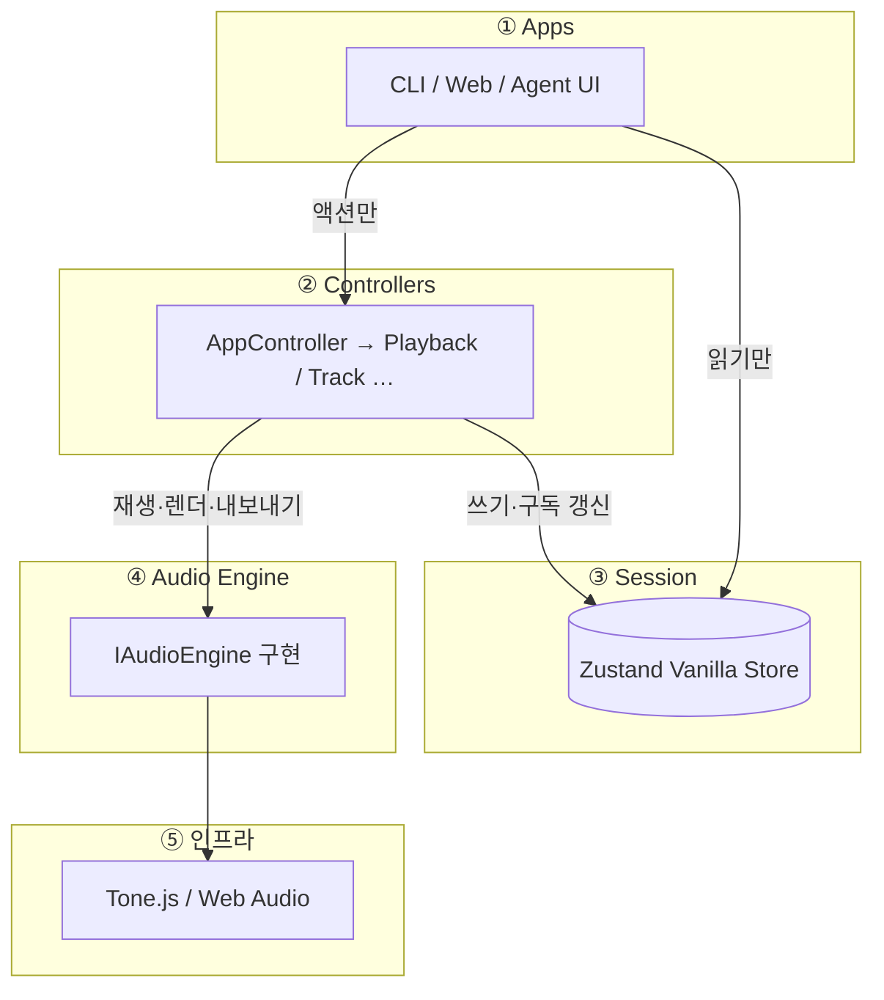
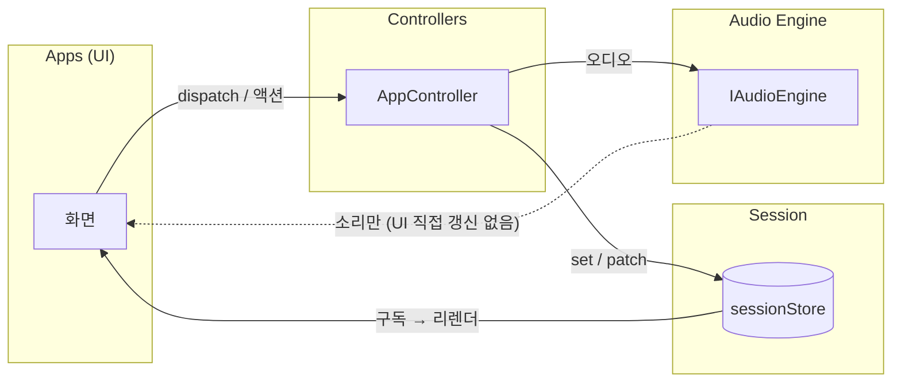
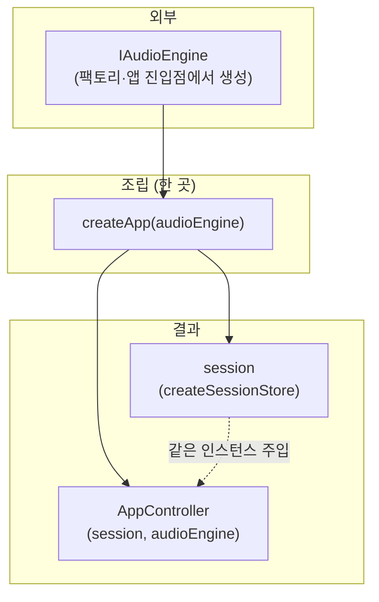
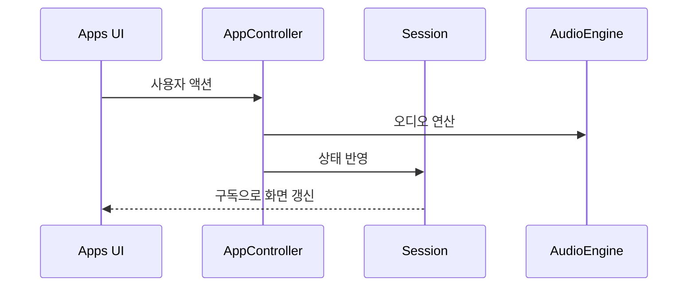

# drop-ai 아키텍처

## 개요

레이어 의존성과 상태·오디오 흐름을 한눈에 본다. 규칙의 단일 출처는 [`src/layers/discipline.md`](../src/layers/discipline.md)이다.

---

## 1. 레이어 한 장 요약

의존 방향은 **항상 아래로만** 간다: Apps → Controllers → (Session + Audio Engine) → Tone.js

아래 그림은 **실행 시점** 레이어만 보여 준다. 객체 조립(`createApp`)은 **§3**에서 따로 그린다.

---

## 2. 읽기 / 쓰기 (규칙 3·6)

UI는 **session을 읽어** 그리고, **상태 변경은 controller**만 한다. 오디오 엔진만으로는 UI state가 바뀌지 않는다.

점선: 엔진 출력은 스피커로 나가지만, **표시용 state는 session 경로**로만 맞춘다(규칙 6).

---

## 3. 조립: `createApp`

**Composition Root** — §1과 달리 **부팅·테스트 진입점**에서 한 번 객체 그래프를 만드는 흐름이다.

`createApp`이 **session**을 만들고, 바깥에서 받은 **audioEngine**과 함께 **AppController**를 조립한다.

구현: [`src/layers/apps/create-app.ts`](../src/layers/apps/create-app.ts)  
웹에서는 [`LayerProvider`](../src/layers/apps/context/LayerContext.tsx)가 `createApp(engine)`을 호출한다.

---

## 4. 시간 순서(요약)

---

## 5. `src/` 디렉터리 역할

| 경로                                  | 역할                                                             |
| ------------------------------------- | ---------------------------------------------------------------- |
| `layers/`                             | 규칙의 중심: apps, controllers, session, audio-engine            |
| `core/`                               | 도메인·순수 로직 ([`src/core/README.md`](../src/core/README.md)) |
| `components/`, `logics/`, `hooks/` 등 | UI·보조 로직·에이전트 등                                         |

---

## 참고

- [`records/`](../records/) 문서는 마이그레이션 이전 기록이며 현재 아키텍처 가이드로 쓰지 않는다([`discipline.md`](../src/layers/discipline.md)).
