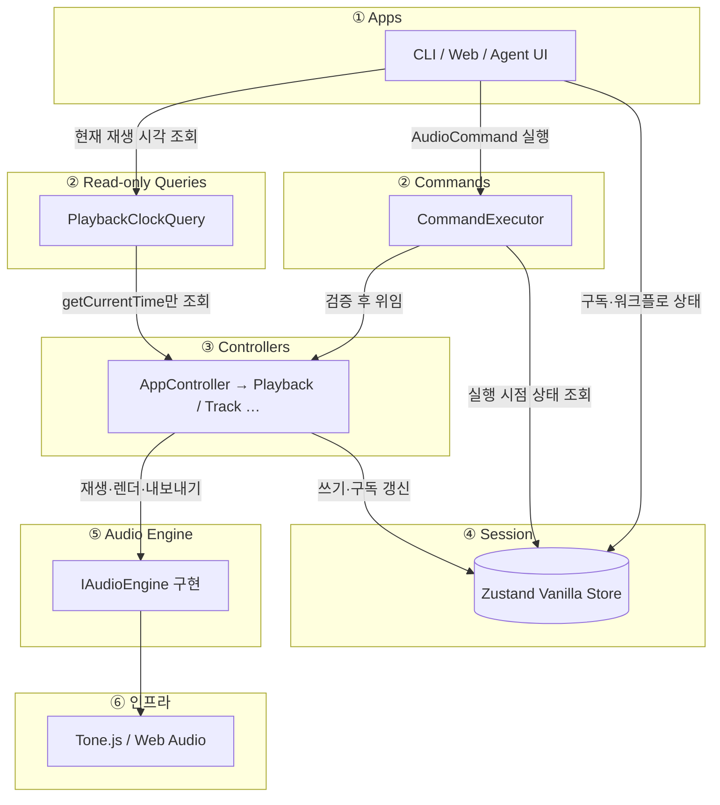
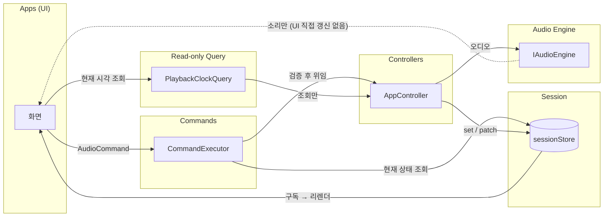
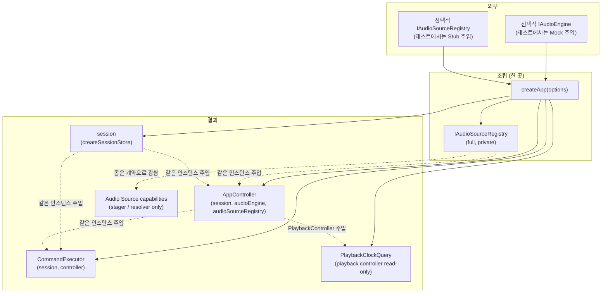
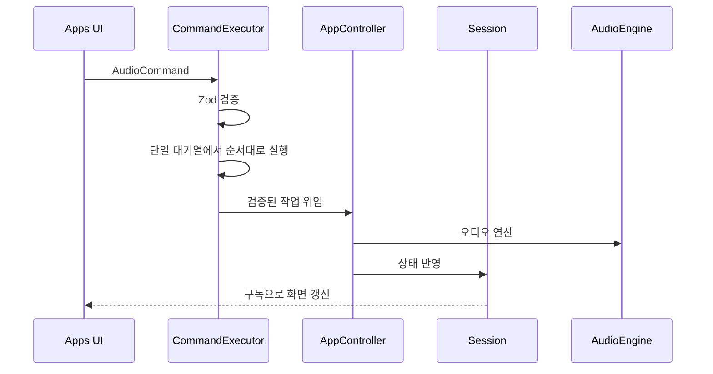

# drop-ai 아키텍처

## 개요

레이어 의존성과 상태·오디오 흐름을 한눈에 본다. 규칙의 단일 출처는
[`src/layers/architecture.md`](../src/layers/architecture.md)이다.

---

## 1. 레이어 한 장 요약

AudioCommand 실행 방향은 아래와 같다.

**Apps → CommandExecutor → Controllers → Session / AudioEngine → Tone.js**

아래 그림은 **실행 시점** 레이어만 보여 준다. 객체 조립(`createApp`)은 **§3**에서 따로 그린다.

재생 중 현재 시각은 상태 변경이 아니라 조회이므로 `PlaybackClockQuery`가 PlaybackController의 조회 메서드만 호출한다.
Apps에는 Controller와 AudioEngine 객체를 노출하지 않는다.

---

## 2. 상태와 오디오 흐름

UI는 **Session을 읽어** 그리고, AudioCommand는 **CommandExecutor**에 전달한다.
CommandExecutor는 명령을 검증하고 Controller에 실행을 위임한다.
Agent 메시지와 업로드 파일 같은 앱 워크플로 상태는 Session Action으로 갱신한다.

검증된 명령은 CommandExecutor의 단일 대기열에서 접수 순서대로 하나씩 실행한다. `executeMany`는 묶음 전체를
먼저 검증한 후, 다른 요청이 끼어들지 않게 순서대로 실행한다. 실행 중 첫 오류가 나면 남은 명령은 실행하지
않는다. 이미 완료된 변경은 되돌리지 않으므로 묶음 실행은 원자적 트랜잭션이 아니다. 실패한 실행이 있어도 그
오류는 0부터 시작하는 실패 위치, 실패 명령, 앞선 실행 결과와 원인을 보존한다. 뒤에 대기 중인 요청은 계속
실행한다.
`EXPORT_AUDIO`는 현재 완료될 때까지 대기열을 점유한다. 별도 작업 모델을 도입하기 전의 알려진 제한이다.

Agent 응답은 JSON 배열 전체를 엄격하게 검증한다. 빈 배열은 명령 없음으로 허용한다. 알 수 없는 명령, 잘못된
필드, 누락·추가 필드, JSON 밖의 텍스트가 하나라도 있으면 전체를 실행하지 않는다. Agent 응답에 없는 명령을
실행 단계에서 추가하지 않는다. 검증된 배열은 `executeMany` 한 번으로 실행하며, 중간 실패 뒤 남은 명령은
실행하지 않는다.

Agent Prompt는 AudioCommand 전체의 정확한 필드와 범위를 안내한다. 현재 Session의 실제 Track·Region ID, 시간
범위, 오디오 소스 사용 가능 여부도 함께 전달하며, Prompt 예시는 엄격한 Agent Schema를 통과해야 한다. 아직 앱이
예약한 새 ID와 허용 파일 목록을 제공하지 않으므로 Agent의 `ADD_TRACK` 생성은 막는다. `LOAD_REGION`은 기존
Track의 첫 등록 Source Region을 재사용하는 경우에만 제한적으로 허용한다. 등록 Source Region은 목록의 실제
`sourceId`만 사용한다. Agent 명령의 `url` 필드는 금지하며 Object URL을 노출하지 않는다. 프로젝트 컨텍스트는 모델
입력 한도를 넘길 위험을 줄이도록 길이를 제한하고 잘림
여부를 표시한다.

점선: 엔진 출력은 스피커로 나가지만, **표시용 state는 Session 경로**로 맞춘다.

현재 Region의 시작·끝 위치는 **절대 초**로 저장한다. 음악 시간(musical time) 모델을 도입하기 전까지 tempo는
Session의 프로젝트 값이며, AudioEngine의 Transport BPM이나 Region 예약 시각을 변경하지 않는다.

---

## 3. 조립: `createApp`

**Composition Root** — §1과 달리 **부팅·테스트 진입점**에서 한 번 객체 그래프를 만드는 흐름이다.

`createApp`이 **Session**, **AudioEngine**, **AudioSourceRegistry**, **AppController**, **CommandExecutor**,
**PlaybackClockQuery**를 한 번 조립한다.
AppController 자체는 Apps에 노출하지 않는다. CommandExecutor에는 AppController를, PlaybackClockQuery에는
PlaybackController의 읽기 전용 계약을 주입한다. AudioSourceRegistry는 전체 변경 계약을 노출하지 않고 등록용
`IAudioSourceStager`와 조회용 `IAudioSourceResolver`로 나눠 노출한다. 같은 Registry의 전체 계약은 Source 연결 수명을
관리하는 Controller에만 주입한다.

구현: [`src/layers/apps/create-app.ts`](../src/layers/apps/create-app.ts)  
웹 진입점은 `createApp()` 결과를 `LayerProvider`에 전달한다.

---

## 4. 시간 순서(요약)

---

## 5. `src/` 디렉터리 역할

| 경로                            | 역할                                        |
| ------------------------------- | ------------------------------------------- |
| `layers/apps/`                  | Web, Agent, 내부 CLI 진입점                 |
| `layers/commands/`              | 명령 검증과 실행 순서 관리                  |
| `layers/controllers/`           | Session과 AudioEngine 작업 조정             |
| `layers/queries/`               | Controller의 명시된 값만 읽는 Query         |
| `layers/project-repository/`    | 프로젝트 snapshot 저장 계약과 Adapter       |
| `layers/audio-source-registry/` | 재생 Source URL의 런타임 소유권과 참조 관리 |
| `layers/session/`               | 화면에 표시할 상태 저장                     |
| `layers/audio-engine/`          | Tone.js와 Web Audio 기반 오디오 처리        |

---

## 6. 자동 경계 검사

[`src/layers/architecture.test.ts`](../src/layers/architecture.test.ts)는 Apps의 Controller 직접 import, Command·Query의
AudioEngine import, 계층의 역방향 참조, AudioEngine 밖의 Tone.js import와 대표 Web Audio 생성자·팩토리의 직접 호출을
검사한다. 간접 별칭이나 동적 프로퍼티 접근은 코드 리뷰에서도 확인한다.

---

## 7. Cross-Origin Isolation 배포 헤더

Vite 개발·Preview, Netlify의 `public/_headers`, Docker nginx는 아래 값을 동일하게 설정한다.

- `Cross-Origin-Opener-Policy: same-origin`
- `Cross-Origin-Embedder-Policy: require-corp`

nginx의 정적 파일 `location`은 자체 `add_header`를 사용하므로 두 격리 헤더도 해당 블록에 직접 선언한다.
[`src/layers/deployment-isolation-headers.test.ts`](../src/layers/deployment-isolation-headers.test.ts)는 설정 파일의 계약을
검사한다. 실제 배포 응답과 `crossOriginIsolated` 값은 런타임 검사에서 별도로 확인한다.

Docker nginx의 HTML 응답은 `script-src`에 `'wasm-unsafe-eval'`을 선언한다. 이 토큰은 WebAssembly 컴파일·인스턴스화를
허용하며 JavaScript 문자열 실행을 허용하는 `'unsafe-eval'`은 추가하지 않는다.
[`src/layers/nginx-wasm-csp.test.ts`](../src/layers/nginx-wasm-csp.test.ts)는 이 설정 계약을 검사한다. 실제 브라우저의
WebAssembly 실행 여부는 배포 환경에서 별도로 확인한다.

---

## 8. 브라우저 오디오 런타임 전제조건

`createApp()`은 시작할 때 브라우저 환경을 한 번 읽고 기능별 정적 전제조건을 계산한다.

| 기능                    | 정적 전제조건                                                |
| ----------------------- | ------------------------------------------------------------ |
| AudioWorklet            | 보안 컨텍스트이고 AudioWorklet API가 노출됨                  |
| 단일 스레드 WebAssembly | WebAssembly API가 노출됨                                     |
| 공유 메모리             | 보안 컨텍스트, Cross-Origin Isolation, SharedArrayBuffer API |

Cross-Origin Isolation이 없어도 AudioWorklet과 단일 스레드 WebAssembly 전제조건은 충족할 수 있다. 이 경우 공유
메모리만 제한된다. Web UI 헤더는 이를 `고성능 전제조건 충족`, `공유 메모리 제한`, `기능 제한`으로 표시한다.

브라우저 API 노출 확인은 실제 AudioWorklet 모듈 로딩이나 WebAssembly 컴파일 성공을 증명하지 않는다. Content Security
Policy(CSP), 모듈 URL, 장치 상태를 포함한 실제 실행 검증은 AudioEngine 도입 단계에서 별도로 수행한다. 이 값은 읽기
전용 환경 정보이므로 Session이나 AudioCommand를 거치지 않는다.

---

## 9. ProjectDocument v1

`ProjectDocumentSchema`는 프로젝트를 JSON으로 저장하기 위한 엄격한 v1 계약이다. `documentType`과 `schemaVersion`으로
파일 종류와 형식을 구분하며, 알 수 없는 필드는 거부한다.

| 저장하는 값   | 규칙                                                      |
| ------------- | --------------------------------------------------------- |
| 프로젝트      | 안정적인 UUID, 이름, 0 이상의 revision                    |
| Timeline      | 절대 초 단위, 단일 tempo 메타데이터, 선택적인 Export 범위 |
| 오디오 Source | 안정적인 UUID, 파일 메타데이터, 알고 있는 경우 원본 길이  |
| Track         | 배열 순서, UUID, 이름, volume, pan, mute, solo            |
| Region        | UUID, Source UUID, Timeline 시작, 원본 시작 offset, 길이  |

Region의 끝 시각은 `startTimeSeconds + durationSeconds`로 계산하므로 따로 저장하지 않는다. 모든 ID는 종류별로 중복될
수 없고, Region은 문서 안에 존재하는 Source만 참조한다. Source 길이를 알면 Region의 원본 범위가 그 길이를 넘을 수 없다.
`schemaVersion`은 문서 구조 버전이고 `project.revision`은 같은 프로젝트 내용의 저장 revision이다. 새 문서는 revision
0에서 시작하고, 후속 저장소는 교체 저장에 성공할 때 1씩 증가시킨다. 이 값은 편집 횟수, Undo 번호, 저장되지 않은 변경
여부가 아니다. 일반 편집과 Undo에서는 유지하고, 저장 성공 후 Repository가 반환한 값으로만 교체한다.

`readProjectDocument`는 신뢰할 수 없는 입력에서 문서 식별자와 정수 `schemaVersion`을 먼저 읽고, 지원하는 버전의 전체
Schema를 적용한다. `readProjectDocumentJson`은 JSON 문법 오류를 문서 구조 오류와 구분한다. 현재 실제로 정의된 형식은
v1뿐이다. v0은 유효하지 않은 버전으로, v2 이상은 `UNSUPPORTED_SCHEMA_VERSION`으로 거부한다. 과거 형식의 필드를
추측해 채우지 않는다. 객체를 직접 읽을 때도 JSON과 같은 자기 소유 열거 가능 데이터 속성만 복제하며, 상속 속성과
접근자 속성은 문서 필드로 인정하지 않는다. 향후 v2를 정의할 때 실제 v1 fixture와 함께 v1→v2 변환을 추가한다.

현재 Session은 파일 길이를 아직 확인하지 못한 길이 0 Region과 드래그 시작 시점의 빈 Export 범위를 잠시 가질 수 있다.
v1은 이 상태를 손실 없이 저장하기 위해 길이 0과 `startTimeSeconds === endTimeSeconds`를 허용한다. 실제 재생·Export
가능 여부는 해당 Command와 Controller가 별도로 검증한다.

다음 런타임 값은 저장하지 않는다.

- `File`, `Blob`, Object URL, AudioBuffer, 정리 함수
- Zustand의 `Map`과 Action
- 재생 여부와 현재 playhead
- 선택·드래그 상태
- Agent 대화, 모델 로딩, 모달과 zoom 같은 앱 상태

원본 오디오 바이트는 Source UUID를 키로 사용하는 별도 저장소에 둔다. 프로젝트를 다시 열 때 새 Object URL을 만들고
런타임 Source Registry에서 관리한다. 현재 Session은 ProjectDocument의 `project` 형식과 같은 프로젝트 metadata를
가지며, `createApp`이 새 UUID·기본 이름·revision 0을 만들거나 검증을 마친 기존 metadata를 주입한다.

`ProjectDocumentMapper`는 Store·Repository·Registry를 호출하지 않는 순수 변환 계층이다. 저장할 때 Session의 프로젝트
metadata, tempo, master volume, Export 범위, Track·Region과 호출자가 전달한 committed Source metadata를 문서로 만든다.
참조되지 않는 committed Source도 보존하며, pending 여부는 metadata만으로 판별할 수 없으므로 호출자가 제외해야 한다.
복원할 때는 Session용 snapshot과 Source metadata를 분리해 반환한다. Track Map 삽입 순서와 Region·Source 입력 순서를
유지하고 임의 정렬하지 않는다. Region `endTime`은 `startTime + duration`으로 다시 계산하며 Track·Region status는 빈
배열로 초기화한다. 재생 여부, playhead, Agent 상태는 Mapper 결과에 포함하지 않고 후속 Controller가 교체 정책을 정한다.

Mapper는 Export 범위의 부분 `null`, Track Map key와 Track ID 불일치, 허용 오차를 초과한 Region 끝 시각 불일치를
거부한다. 끝 시각 비교는 절대 오차 `1e-9`초와 숫자 크기에 비례한 `Number.EPSILON * magnitude * 4` 중 큰 값을 허용한다.
최종 문서는 기존 `ProjectDocumentSchema`로 검증하고, 역변환 입력은 `readProjectDocument`로 다시 검증·복제한다. 현재
화면의 저장·불러오기 기능과 Session 전체 교체 Action은 아직 없다. Undo 이력도 snapshot 문서에 넣지 않고 후속 Undo
Journal에서 별도로 관리한다.

---

## 10. ProjectRepository 계약

`IProjectRepository`는 ProjectDocument snapshot만 다룬다. `InMemoryProjectRepository`는 계약 검증용이고,
`IndexedDbProjectRepository`는 브라우저 metadata 영구 저장용이다.

| 작업   | 규칙                                                                   |
| ------ | ---------------------------------------------------------------------- |
| create | revision 0 문서만 생성하며 같은 Project ID가 있으면 거부한다.          |
| save   | 문서·요청·저장소 revision이 모두 같을 때 내용을 교체하고 1 증가시킨다. |
| load   | 문서의 깊은 복사본을 반환하며 없으면 `null`을 반환한다.                |
| list   | ID, 이름, revision, 저장 시각만 반환하고 문서 본문은 읽지 않는다.      |
| delete | expected revision이 최신 값과 같을 때만 삭제한다.                      |

IndexedDB에서 문서를 읽을 때 저장 record의 Project ID를 먼저 확인하고, 내부 `document`는 `readProjectDocument`로
판독한다. 손상된 문서는 `INVALID_STORED_DATA`, 현재 앱보다 새로운 문서 버전은
`UNSUPPORTED_STORED_DOCUMENT_SCHEMA_VERSION`으로 구분한다. 문서 안의 Project ID가 저장 키와 달라도 손상으로
처리한다.

create·save의 입력, 반환값, load 결과는 내부 저장값과 객체 참조를 공유하지 않는다. 같은 revision을 가진 두 저장이 겹치면
하나만 성공하고 다른 하나는 `REVISION_CONFLICT`로 끝난다. 비교와 교체는 한 저장소 작업 안에서 수행해야 한다.
expected revision은 0 이상의 JavaScript 안전 정수여야 하며, save는 증가 결과도 안전 정수 범위에 남아야 한다.
`list()` 반환 순서는 계약하지 않는다. 화면은 필요한 정렬 기준을 직접 적용해야 한다.

IndexedDB Adapter는 ProjectDocument와 목록 요약을 별도 Object Store에 두고, create·save·delete에서 두 Store를 하나의
transaction으로 갱신한다. save의 읽기·revision 비교·교체도 같은 transaction 안에서 처리한다. 단위 테스트는 메모리 기반
IndexedDB 대역으로 이 규칙을 검증하므로, 실제 브라우저의 디스크 내구성·용량 제한·저장소 제거 정책까지 증명하지는 않는다.

원본 오디오 바이트와 Undo Journal은 Repository snapshot에 포함하지 않는다. `OpfsAudioSourceRepository`는 원본 바이트를
`drop-ai/audio-sources/v1/<Source UUID>`에 저장한다. `create`는 metadata와 Blob 크기를 확인하고 쓰기를 닫은 뒤 저장
크기를 다시 확인한다. `load`도 ProjectDocument metadata의 크기를 확인하고 `mimeType`을 Blob 생성 옵션으로 전달한다.
반환된 Blob의 `type`은 브라우저 Blob 규칙에 따라 정규화될 수 있다. `delete`는 반복 호출을 허용한다. 같은 Source의
`create`, `load`, `delete`는 `drop-ai:audio-source:v1:<Source UUID>` Web Lock으로 동일-origin에서 순서대로 실행한다.
Web Locks가 없으면 동시 접근의 무결성을 보장할 수 없으므로 저장소 사용 불가로 처리한다. 구체 OPFS 구현은 Composition
Root와 테스트에서만 import하고, 다른 계층은 Repository 인터페이스와 오류 계약만 참조한다.

크기 확인은 같은 크기의 바이트 손상을 검출하지 못한다. 후속 문서 버전에서 cryptographic hash를 비교하면 검출 범위를
넓힐 수 있지만, hash 충돌 가능성 때문에 모든 손상을 절대적으로 보장하지는 않는다.

OPFS와 IndexedDB는 하나의 transaction이 아니다. 후속 저장은 오디오 바이트 저장·검증을 먼저 끝내고 그 Source ID를
참조하는 snapshot을 공개해야 한다. 반대 순서는 문서만 있고 오디오가 없는 손상 상태를 만들 수 있다.

현재 Repository는 `createApp`, Controller, Command, Session에 아직 연결하지 않았다. 연결은 Session Mapper를 추가한 뒤
별도 기능 단위에서 진행한다.

Session의 프로젝트 metadata 전체 교체는 후속 Project Controller만 사용한다. Apps는 직접 호출하지 않는다. 불러오기
과정에서는 Source와 AudioEngine 준비가 성공하기 전에 metadata만 먼저 교체하지 않는다. 저장 과정에서는 Repository가
성공 결과를 반환했을 때만 Session revision을 교체하며, 실패나 revision 충돌이면 기존 값을 유지한다.

---

## 11. Runtime Audio Source Registry

Source UUID는 ProjectDocument에 저장하는 고정 식별자다. Object URL은 브라우저가 현재 실행 중에만 제공하는 임시 값이므로
ProjectDocument의 식별자로 사용하지 않는다. Session Region도 Source UUID만 저장한다. `AudioSourceRegistry`가
**재생 Source용 Object URL**의 생성과 해제를 전담한다.
오디오 길이 판독용 임시 URL과 Export 다운로드 URL은 별도 수명이라 이 Registry의 소유 범위가 아니다.

| 상태·작업             | 규칙                                                                     |
| --------------------- | ------------------------------------------------------------------------ |
| stage                 | metadata와 Blob 크기를 검증하고 pending Source와 URL을 만든다.           |
| attach                | 전역에서 중복되지 않은 Region ID를 연결하고 Source를 committed로 바꾼다. |
| detach                | Region 연결만 끊고 committed Source와 URL은 유지한다.                    |
| discardPending        | 한 번도 연결되지 않은 pending Source만 제거하고 URL을 해제한다.          |
| purgeUnused           | Region이 없는 committed Source를 사용자가 명시적으로 정리한다.           |
| clear                 | 프로젝트 종료나 실패한 임시 복원 정리에서 모든 Source URL을 해제한다.    |
| listCommittedMetadata | pending은 제외하고 Region이 없는 committed Source는 포함한다.            |

Region 삭제 직후 Source를 자동 제거하지 않는다. React·WaveSurfer 정리 순서와 경쟁할 수 있고 Undo가 같은 Source와 Region
ID를 다시 연결할 수 있기 때문이다. 조회 결과와 metadata 목록은 내부 `Set`이나 객체 참조를 노출하지 않고 복사본을 반환한다.
Object URL 생성·해제 실패는 typed Registry 오류로 구분한다.
URL 해제가 실패한 Source는 Registry에 남겨 다음 정리 호출에서 다시 시도하고, 이미 해제한 Source는 다시 해제하지 않는다.

### 11.1. Region Source 경로

Session Region은 `sourceId`만 저장하고 Object URL을 저장하지 않는다. `LOAD_REGION`은 폐기된 `url` 필드를 일반·Agent
Schema에서 명시적으로 거부한다. 새 Region은 등록된 `sourceId`를 명시하거나 같은 Track의 첫 Region Source를 재사용한다.
`trackId`를 생략하면 Controller가 첫 Track을 선택한다. 유효한 `LOAD_REGION`이 Controller에 전달된 뒤 Track 선택이나
존재 검증이 실패하면 명시된 pending Source도 Controller가 정리한다. Controller는 Registry 등록과 Region 연결을 확인한
Object URL만 AudioEngine에 전달한다. 등록 Source의 URL은 Session과 Agent Prompt에 넣지 않는다. Web 파형, Agent
context, Export도 같은 등록·연결 조건을 사용한다. 연결이 없으면 Web 파형은 오류를 표시하고 Agent context는
`unavailable`, Export는 typed 오류를 반환한다. 다른 URL을 추측하거나 Region을 조용히 제외하지 않는다.

등록 Source 길이를 알면 Controller는 `sourceStartTime + duration`이 Source 길이를 넘지 않는지 연결 전에 검증한다.
`duration`을 생략하면 Source의 남은 길이로 정규화해 AudioEngine과 Session에 같은 값을 전달한다. Source 길이가
`null`이면 남은 길이를 계산할 수 없으므로 `duration`을 명시해야 한다. 이 규칙은 ProjectDocument 검증과 같은 1e-9초
부동소수점 허용오차를 사용한다.

### 11.2. 실패 보상

등록 Source Region의 Controller 변경은 한 저장소 transaction이 아니라 다음 작업을 순서대로 조정하는 절차다.

1. Registry 연결을 준비한다.
2. AudioEngine을 변경한다.
3. Session을 반영한다.

Controller 진입 뒤 중간 실패 시 완료한 Registry 변경을 역순으로 되돌린다. 처음 연결된 pending Source의 추가가 실패하면
Object URL도 정리한다. 이미 committed인 Source는 Region 연결만 되돌리고 Undo와 재사용을 위해 유지한다. 원래 작업과
보상 작업이 모두 실패하면 `ProjectMutationCompensationError`가 원래 원인과 각 보상 실패를 함께 보존한다. `stage` 뒤
Command Schema 검증이나 dispatch 전에 실패한 경우는 Controller가 Source를 볼 수 없으므로 stage 호출자가
`discardPending`을 실행해야 한다.

등록 Source Region을 분할할 때는 새 Region 연결을 먼저 예약하되 기존 Region 연결을 AudioEngine 교체가 끝날 때까지
유지한다. 따라서 비동기 교체 중에도 Session에 남은 기존 Region의 파형 조회가 유효하다. 교체 성공 뒤 기존 연결을
끊고 Session을 바꾼다. 재검증 시 Session에서 대상이 이미 사라졌다면 Engine의 새 Region과 남은 Source 연결을 제거해
최신 Session에 맞춘다. Session 대상은 남아 있지만 Source 전환이 실패하면 Engine과 Registry를 기존 Region 상태로
되돌린다.

이 보상 절차는 원자적 transaction을 보장하지 않는다. 일반 Web·CLI·Agent 변경은 CommandExecutor의 단일 대기열을
통과하므로 서로 끼어들지 않지만, AudioEngine API가 부분 성공한 뒤 실패하는 구현이나 외부에서 Session을 직접 변경하는
경우까지 복구한다고 결론낼 수 없다. 후속 프로젝트 불러오기와 오디오 그래프 교체에는 준비된 전체 상태를 한 번에
교체하는 별도 계약이 필요하다.

`restoreCommitted`는 Blob 하나를 committed 상태로 복원하는 동작일 뿐 프로젝트 전체를 원자적으로 불러오는 API가 아니다.
후속 불러오기 Controller는 새 Registry에서 모든 Source 복원과 AudioEngine 준비를 끝낸 뒤 기존 프로젝트를 교체해야 한다.
중간 실패 시 새 Registry를 `clear`하고 기존 Session과 Registry를 유지한다.

Registry는 영구 저장소가 아니다. OPFS Repository가 Source UUID를 키로 원본 바이트를 보존하고, Registry는 현재 실행의
Object URL과 Region 연결을 관리한다. 현재 단계에서는 Registry 계약·브라우저 URL Adapter·메모리 구현을 Composition
Root에서 한 번 조립한다. Apps에는 `IAudioSourceStager`와 `IAudioSourceResolver`만 제공하며, 전체 Registry 변경 계약과
구체 구현은 노출하지 않는다. 연결 수명을 바꾸는 Track·Region Controller만 전체 Registry 계약을 받고, 조회만 하는
Export는 `IAudioSourceResolver`를 받는다. ProjectDocument Mapper와 저장·불러오기 연결은 별도 기능 단위로 진행한다.

production Web 파일 가져오기는 파일 metadata를 만든 뒤 Blob을 Registry에 `stage`한다. metadata 변환 단계는 재생용
Object URL을 만들지 않는다. Web Adapter가 Source UUID를 만들고, Registry가 이를 검증·등록하면서 Object URL을 만든다.
Web Adapter 반환값도 URL 없는 파일 metadata와 Source UUID만 제공한다. 재생 URL은 Web 파일 정보로 전달하지 않는다.
`ADD_TRACK`은 Track ID만으로 빈 Track을 만들고 Region 명령은 `sourceId`를 사용한다. Session은 재생 URL 기반 파일
목록을 보관하지 않는다.
Web UI는 이 재생 URL을 직접 해제하지 않는다. 길이 판독용 임시 URL과 Export 다운로드 URL은 각 기능이 계속 소유한다.

새 Track 가져오기는 stage 성공 뒤 `ADD_TRACK`, `LOAD_REGION`을 하나의 `executeMany`에 전달한다. 첫 명령이 실패하면
pending Source만 정리한다. 두 번째 명령이 실패하면 별도 `REMOVE_TRACK` 명령을 시도한 뒤 pending Source도 정리한다. 두
보상은 가능한 범위에서 모두 시도하며, 실패하면 원래 오류와 보상 오류를 Web workflow 전용
`AudioImportCompensationError`에 보존한다.
기존 Track의 Region 가져오기는 유효한 길이를 stage 전에 확인한다. stage 뒤 `LOAD_REGION`이 실패하면 호출자가
`discardPending`을 실행한다. Controller가 이미 정리한 Source라면 이 호출은 아무 작업도 하지 않는다. stage 자체가
실패한 경우에는 같은 ID의 기존 Source를 잘못 제거할 수 있으므로 `discardPending`을 호출하지 않는다. 새 Track
가져오기가 성공하면 화면 callback을 실행해 완료된 프로젝트 화면으로 이동한다. callback 자체가 실패한 경우도 이미
committed인 Source는 pending 정리하지 않는다. 이 보상은 여러 저장소를 묶는 원자적 transaction이 아니다.

---

## 참고

- Web UI의 Region 분할은 현재 시각에 정확히 하나의 Region이 있을 때 해당 ID로 `SPLIT_REGION`을 실행한다.
- Web UI의 Region 삭제는 사용자 확인 후 정확한 Track·Region ID로 `UNLOAD_REGION`을 실행한다.
- Web UI의 Region 이동은 드래그 중 로컬 미리보기만 바꾸고 포인터를 놓을 때 `MOVE_REGION`을 한 번 실행한다.
- Web UI의 Track 삭제는 사용자 확인 후 정확한 Track ID로 `REMOVE_TRACK`을 한 번 실행하고 처리 중 중복 입력을 막는다.
- Web UI의 Mute·Solo는 정확한 Track ID로 `SET_TRACK_MUTE`·`SET_TRACK_SOLO`를 실행한다.
- Web UI의 Tempo 입력은 `SET_TEMPO`로 Session 메타데이터만 바꾸며 오디오 속도와 Region 예약은 바꾸지 않는다.
- Web UI의 `Region 추가`는 파일 검증·Source staging 후 선택한 Track ID와 현재 시각으로 sourceId 기반 `LOAD_REGION`을 한
  번 실행한다.
- 내부 CLI의 변경 작업은 CommandExecutor를 사용한다.
- Web 파일 가져오기는 Track 생성과 sourceId 기반 Region 등록을 하나의 `executeMany` 호출로 전달한다.
- Web JSON CLI는 파싱된 명령 배열을 하나의 `executeMany` 호출로 전달하고, 중간 실패 전 결과만 후처리한다.
