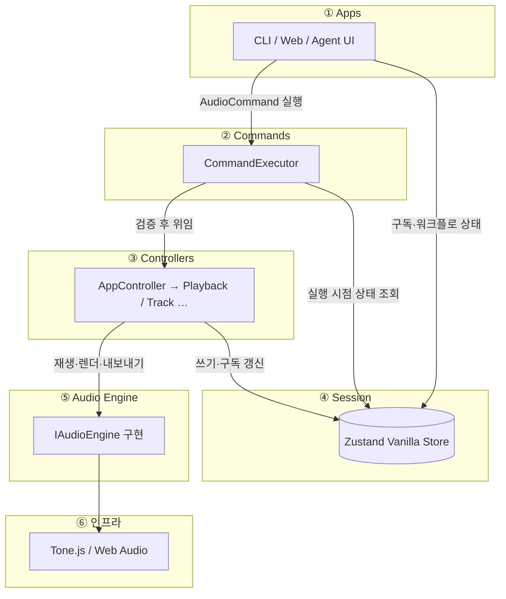
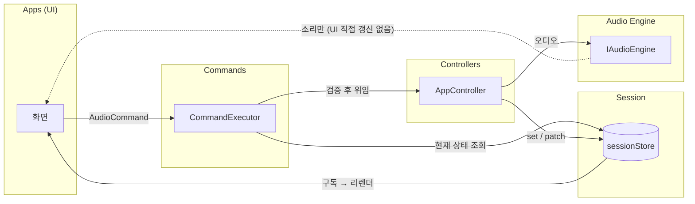
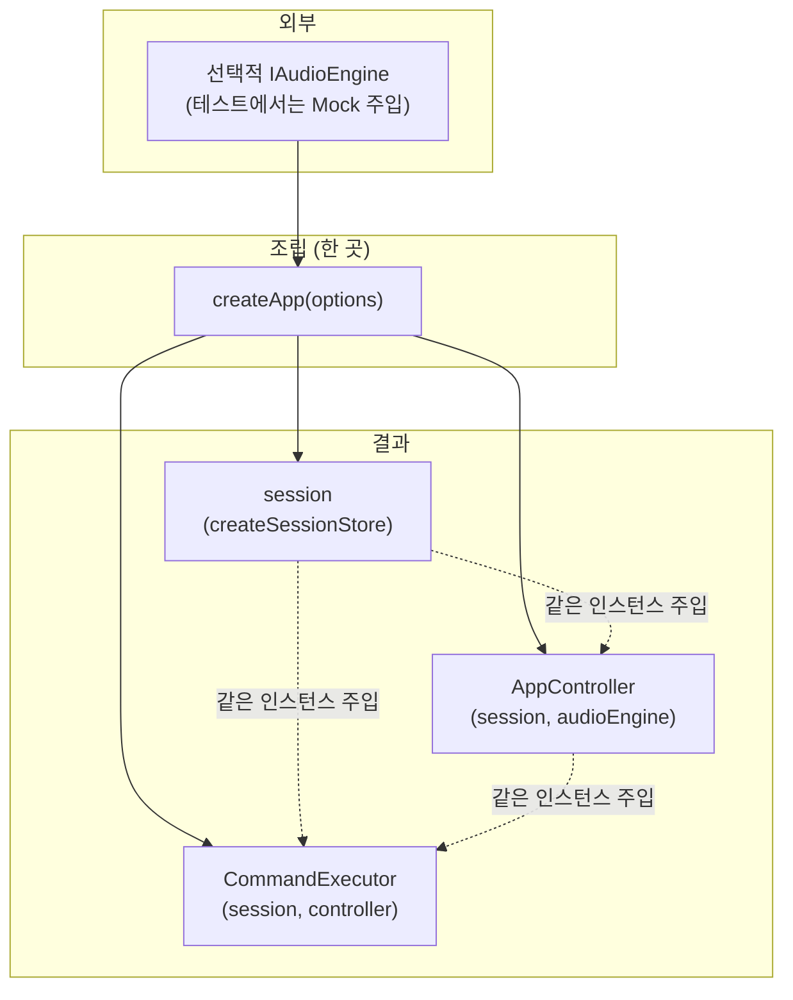
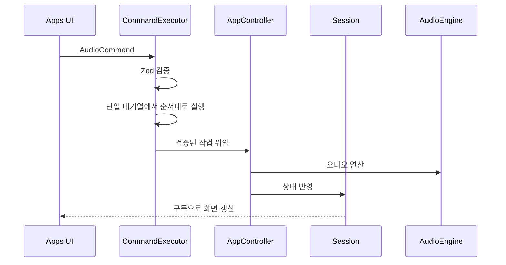

# drop-ai 아키텍처

## 개요

레이어 의존성과 상태·오디오 흐름을 한눈에 본다. 규칙의 단일 출처는
[`src/layers/architecture.md`](../src/layers/architecture.md)이다.

---

## 1. 레이어 한 장 요약

AudioCommand 실행 방향은 아래와 같다.

**Apps → CommandExecutor → Controllers → Session / AudioEngine → Tone.js**

아래 그림은 **실행 시점** 레이어만 보여 준다. 객체 조립(`createApp`)은 **§3**에서 따로 그린다.

---

## 2. 상태와 오디오 흐름

UI는 **Session을 읽어** 그리고, AudioCommand는 **CommandExecutor**에 전달한다.
CommandExecutor는 명령을 검증하고 Controller에 실행을 위임한다.
Agent 메시지와 업로드 파일 같은 앱 워크플로 상태는 Session Action으로 갱신한다.

검증된 명령은 CommandExecutor의 단일 대기열에서 접수 순서대로 하나씩 실행한다. `executeMany`는 묶음 전체를
먼저 검증한 후, 다른 요청이 끼어들지 않게 순서대로 실행한다. 실행 중 첫 오류가 나면 남은 명령은 실행하지
않는다. 이미 완료된 변경은 되돌리지 않으므로 묶음 실행은 원자적 트랜잭션이 아니다. 실패한 실행이 있어도 그
오류는 0부터 시작하는 실패 위치, 실패 명령, 앞선 실행 결과와 원인을 보존한다. 뒤에 대기 중인 요청은 계속
실행한다.
`EXPORT_AUDIO`는 현재 완료될 때까지 대기열을 점유한다. 별도 작업 모델을 도입하기 전의 알려진 제한이다.

Agent 응답은 JSON 배열 전체를 엄격하게 검증한다. 빈 배열은 명령 없음으로 허용한다. 알 수 없는 명령, 잘못된
필드, 누락·추가 필드, JSON 밖의 텍스트가 하나라도 있으면 전체를 실행하지 않는다. Agent 응답에 없는 명령을
실행 단계에서 추가하지 않는다.

점선: 엔진 출력은 스피커로 나가지만, **표시용 state는 Session 경로**로 맞춘다.

현재 Region의 시작·끝 위치는 **절대 초**로 저장한다. 음악 시간(musical time) 모델을 도입하기 전까지 tempo는
Session의 프로젝트 값이며, AudioEngine의 Transport BPM이나 Region 예약 시각을 변경하지 않는다.

---

## 3. 조립: `createApp`

**Composition Root** — §1과 달리 **부팅·테스트 진입점**에서 한 번 객체 그래프를 만드는 흐름이다.

`createApp`이 **Session**, **AudioEngine**, **AppController**, **CommandExecutor**를 한 번 조립한다.

구현: [`src/layers/apps/create-app.ts`](../src/layers/apps/create-app.ts)  
웹 진입점은 `createApp()` 결과를 `LayerProvider`에 전달한다.

---

## 4. 시간 순서(요약)

---

## 5. `src/` 디렉터리 역할

| 경로                   | 역할                                 |
| ---------------------- | ------------------------------------ |
| `layers/apps/`         | Web, Agent, 내부 CLI 진입점          |
| `layers/commands/`     | 명령 검증과 실행 순서 관리           |
| `layers/controllers/`  | Session과 AudioEngine 작업 조정      |
| `layers/session/`      | 화면에 표시할 상태 저장              |
| `layers/audio-engine/` | Tone.js와 Web Audio 기반 오디오 처리 |

---

## 참고

- Web UI의 Region 분할은 실행 경로 이전이 끝나지 않아 Controller를 직접 호출한다.
- 내부 CLI의 변경 작업은 CommandExecutor를 사용한다.
