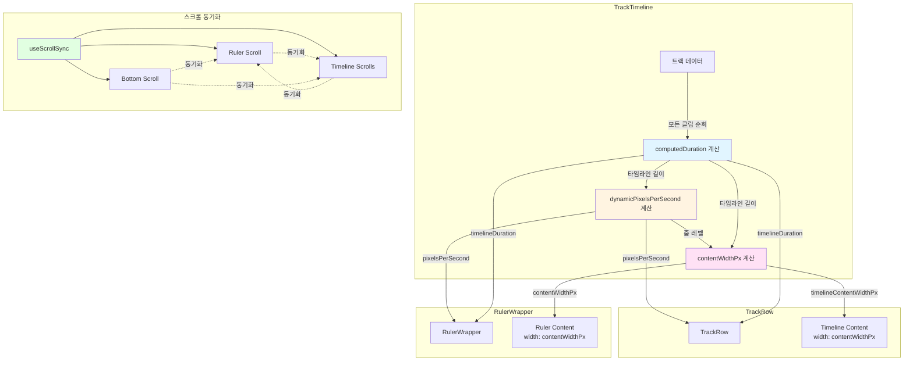
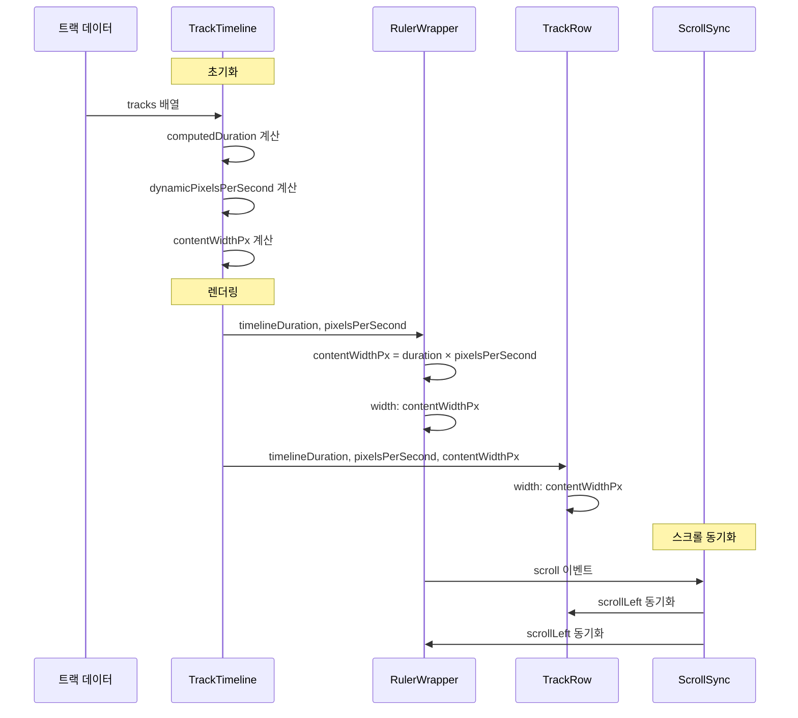

# 트랙과 룰러 길이 연동 아키텍처

## 개요

트랙과 룰러는 **동일한 타임라인 길이**와 **동일한 픽셀 너비**를 공유하여 완벽하게 정렬됩니다. 모든 트랙의 클립 중 최대 종료 지점을 기준으로 타임라인 길이가 자동 계산되며, 동적 줌 레벨에 따라 픽셀 너비가 결정됩니다.

## 핵심 개념

### 1. 타임라인 길이 계산 (`computedDuration`)

```typescript
const computedDuration = useMemo(() => {
  let maxEnd = 0;
  for (const track of tracks) {
    const items = track.getPlaylistItems();
    for (const item of items) {
      // Region의 실제 길이 사용 (Ardour처럼)
      const regionLength = item.region.getLength();
      const end = item.position + regionLength;
      if (end > maxEnd) maxEnd = end;
    }
  }
  // 최소 타임라인 길이를 보장하되, 클립이 더 길면 그에 맞춰 확장
  return Math.max(DEFAULT_TIMELINE_DURATION, maxEnd);
}, [tracks]);
```

**계산 로직:**
1. 모든 트랙의 모든 클립(PlaylistItem) 순회
2. 각 클립의 종료 지점 계산: `item.position + item.region.getLength()`
3. 최대 종료 지점(`maxEnd`) 찾기
4. 최소 길이(`DEFAULT_TIMELINE_DURATION = 30초`)와 비교하여 더 큰 값 반환

**예시:**
```
트랙 1: 클립 A (0초 ~ 10초)
트랙 2: 클립 B (5초 ~ 25초)
트랙 3: 클립 C (20초 ~ 35초)

maxEnd = max(10, 25, 35) = 35초
computedDuration = max(30, 35) = 35초
```

### 2. 동적 줌 레벨 계산 (`dynamicPixelsPerSecond`)

```typescript
const [dynamicPixelsPerSecond, setDynamicPixelsPerSecond] = useState<number>(PIXELS_PER_SECOND);

useEffect(() => {
  const updateZoom = () => {
    const scrollContainer = rulerScrollRef.current;
    if (!scrollContainer) return;

    // 뷰포트 너비 (스페이서 제외한 실제 타임라인 영역)
    const viewportWidth = scrollContainer.clientWidth;
    
    // 전체 타임라인이 보이도록 필요한 pixelsPerSecond 계산
    // 여유 공간(40px)을 두어 양쪽에 약간의 여백 확보
    const availableWidth = viewportWidth - 40;
    const calculatedPixelsPerSecond = availableWidth / computedDuration;
    
    // 최소/최대 줌 레벨 제한
    const minPixelsPerSecond = 10;
    const maxPixelsPerSecond = 200;
    
    const clampedPixelsPerSecond = Math.max(
      minPixelsPerSecond,
      Math.min(maxPixelsPerSecond, calculatedPixelsPerSecond)
    );
    
    setDynamicPixelsPerSecond(clampedPixelsPerSecond);
  };

  updateZoom();
  
  // 리사이즈 이벤트 리스너 추가
  const resizeObserver = new ResizeObserver(updateZoom);
  if (rulerScrollRef.current) {
    resizeObserver.observe(rulerScrollRef.current);
  }
  
  return () => {
    resizeObserver.disconnect();
  };
}, [computedDuration, tracks.length]);
```

**계산 로직:**
1. 뷰포트 너비 측정 (스크롤 컨테이너의 `clientWidth`)
2. 여유 공간(40px) 제외한 사용 가능한 너비 계산
3. `availableWidth / computedDuration`으로 초당 픽셀 수 계산
4. 최소(10px/초) ~ 최대(200px/초) 범위로 제한

**예시:**
```
뷰포트 너비: 1200px
여유 공간: 40px
사용 가능 너비: 1160px
타임라인 길이: 35초

calculatedPixelsPerSecond = 1160 / 35 = 33.14px/초
clampedPixelsPerSecond = clamp(10, 33.14, 200) = 33.14px/초
```

### 3. 픽셀 너비 계산 (`contentWidthPx`)

```typescript
const contentWidthPx = useMemo(
  () => Math.ceil(computedDuration * dynamicPixelsPerSecond),
  [computedDuration, dynamicPixelsPerSecond]
);
```

**계산:**
```
contentWidthPx = computedDuration × dynamicPixelsPerSecond
```

**예시:**
```
computedDuration = 35초
dynamicPixelsPerSecond = 33.14px/초

contentWidthPx = 35 × 33.14 = 1159.9px ≈ 1160px
```

## 길이 연동 구조

### 공유 값

모든 컴포넌트가 동일한 값들을 공유합니다:

```typescript
// TrackTimeline에서 계산
const computedDuration = ...;           // 타임라인 길이 (초)
const dynamicPixelsPerSecond = ...;     // 줌 레벨 (픽셀/초)
const contentWidthPx = ...;             // 픽셀 너비 (픽셀)

// RulerWrapper에 전달
<RulerWrapper
  timelineDuration={computedDuration}      // ✅ 동일한 길이
  pixelsPerSecond={dynamicPixelsPerSecond} // ✅ 동일한 줌 레벨
/>

// TrackRow에 전달
<TrackRow
  timelineDuration={computedDuration}      // ✅ 동일한 길이
  timelineContentWidthPx={contentWidthPx}   // ✅ 동일한 픽셀 너비
  pixelsPerSecond={dynamicPixelsPerSecond}   // ✅ 동일한 줌 레벨
/>
```

### 렌더링 구조

```
┌─────────────────────────────────────────────────────────┐
│ TrackTimeline                                           │
│                                                         │
│ ┌───────────────────────────────────────────────────┐ │
│ │ RulerWrapper                                      │ │
│ │ ┌──────────┐ ┌────────────────────────────────┐ │ │
│ │ │ Spacer   │ │ ScrollContainer                 │ │ │
│ │ │ (296px)  │ │ width: contentWidthPx           │ │ │
│ │ └──────────┘ └────────────────────────────────┘ │ │
│ └───────────────────────────────────────────────────┘ │
│                                                         │
│ ┌───────────────────────────────────────────────────┐ │
│ │ TrackRow 1                                        │ │
│ │ ┌──────────┐ ┌────────────────────────────────┐ │ │
│ │ │ Controls │ │ Timeline                        │ │ │
│ │ │ (296px)  │ │ width: contentWidthPx           │ │ │
│ │ └──────────┘ └────────────────────────────────┘ │ │
│ └───────────────────────────────────────────────────┘ │
│                                                         │
│ ┌───────────────────────────────────────────────────┐ │
│ │ TrackRow 2                                        │ │
│ │ ┌──────────┐ ┌────────────────────────────────┐ │ │
│ │ │ Controls │ │ Timeline                        │ │ │
│ │ │ (296px)  │ │ width: contentWidthPx           │ │ │
│ │ └──────────┘ └────────────────────────────────┘ │ │
│ └───────────────────────────────────────────────────┘ │
│                                                         │
│ ┌───────────────────────────────────────────────────┐ │
│ │ Bottom Scrollbar                                  │ │
│ │ ┌──────────┐ ┌────────────────────────────────┐ │ │
│ │ │ Spacer   │ │ ScrollContainer                 │ │ │
│ │ │ (296px)  │ │ width: contentWidthPx           │ │ │
│ │ └──────────┘ └────────────────────────────────┘ │ │
│ └───────────────────────────────────────────────────┘ │
└─────────────────────────────────────────────────────────┘
```

### RulerWrapper 내부

```typescript
// RulerWrapper.tsx
const contentWidthPx = Math.ceil(
  (timelineDuration ?? DEFAULT_TIMELINE_DURATION) * pixelsPerSecond
);

return (
  <div className={styles.wrapper}>
    <div className={styles.spacer} />
    <div className={styles.scrollContainer} ref={ref}>
      <div
        style={{
          width: `${contentWidthPx}px`,      // ✅ 동일한 너비
          minWidth: `${contentWidthPx}px`,
        }}
      >
        <Ruler
          timelineDuration={timelineDuration}  // ✅ 동일한 길이
          pixelsPerSecond={pixelsPerSecond}   // ✅ 동일한 줌 레벨
        />
      </div>
    </div>
  </div>
);
```

### TrackRow 내부

```typescript
// TrackRow.tsx
return (
  <div className={styles.trackRow}>
    <div className={styles.trackControls}>...</div>
    <div className={styles.timelineContainer} ref={...}>
      <div
        style={{
          width: `${timelineContentWidthPx}px`,  // ✅ 동일한 너비
          minWidth: `${timelineContentWidthPx}px`,
        }}
      >
        <Timeline
          timelineDuration={timelineDuration}  // ✅ 동일한 길이
          pixelsPerSecond={pixelsPerSecond}     // ✅ 동일한 줌 레벨
        />
      </div>
    </div>
  </div>
);
```

## 스크롤 동기화

### useScrollSync 훅

```typescript
useScrollSync<HTMLDivElement>({
  rulerRef: rulerScrollRef,           // 룰러 스크롤 컨테이너
  timelineRefs: timelineScrollRefs,    // 모든 트랙 타임라인 스크롤 컨테이너
  bottomScrollRef: bottomScrollRef,    // 하단 스크롤바
  trackCount: tracks.length,
});
```

**동작 방식:**
1. 룰러 스크롤 → 모든 트랙 타임라인과 하단 스크롤바 동기화
2. 트랙 타임라인 스크롤 → 룰러와 다른 트랙들, 하단 스크롤바 동기화
3. 하단 스크롤바 스크롤 → 룰러와 모든 트랙 타임라인 동기화

**구현:**
```typescript
const handleScroll = (scrollLeft: number, sourceElement: HTMLElement) => {
  if (isSyncingRef.current) return;  // 무한 루프 방지
  isSyncingRef.current = true;

  // 룰러 스크롤 동기화
  if (rulerRef?.current && rulerRef.current !== sourceElement) {
    rulerRef.current.scrollLeft = scrollLeft;
  }

  // 타임라인 스크롤 동기화
  timelineRefs.current.forEach(otherElement => {
    if (otherElement && otherElement !== sourceElement) {
      otherElement.scrollLeft = scrollLeft;
    }
  });

  // 하단 스크롤바 동기화
  if (bottomScrollRef?.current && bottomScrollRef.current !== sourceElement) {
    bottomScrollRef.current.scrollLeft = scrollLeft;
  }

  requestAnimationFrame(() => {
    isSyncingRef.current = false;
  });
};
```

## 데이터 흐름 다이어그램



## 시퀀스 다이어그램



## 주요 특징

### 1. 단일 소스 원칙
- `computedDuration`: 모든 컴포넌트가 동일한 타임라인 길이 사용
- `dynamicPixelsPerSecond`: 모든 컴포넌트가 동일한 줌 레벨 사용
- `contentWidthPx`: 모든 컴포넌트가 동일한 픽셀 너비 사용

### 2. 자동 동기화
- 트랙/클립 변경 시 `computedDuration` 자동 재계산
- 뷰포트 크기 변경 시 `dynamicPixelsPerSecond` 자동 재계산
- 스크롤 시 모든 요소 자동 동기화

### 3. 동적 줌
- 뷰포트 크기에 맞춰 자동으로 줌 레벨 조정
- 전체 타임라인이 한 화면에 보이도록 최적화
- 최소/최대 줌 레벨 제한으로 사용성 보장

### 4. 정확한 정렬
- 룰러와 트랙이 픽셀 단위로 정확히 정렬
- 스크롤 오프셋 고려한 정확한 위치 계산
- 플레이헤드가 모든 요소에서 동일한 위치 표시

## 코드 참조

### TrackTimeline.tsx

```typescript
// 1. 타임라인 길이 계산
const computedDuration = useMemo(() => {
  let maxEnd = 0;
  for (const track of tracks) {
    const items = track.getPlaylistItems();
    for (const item of items) {
      const regionLength = item.region.getLength();
      const end = item.position + regionLength;
      if (end > maxEnd) maxEnd = end;
    }
  }
  return Math.max(DEFAULT_TIMELINE_DURATION, maxEnd);
}, [tracks]);

// 2. 동적 줌 레벨 계산
const [dynamicPixelsPerSecond, setDynamicPixelsPerSecond] = useState<number>(PIXELS_PER_SECOND);
// ... ResizeObserver로 자동 업데이트

// 3. 픽셀 너비 계산
const contentWidthPx = useMemo(
  () => Math.ceil(computedDuration * dynamicPixelsPerSecond),
  [computedDuration, dynamicPixelsPerSecond]
);

// 4. 컴포넌트에 전달
<RulerWrapper
  timelineDuration={computedDuration}
  pixelsPerSecond={dynamicPixelsPerSecond}
/>

<TrackRow
  timelineDuration={computedDuration}
  timelineContentWidthPx={contentWidthPx}
  pixelsPerSecond={dynamicPixelsPerSecond}
/>
```

## 요약

1. **타임라인 길이**: 모든 트랙의 클립 중 최대 종료 지점으로 자동 계산
2. **줌 레벨**: 뷰포트 크기에 맞춰 자동 조정 (10~200px/초)
3. **픽셀 너비**: `길이 × 줌레벨`로 계산하여 모든 컴포넌트에 동일하게 적용
4. **스크롤 동기화**: `useScrollSync` 훅으로 룰러, 트랙, 하단 스크롤바 동기화
5. **자동 업데이트**: 트랙/클립 변경, 뷰포트 리사이즈 시 자동으로 재계산 및 업데이트

이러한 구조로 룰러와 트랙이 항상 정확하게 정렬되고 동기화됩니다.


