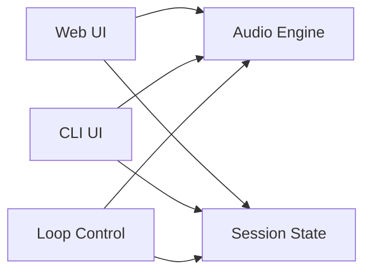
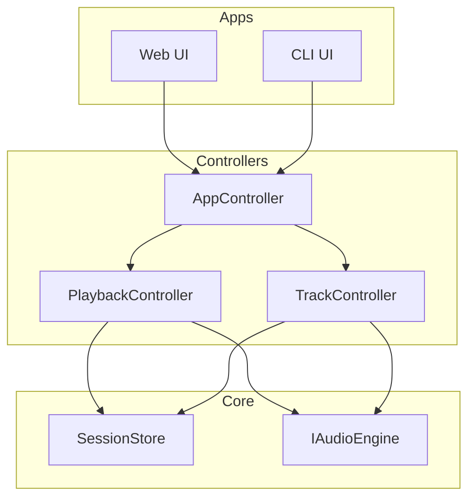
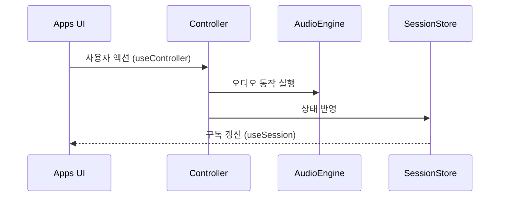
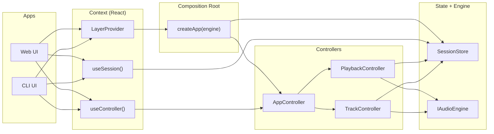

# Drop-AI 재구축 2편: 레이어 경계를 먼저 그려야 했던 이유

처음에는 빠르게 붙이고 싶었다.  
재생 버튼부터 만들고, 동작하면 다음 기능을 붙이면 된다고 생각했다.  
그 결과 UI 핸들러가 오디오 엔진을 직접 호출하고, 상태도 직접 바꾸는 코드가 쌓였다.

## 문제: 무엇이 문제였는가

세 군데에서 동시에 오디오 엔진을 호출하는 코드가 생겼다.  
Web UI 버튼, CLI 명령어, 루프 컨트롤이 각자 `play()`를 불렀다.  
기능 하나를 고치면 세 군데 를 같이 찾아야 했다.

증상은 중복 코드였다.  
원인은 변경 책임이 한 곳에 없었다는 것이었다.

아래는 그 상태를 단순화한 흐름이다.




Web, CLI, Loop 각각이 AudioEngine과 SessionState를 직접 참조하고 있다.  
새 UI를 추가할 때마다 이 두 의존이 복제된다.

## 선택: 어떤 구조를 검토했는가

세 가지 방향을 비교했다.


| 방향                             | 개념                                   | 판단 근거                     | 결론  |
| ------------------------------ | ------------------------------------ | ------------------------- | --- |
| UI 직접 제어                       | UI마다 엔진과 상태를 직접 호출                   | 초기엔 빠르지만 변경 범위를 예측 불가     | 제외  |
| 전역 상태에 로직 집중                   | Zustand store 안에 오디오 호출 포함           | 오디오 부수효과와 상태가 뒤섞임, 테스트 불가 | 제외  |
| Controller 경유 + Session 단방향 읽기 | UI → Controller → (Engine + Session) | 변경 지점 단일화, 레이어별 테스트 가능    | 채택  |


판단에서 결정적이었던 제약 조건이 하나 있었다.  
**Web UI와 CLI가 동일 로직을 공유해야 했다.**

UI가 두 개라는 조건이 있었기 때문에, UI에 로직을 두는 방식은 처음부터 불가능했다.  
같은 Controller를 두 UI에서 재사용할 수 있어야 구조가 성립한다.

전역 상태 안에 오디오 호출을 넣는 방법도 시도해봤다.  
하지만 `play()`는 브라우저 Audio Context를 시작하는 부수효과다.  
이 효과를 상태 액션 안에 두면 테스트에서 실제 오디오를 다루지 않으면 검증이 불가능해진다.

## 해결: 어떻게 경계를 그었는가

### 1) 의존성 방향을 단방향으로 잠근다

의존성은 아래 방향으로만 허용한다.

`Apps → Controllers → Session + AudioEngine`

역방향은 금지한다.  
AudioEngine이 Session을 직접 바꾸거나, Session이 Controller를 호출하지 않는다.




이 규칙이 있으면 "이 코드 어디에 둬야 하나?"는 레이어를 보면 즉시 답이 나온다.

### 2) UI는 읽기와 쓰기 경로를 분리한다

UI에서 허용하는 경로는 두 가지뿐이다.

- **읽기**: `useSession(selector)` — SessionStore를 구독한다
- **쓰기**: `useController().playback` 또는 `.track` — Controller에 위임한다

이 분리가 중요한 이유는 렌더링 코드와 도메인 변경 코드가 같은 파일에 있으면 리팩토링 시 영향 범위가 예측 불가능해지기 때문이다.




UI는 결과만 구독한다.  
그 결과가 어떤 경로로 만들어졌는지 UI는 알지 못한다.

### 3) 조립 지점을 한 곳으로 고정한다

`createApp(engine)` 하나가 전체 객체 그래프를 만든다.

```typescript
export function createApp(audioEngine: IAudioEngine): AppInstance {
  const session = createSessionStore();
  const controller = new AppController(session, audioEngine);
  return { session, controller };
}
```

이 함수가 Composition Root다.  
앱 진입점, 테스트, UI 컨텍스트 모두 이 함수를 통해 조립한다.  
객체를 만드는 코드가 여러 곳에 있으면 인스턴스가 달라지는 버그가 생긴다.

### 4) AudioEngine은 인터페이스로만 의존한다

Controller는 `IAudioEngine`에만 의존한다.  
Tone.js 구현체를 직접 참조하지 않는다.

이 결정이 준 가장 큰 이익은 테스트였다.  
Controller 단위 테스트에서 실제 오디오 없이 Mock으로 검증할 수 있었다.  
Web Audio는 브라우저 환경에서만 동작하기 때문에 이 경계가 없으면 테스트 자체가 불가능하다.

## 결과: 실제로 어떻게 달라졌는가

경계 고정 전후 차이는 아래와 같다.


| 항목        | 고정 전           | 고정 후                            |
| --------- | -------------- | ------------------------------- |
| 상태 변경 위치  | UI 곳곳에서 직접 변경  | Controller를 통해서만 변경             |
| 오디오 호출 위치 | UI 이벤트 핸들러에 분산 | Controller에 집중                  |
| UI 재사용성   | 화면마다 로직 중복     | Web/CLI에서 동일 Controller 공유      |
| 테스트 범위    | UI 결합 테스트 위주   | Controller/Session 단위 테스트 분리 가능 |


아래는 고정 후 전체 연결 구조다.




남은 과제도 분명하다.

- 타임라인 UI 편집이 추가될 때 Controller 책임 범위를 다시 검토해야 한다.
- Controller 내부 유효성 검증 정책(경계값, 에러 메시지)을 표준화해야 한다.

## 마무리

"어디에 코드를 두는가"는 취향의 문제가 아니다.  
변경이 들어왔을 때 영향 범위를 예측할 수 있는가의 문제다.  
레이어 경계는 그 예측 가능성을 만드는 도구다.

다음 편에서는 이 경계 안에서 Session 모델을 타입 수준으로 설계한다.

## FAQ

### Q1. 작은 프로젝트인데 이 구조가 과하지 않은가?

처음에는 과하다고 느꼈다.  
트랙/리전 기능이 붙으면서 중복 코드가 세 곳 이상 생겼을 때 생각이 바뀌었다.  
기능이 늘수록 경계 없는 구조의 비용이 선형이 아니라 복잡도에 비례해서 커진다.

### Q2. Session과 AudioEngine 중 UI 상태의 진짜 출처는 어디인가?

UI 입장에서 진짜 상태는 Session이다.  
AudioEngine은 실제 소리를 내는 실행 계층이고, UI 렌더링 기준이 아니다.  
두 출처를 혼용하면 AudioEngine 상태와 SessionStore 상태가 엇갈리는 버그가 생긴다.

### Q3. Controller가 너무 커지면 어떻게 하나?

지금처럼 도메인 축으로 분리한다.  
PlaybackController는 재생/BPM/루프, TrackController는 트랙/리전 편집.  
편집 기능이 더 늘면 EditController를 별도로 추가한다.