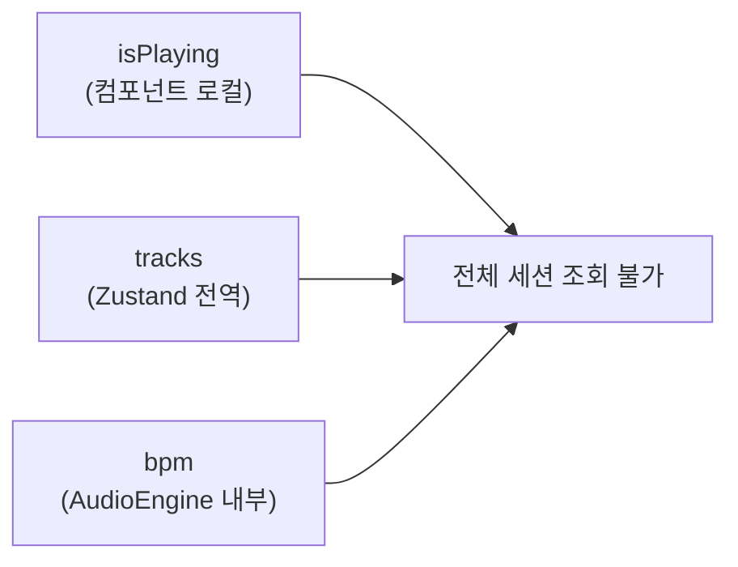

# Drop-AI 재구축 3편: 상태는 어디에, 어떤 모양으로 두어야 하는가

코드보다 타입을 먼저 쓴다는 게 처음에는 낯설게 느껴진다.  
하지만 상태 모델을 잘못 잡으면 이후 모든 계층이 그 모양에 종속된다.  
이번 편에서는 세션 모델을 어떤 이유로 지금 모양으로 결정했는지를 다룬다.

## 문제: 무엇이 문제였는가

상태를 대충 시작하면 이런 패턴이 반복된다.

- 재생 상태는 컴포넌트 로컬 `useState`에
- 트랙 목록은 전역 Zustand에
- BPM은 AudioEngine 내부에

세 곳에 흩어진 상태를 조합해야 "현재 세션이 어떤 상태인가"를 알 수 있다.  
WAV 내보내기나 CLI `status` 명령처럼 전체 세션을 읽어야 할 때 이 구조가 무너진다.

증상은 상태를 합치기 어렵다는 것이었다.  
원인은 상태의 출처가 여러 곳이라는 것이었다.



## 선택: 어떤 상태 구조를 검토했는가

| 방식 | 개념 | 문제 | 판단 |
| --- | --- | --- | --- |
| 컴포넌트 로컬 상태 분산 | 각 UI가 필요한 상태를 관리 | 전체 세션을 한 번에 읽을 수 없음 | 제외 |
| AudioEngine 안에 상태 포함 | 엔진이 상태와 오디오 처리를 동시에 담당 | UI가 엔진에 직접 의존, 테스트 불가 | 제외 |
| React 전용 상태 (useState/useReducer) | React 컴포넌트 트리 안에서 관리 | CLI UI는 React 밖에 있어서 공유 불가 | 제외 |
| Zustand Vanilla Store | React와 독립된 순수 JS 스토어 | 초기 설계 비용이 다소 있음 | 채택 |

결정적인 제약이 있었다.  
**CLI는 React 컴포넌트가 아니다.**  
React 상태(`useState`, `useReducer`)는 React 트리 안에서만 읽힌다.  
CLI `status` 명령이 같은 세션 상태를 읽으려면 React 바깥에서도 접근 가능한 스토어가 필요했다.

Zustand의 `createStore`(vanilla)는 React와 독립적이다.  
React에서는 `useStore`로 구독하고, CLI에서는 `store.getState()`로 직접 읽는다.  
이 하나의 이유로 Vanilla Store를 선택했다.

## 해결: 어떻게 모델을 설계했는가

### 1) 상태와 액션을 타입으로 먼저 분리한다

상태(데이터)와 액션(변경 함수)을 별도 인터페이스로 선언한다.

```typescript
// 상태 (읽기 전용 데이터)
interface SessionData {
  isPlaying: boolean;
  masterVolume: number;
  bpm: number;
  isLooping: boolean;
  loopStart: number;
  loopEnd: number;
  tracks: Map<string, TrackState>;
}

// 액션 (상태 변경 함수)
interface SessionActions {
  setPlaying: (playing: boolean) => void;
  setMasterVolume: (volume: number) => void;
  setBpm: (bpm: number) => void;
  setLoop: (isLooping: boolean) => void;
  setLoopPoints: (start: number, end: number) => void;
  addTrack: (track: TrackState) => void;
  updateTrack: (id: string, updates: Partial<TrackState>) => void;
  removeTrack: (id: string) => void;
  addRegion: (trackId: string, region: RegionState) => void;
  updateRegion: (trackId: string, regionId: string, updates: Partial<RegionState>) => void;
  removeRegion: (trackId: string, regionId: string) => void;
}
```

분리한 이유는 두 가지다.  
Controller 테스트에서 `SessionData`만 검사하면 되고, UI는 `SessionData`만 구독하면 된다.  
읽기와 쓰기 인터페이스가 섞여 있으면 테스트 코드가 불필요하게 커진다.

### 2) Track과 Region의 중첩 모델을 결정한다

`Track`이 `Region[]`을 가지는 구조를 선택했다.

```typescript
interface TrackState {
  id: string;
  name: string;
  volume: number;
  isMuted: boolean;
  isSoloed: boolean;
  pan: number;
  regions: RegionState[];
}

interface RegionState {
  id: string;
  trackId: string;
  src: string;       // Blob URL
  startTime: number; // 타임라인 위치 (초)
  duration: number;  // 리전 길이 (초)
  offset: number;    // 버퍼 내 시작 지점 (초)
}
```

`RegionState`에 `trackId`를 중복으로 저장하는 선택을 했다.  
`Track` 밖에서 리전을 단독으로 참조할 때 트랙 ID를 알아야 오디오 엔진에 명령할 수 있기 때문이다.

### 3) 트랙 컨테이너로 Map을 선택한다

배열 대신 `Map<string, TrackState>`를 선택했다.

| 컨테이너 | 조회 | 삽입/삭제 | 순서 | 판단 |
| --- | --- | --- | --- | --- |
| 배열 | O(n) | O(n) | 보장 | 제외 |
| Map | O(1) | O(1) | 삽입 순서 유지 | 채택 |

트랙 ID로 즉시 조회하는 패턴이 많아서 Map이 적합했다.  
Zustand에서 Map을 불변으로 업데이트할 때는 `new Map(state.tracks)` 패턴을 일관되게 사용한다.

### 4) 불변 업데이트를 일관된 패턴으로 고정한다

리전 추가 액션을 예시로 보면:

```typescript
addRegion: (trackId, region) =>
  set(state => {
    const track = state.tracks.get(trackId);
    if (!track) return state; // 트랙이 없으면 상태 유지

    const newTracks = new Map(state.tracks);
    newTracks.set(trackId, {
      ...track,
      regions: [...track.regions, region],
    });
    return { tracks: newTracks };
  }),
```

트랙이 없을 때 `state`를 그대로 반환하는 패턴을 모든 액션에 적용했다.  
예외를 던지지 않고 조용히 무시하는 이유는 Controller 레이어가 이미 유효성을 검증하기 때문이다.  
Session은 상태 저장소 역할만 한다.

## 결과: 실제로 어떻게 달라졌는가

| 항목 | 설계 전 | 설계 후 |
| --- | --- | --- |
| 전체 세션 조회 | 여러 출처를 합쳐야 함 | `store.getState()` 한 번 |
| CLI/Web 공유 | 불가능 | 동일 스토어 인스턴스 공유 |
| 상태 변경 경로 | 불명확 | 액션을 통해서만 변경 |
| 테스트 검증 | UI 의존 | 순수 JS로 단위 테스트 가능 |

단위 테스트 예시:

```typescript
it('addTrack이 트랙을 추가한다', () => {
  const store = createSessionStore();
  store.getState().addTrack({ id: 'track-1', name: 'Track 1', volume: 1, isMuted: false, isSoloed: false, pan: 0, regions: [] });

  const { tracks } = store.getState();
  expect(tracks.size).toBe(1);
  expect(tracks.get('track-1')?.name).toBe('Track 1');
});
```

React 없이 순수 JS로 세션 액션을 검증할 수 있다.

남은 과제가 있다.  
Session은 현재 유효성 검증을 하지 않는다.  
볼륨 범위 초과, 중복 트랙 ID 같은 검증은 Controller에서 해야 하는데, 그 경계를 다음 편에서 다룬다.

## 마무리

상태 모델은 이후 모든 계층이 의존하는 기반이다.  
"일단 만들고 나중에 고치자"는 전략이 통하지 않는 몇 안 되는 지점이다.  
Vanilla Store로 분리한 덕분에 CLI와 Web이 동일한 상태를 공유할 수 있었다.

다음 편에서는 오디오 엔진을 인터페이스로 먼저 설계하고, Mock으로 Controller를 테스트하는 방법을 다룬다.

## FAQ

### Q1. Map 대신 객체(`Record<string, TrackState>`)를 쓰면 안 되나?

쓸 수 있다. 다만 Map은 삽입 순서를 보장하고, 순회 시 `forEach`/`entries()`를 그대로 쓸 수 있다.  
JSON 직렬화가 필요한 시점에 `Object.fromEntries(map)`으로 변환하면 된다.

### Q2. Region을 Track 밖에서 별도로 관리하는 플랫 구조는 왜 검토하지 않았나?

검토했다. 플랫 구조는 리전을 트랙 간 이동시킬 때 유리하다.  
그러나 현재 MVP에는 트랙 간 이동이 없다.  
중첩 구조가 단순하고, 트랙 하나를 렌더링할 때 별도 조인이 필요 없다.

### Q3. Zustand 대신 Jotai나 Redux를 쓰면?

Vanilla Store 개념이 있는 상태 관리 라이브러리면 같은 패턴을 적용할 수 있다.  
핵심은 React 바깥에서 `.getState()`로 상태를 읽을 수 있어야 한다는 것이다.
