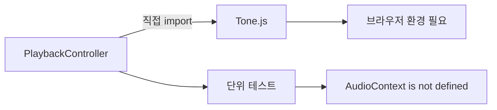

# Drop-AI 재구축 4편: 구현보다 계약을 먼저 만든 이유

Controller를 만들다 보면 자연스럽게 `Tone.js`를 바로 import하게 된다.  
그렇게 하면 Controller 테스트가 브라우저 환경에 묶인다.  
Web Audio는 브라우저 없이 실행되지 않기 때문이다.

## 문제: 무엇이 문제였는가

Controller가 `Tone.js`를 직접 참조하면 두 가지 문제가 생긴다.

첫째, 단위 테스트를 Node.js(jsdom)에서 실행하면 `AudioContext is not defined` 에러가 발생한다.  
둘째, 오디오 엔진을 교체하거나 테스트용 구현으로 바꾸려면 Controller 코드를 직접 수정해야 한다.



증상은 테스트가 터진다는 것이었다.  
원인은 Controller가 구체 구현에 의존한다는 것이었다.

## 선택: 어떻게 의존성을 끊을 것인가

| 방식 | 개념 | 단점 | 판단 |
| --- | --- | --- | --- |
| jsdom에 AudioContext mock 주입 | 전역 객체를 테스트 환경에서 덮어씀 | 설정이 복잡하고, Tone.js 내부까지 모킹해야 함 | 제외 |
| 테스트 환경에서 import를 조건부로 처리 | `if (process.env.NODE_ENV !== 'test')` | Controller 코드에 테스트 관심사가 침투 | 제외 |
| IAudioEngine 인터페이스로 추상화 | Controller는 인터페이스만 알고, 구현체는 주입 받음 | 초기에 인터페이스 설계 비용 필요 | 채택 |

선택 기준은 하나였다.  
**Controller 코드에 테스트를 위한 분기가 없어야 한다.**  
테스트를 위해 프로덕션 코드를 수정하는 것은 설계 문제의 신호다.

인터페이스를 쓰면 테스트에서는 Mock을, 프로덕션에서는 Tone.js 구현체를 주입한다.  
Controller는 어떤 구현이 들어오는지 알 필요가 없다.

## 해결: 어떻게 인터페이스를 설계했는가

### 1) 기능 축으로 메서드를 분류한다

무작정 모든 메서드를 나열하면 나중에 인터페이스가 너무 커진다.  
기능 축으로 묶어서 명세한다.

```typescript
export interface IAudioEngine {
  // Playback
  play(): Promise<void>;
  stop(): void;
  pause(): void;
  seekTo(time: number): void;
  getCurrentTime(): number;

  // Track / Region
  loadFile(file: File): Promise<{ src: string; duration: number }>;
  createTrack(id: string): void;
  addRegion(trackId: string, region: RegionState): void;
  removeRegion(trackId: string, regionId: string): void;
  moveRegion(trackId: string, regionId: string, newStartTime: number): void;
  removeTrack(id: string): void;

  // Mixer
  setTrackVolume(id: string, volume: number): void;
  setTrackMute(id: string, muted: boolean): void;
  setTrackSolo(id: string, soloed: boolean): void;
  setTrackPan(id: string, pan: number): void;

  // Transport
  setBpm(bpm: number): void;
  setVolume(value: number): void;
  setLoop(loop: boolean): void;
  setLoopPoints(start: number, end: number): void;

  // Export / Debug
  exportSession(duration: number, tracks: Map<string, TrackExportData>): Promise<Blob>;
  getDebugInfo(): string;
}
```

`play()`가 `Promise<void>`인 이유는 브라우저 정책 때문이다.  
Web Audio는 사용자 제스처 이후 첫 `resume()`이 비동기로 완료된다.  
Controller가 이 비동기를 처리하려면 인터페이스 레벨에서 `async`를 표현해야 한다.

### 2) Mock 구현을 먼저 만든다

인터페이스를 정의했으면 테스트용 Mock을 바로 만든다.  
Mock은 메서드 호출 여부와 인자를 기록한다.

```typescript
export class MockAudioEngine implements IAudioEngine {
  public calls: { method: string; args: unknown[] }[] = [];

  private record(method: string, args: unknown[]) {
    this.calls.push({ method, args });
  }

  async play(): Promise<void> { this.record('play', []); }
  stop(): void { this.record('stop', []); }
  pause(): void { this.record('pause', []); }
  seekTo(time: number): void { this.record('seekTo', [time]); }
  getCurrentTime(): number { return 0; }
  async loadFile(file: File) { this.record('loadFile', [file]); return { src: 'mock://url', duration: 10 }; }
  createTrack(id: string): void { this.record('createTrack', [id]); }
  addRegion(trackId: string, region: RegionState): void { this.record('addRegion', [trackId, region]); }
  removeRegion(trackId: string, regionId: string): void { this.record('removeRegion', [trackId, regionId]); }
  moveRegion(trackId: string, regionId: string, newStartTime: number): void { this.record('moveRegion', [trackId, regionId, newStartTime]); }
  removeTrack(id: string): void { this.record('removeTrack', [id]); }
  setTrackVolume(id: string, volume: number): void { this.record('setTrackVolume', [id, volume]); }
  setTrackMute(id: string, muted: boolean): void { this.record('setTrackMute', [id, muted]); }
  setTrackSolo(id: string, soloed: boolean): void { this.record('setTrackSolo', [id, soloed]); }
  setTrackPan(id: string, pan: number): void { this.record('setTrackPan', [id, pan]); }
  setBpm(bpm: number): void { this.record('setBpm', [bpm]); }
  setVolume(value: number): void { this.record('setVolume', [value]); }
  setLoop(loop: boolean): void { this.record('setLoop', [loop]); }
  setLoopPoints(start: number, end: number): void { this.record('setLoopPoints', [start, end]); }
  async exportSession(): Promise<Blob> { return new Blob(); }
  getDebugInfo(): string { return 'mock'; }
}
```

### 3) Mock으로 인터페이스 계약을 검증한다

Mock을 만든 시점에서 인터페이스가 실제로 테스트 가능한지 확인한다.

```typescript
it('play를 호출하면 AudioEngine의 play가 실행된다', async () => {
  const engine = new MockAudioEngine();
  const session = createSessionStore();
  const controller = new PlaybackController(session, engine);

  await controller.handlePlay();

  expect(engine.calls[0].method).toBe('play');
});
```

이 테스트가 통과하면 인터페이스 설계가 Controller와 계약이 맞다는 증거가 된다.

### 4) Tone.js 구현체는 인터페이스를 구현하는 방식으로 작성한다

```typescript
export class AudioEngine implements IAudioEngine {
  async play(): Promise<void> {
    if (Tone.getTransport().state !== 'started') {
      Tone.getTransport().start();
    }
  }
  // ... 이후 구현
}
```

Controller 입장에서는 `MockAudioEngine`과 `AudioEngine` 모두 `IAudioEngine`이다.  
어떤 것이 주입되든 Controller는 동일하게 동작한다.

## 결과: 실제로 어떻게 달라졌는가

| 항목 | 인터페이스 전 | 인터페이스 후 |
| --- | --- | --- |
| 테스트 환경 | 브라우저 전용 | Node.js(jsdom)에서 실행 가능 |
| 엔진 교체 | Controller 코드 수정 필요 | 주입 지점만 교체 |
| 테스트 속도 | 오디오 처리 시간 포함 | 즉시 실행 |
| Controller 코드 오염 | 테스트용 분기 필요 | 없음 |

인터페이스 설계 비용은 초기 1시간 정도였다.  
그 대신 이후 모든 Controller 테스트가 브라우저 없이 실행된다.

한 가지 한계는 있다.  
Mock은 실제 Tone.js 동작과 다르게 작동할 수 있다.  
Mock 테스트는 "Controller 로직이 맞는가"를 검증하고, 실제 오디오 동작은 E2E로 검증한다.

## 마무리

인터페이스를 먼저 만드는 것은 테스트를 위한 것이기도 하지만,  
그보다 먼저 "무엇을 기대하는가"를 명확히 만드는 과정이다.  
구현에 앞서 계약을 고정하면 나중에 구현이 계약을 이탈할 때 즉시 발견된다.

다음 편에서는 이 인터페이스와 Session을 조합해서 PlaybackController를 구현한다.

## FAQ

### Q1. Mock이 실제 구현과 다르게 작동하면 테스트가 무의미하지 않나?

Mock 테스트는 Controller 로직(순서, 상태 반영)을 검증한다.  
AudioEngine이 실제로 소리를 내는지는 E2E 테스트 또는 통합 테스트로 검증한다.  
두 테스트의 역할이 다르다.

### Q2. Tone.js를 직접 참조해도 Vitest의 mock 기능으로 처리할 수 있지 않나?

가능하다. 하지만 Tone.js의 전체 API를 모킹하는 것은 유지 비용이 크다.  
인터페이스를 두면 모킹 대상이 훨씬 좁아진다.

### Q3. 인터페이스에 없는 기능이 나중에 필요하면?

인터페이스에 메서드를 추가하고 모든 구현체에 반영한다.  
TypeScript 컴파일러가 누락된 구현체를 즉시 에러로 알려준다.
