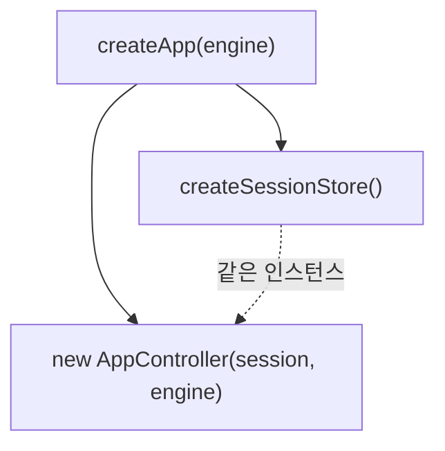
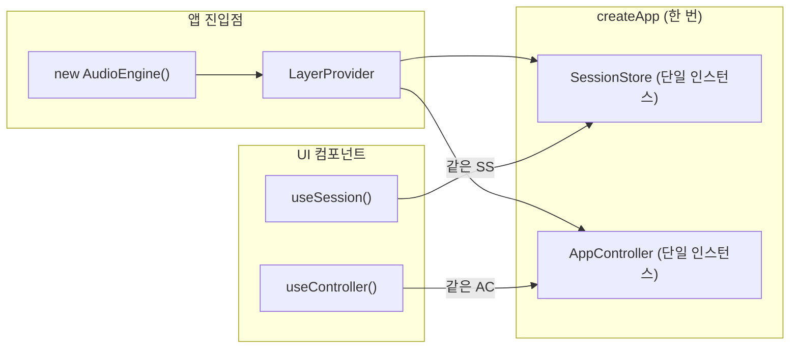

# Drop-AI 재구축 7편: 조립은 한 곳에서만 — createApp과 LayerProvider

Session, Controller, AudioEngine을 각각 만들었다.  
이제 문제는 이것들을 어떻게 연결하느냐다.  
"연결"을 여러 곳에서 하면 인스턴스가 달라지는 버그가 생긴다.

## 문제: 무엇이 문제였는가

조립 코드가 여러 곳에 흩어지면 이런 상황이 생긴다.

```typescript
// App.tsx
const session = createSessionStore();
const controller = new AppController(session, engine);

// SomeOtherComponent.tsx
const anotherSession = createSessionStore(); // 다른 인스턴스!
```

Web 컴포넌트가 읽는 세션과 Controller가 쓰는 세션이 다른 인스턴스다.  
Controller가 `setPlaying(true)`를 호출해도 UI가 변하지 않는다.

이건 가상의 예시가 아니다.  
초기 구현에서 정확히 이 버그가 있었다.  
재생 버튼을 눌러도 UI 상태가 업데이트되지 않았고, 원인을 찾는 데 시간이 걸렸다.

증상은 상태가 바뀌지 않는다는 것이었다.  
원인은 Controller와 UI가 다른 스토어 인스턴스를 참조하고 있었다는 것이었다.

## 선택: 어떻게 인스턴스를 공유할 것인가

| 방식 | 개념 | 문제 | 판단 |
| --- | --- | --- | --- |
| 모듈 싱글턴 | 파일 최상위에서 인스턴스 생성 | 테스트 간 상태가 오염됨, 격리 불가 | 제외 |
| React Context에서 각자 생성 | 컴포넌트별로 store/controller 생성 | 인스턴스가 달라질 수 있음 | 제외 |
| `createApp` 팩토리 + Provider 주입 | 한 곳에서 조립, Context로 배포 | 없음 | 채택 |

결정적인 이유는 **테스트 격리** 때문이었다.  
모듈 싱글턴은 테스트 케이스가 같은 인스턴스를 공유해서 상태가 오염된다.  
`createApp`을 테스트마다 새로 호출하면 완벽하게 격리된 환경을 만들 수 있다.

## 해결: 어떻게 조립했는가

### 1) createApp이 전체 객체 그래프를 만든다

```typescript
export function createApp(audioEngine: IAudioEngine): AppInstance {
  const session = createSessionStore();
  const controller = new AppController(session, audioEngine);
  return { session, controller };
}
```

이 함수가 Composition Root다.  
`session`과 `controller`는 반드시 같은 `createApp` 호출에서 만들어진 것이어야 한다.  
`session`이 `controller` 생성자에 주입되어 두 객체가 같은 인스턴스를 참조한다.



### 2) LayerProvider가 React 트리에 인스턴스를 배포한다

```typescript
export const LayerProvider: React.FC<LayerProviderProps> = ({ engine, children }) => {
  const value = useMemo(() => createApp(engine), [engine]);

  return (
    <LayerContext.Provider value={value}>
      {children}
    </LayerContext.Provider>
  );
};
```

`useMemo`로 `engine`이 바뀌지 않는 한 `createApp`이 한 번만 실행된다.  
앱 전체가 동일한 `session`과 `controller` 인스턴스를 공유한다.

### 3) 읽기와 쓰기 훅을 분리한다

Context에서 두 가지 경로를 명확히 분리한다.

```typescript
// 쓰기: Controller에 액션 위임
export function useController(): AppController {
  return useLayer().controller;
}

// 읽기: Session 상태 구독 (Zustand Vanilla → React 브릿지)
export function useSession<T>(selector: (state: SessionData) => T): T {
  const { session } = useLayer();
  return useStore(session, selector);
}
```

`useStore`는 Zustand Vanilla Store를 React 리렌더 사이클에 연결한다.  
`selector`로 필요한 상태만 구독하면 불필요한 리렌더를 막을 수 있다.

### 4) 진입점에서 engine을 주입한다

```typescript
// main.tsx / App.tsx
function App() {
  const audioEngine = useMemo(() => new AudioEngine(), []);

  return (
    <LayerProvider engine={audioEngine}>
      <AppRouter />
    </LayerProvider>
  );
}
```

`AudioEngine` 인스턴스는 앱 최상위에서 한 번 만든다.  
`useMemo`로 리렌더 시 재생성을 막는다.  
테스트에서는 `AudioEngine` 대신 `MockAudioEngine`을 주입한다.

```typescript
// 통합 테스트
const engine = new MockAudioEngine();
render(
  <LayerProvider engine={engine}>
    <WebDAW />
  </LayerProvider>
);
```

## 결과: 인스턴스 공유가 보장된다



조립 전후 비교:

| 항목 | 조립 전 | 조립 후 |
| --- | --- | --- |
| 인스턴스 공유 보장 | 없음 (버그 발생) | createApp이 보장 |
| 테스트 격리 | 모듈 싱글턴으로 오염 가능 | createApp 재호출로 완전 격리 |
| 엔진 교체 | 코드 수정 필요 | 주입 지점만 변경 |
| 읽기/쓰기 경로 | 명확하지 않음 | useSession / useController로 분리 |

## 마무리

조립 지점을 한 곳(`createApp`)으로 고정하고 React Context로 배포한 덕분에  
어디서 `useController()`를 호출해도 동일한 인스턴스에 접근한다.  
이 보장 없이는 이전 편에서 만든 Controller와 Session이 제대로 연결되지 않는다.

다음 편에서는 이 Context를 실제 Web UI(Transport, TrackList)에 연결한다.

## FAQ

### Q1. Context 대신 전역 변수로 인스턴스를 공유하면 안 되나?

가능하다. 하지만 전역 변수는 테스트 간 격리가 어렵고, 모듈 로드 시점에 생성되어 진입점에서 제어가 안 된다.  
Context + createApp 패턴은 React 생명주기 안에서 관리된다.

### Q2. engine을 매번 useMemo로 감싸야 하나?

`AudioEngine`은 내부에 Tone.js 상태를 갖는다.  
리렌더 시 재생성되면 기존 오디오 컨텍스트가 사라진다.  
`useMemo`로 한 번만 생성되도록 보장해야 한다.

### Q3. SSR 환경에서 사용 가능한가?

`AudioEngine`은 `window.AudioContext`를 사용하므로 서버에서 실행되면 에러가 발생한다.  
SSR이 필요하다면 서버에서는 `AudioEngine` 생성을 지연하거나 dummy 구현체를 주입해야 한다.
