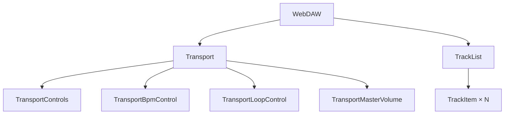

# Drop-AI 재구축 8편: Web UI — useSession과 useController로 화면을 연결하는 방법

도메인 로직이 다 만들어졌다.  
이제 UI 컴포넌트에서 두 훅만 쓰면 된다.  
어디서 읽고, 어디서 쓰는지가 명확하면 컴포넌트는 단순해진다.

## 문제: 무엇이 문제였는가

도메인 레이어가 완성된 상태에서 UI를 붙일 때 흔히 나오는 실수가 있다.

```typescript
// 버튼 안에서 직접 상태도 바꾸고, 엔진도 호출한다
const handlePlay = () => {
  setIsPlaying(true);               // 로컬 상태
  controller.playback.handlePlay(); // Controller
};
```

`isPlaying`이 두 곳에 있다.  
로컬 `useState`와 `SessionStore` 중 어느 것이 진실 출처인지 혼란이 생긴다.  
재생 중에 페이지를 이동하거나 CLI에서 정지하면 두 상태가 엇갈린다.

증상은 UI 상태와 실제 재생 상태가 다르다는 것이었다.  
원인은 상태 출처가 두 개였다는 것이었다.

## 선택: UI에서 상태를 어떻게 관리하는가

| 방식 | 개념 | 문제 | 판단 |
| --- | --- | --- | --- |
| 컴포넌트 로컬 상태 | `useState`로 각자 관리 | SessionStore와 동기화 문제 발생 | 제외 |
| Controller 호출 + 로컬 상태 동기화 | 둘 다 갱신 | 상태 출처가 두 개 | 제외 |
| SessionStore만 구독, 쓰기는 Controller | `useSession` 읽기 + `useController` 쓰기 | 없음 | 채택 |

선택 기준은 하나였다.  
**UI 컴포넌트에는 도메인 상태가 없어야 한다.**  
UI는 SessionStore를 구독해서 그릴 뿐이고, 변경은 Controller에 위임한다.

## 해결: 어떻게 컴포넌트를 만들었는가

### 1) Transport: 재생 제어 컴포넌트

Transport는 Play/Stop/Pause, BPM, 루프, 마스터 볼륨을 담는다.

```typescript
export const TransportControls = () => {
  const controller = useController();
  const isPlaying = useSession(state => state.isPlaying);

  return (
    <div>
      <button onClick={() => controller.playback.handlePlay()} disabled={isPlaying}>
        Play
      </button>
      <button onClick={() => controller.playback.handleStop()}>
        Stop
      </button>
      <button onClick={() => controller.playback.handlePause()} disabled={!isPlaying}>
        Pause
      </button>
    </div>
  );
};
```

`isPlaying`은 `useSession`으로 읽는다.  
버튼 클릭은 `useController()`를 통해 Controller에 위임한다.  
컴포넌트에는 로컬 상태가 없다.

BPM 입력은 키 입력마다 Controller를 호출하면 Tone.js 내부에서 과도한 업데이트가 발생한다.  
debounce를 적용한 입력 컴포넌트로 감싼다.

```typescript
export const TransportBpmControl = () => {
  const controller = useController();
  const bpm = useSession(state => state.bpm);

  return (
    <div>
      <label>BPM</label>
      <DebouncedInput
        value={bpm}
        onChange={val => {
          const num = parseFloat(String(val));
          if (!isNaN(num) && num > 0) controller.playback.handleBpm(num);
        }}
        debounce={500}
      />
    </div>
  );
};
```

### 2) 루프 컨트롤은 조건부 렌더링으로 구간 입력을 드러낸다

루프가 꺼져 있을 때는 구간 입력을 숨긴다.  
켜지면 구간이 나타나고, 입력 변경이 즉시 Controller에 반영된다.

```typescript
export const TransportLoopControl = () => {
  const controller = useController();
  const { isLooping, loopStart, loopEnd } = useSession(
    useShallow(state => ({
      isLooping: state.isLooping,
      loopStart: state.loopStart,
      loopEnd: state.loopEnd,
    }))
  );

  return (
    <div>
      <button onClick={() => controller.playback.handleLoop(loopStart, loopEnd, !isLooping)}>
        Loop {isLooping ? 'ON' : 'OFF'}
      </button>
      {isLooping && (
        <>
          <DebouncedInput
            value={loopStart}
            onChange={val => {
              const start = parseFloat(String(val));
              if (!isNaN(start) && start < loopEnd) {
                controller.playback.handleLoop(start, loopEnd, true);
              }
            }}
          />
          <DebouncedInput
            value={loopEnd}
            onChange={val => {
              const end = parseFloat(String(val));
              if (!isNaN(end) && loopStart < end) {
                controller.playback.handleLoop(loopStart, end, true);
              }
            }}
          />
        </>
      )}
    </div>
  );
};
```

`useShallow`를 쓰는 이유는 객체를 selector로 반환할 때 얕은 비교로 불필요한 리렌더를 막기 위해서다.

### 3) TrackList: 트랙 추가 버튼 + 트랙 목록

```typescript
export const TrackList = () => {
  const controller = useController();
  const tracks = useSession(state => state.tracks);
  const trackList = Array.from(tracks.values());

  return (
    <div>
      <header>
        <span>Tracks ({tracks.size})</span>
        <button onClick={() => controller.track.addTrack()}>+ Add Track</button>
      </header>
      {trackList.map(track => (
        <TrackItem key={track.id} track={track} />
      ))}
    </div>
  );
};
```

`tracks`는 `Map`이기 때문에 `Array.from`으로 변환해서 `map`을 쓴다.  
`Map` 자체를 의존성에 넣으면 새 Map이 생성될 때마다 리렌더가 발생한다.

### 4) TrackItem: 트랙 하나의 믹서 컨트롤

```typescript
export const TrackItem = ({ track }: { track: TrackState }) => {
  const controller = useController();

  return (
    <div>
      <strong>{track.name}</strong>

      <input
        type="range" min="0" max="1" step="0.05"
        value={track.volume}
        onChange={e => controller.track.setTrackVolume(track.id, parseFloat(e.target.value))}
      />

      <input
        type="range" min="-1" max="1" step="0.1"
        value={track.pan}
        onChange={e => controller.track.setTrackPan(track.id, parseFloat(e.target.value))}
      />

      <button onClick={() => controller.track.setTrackMute(track.id, !track.isMuted)}>
        {track.isMuted ? 'M(ON)' : 'M'}
      </button>

      <button onClick={() => controller.track.setTrackSolo(track.id, !track.isSoloed)}>
        {track.isSoloed ? 'S(ON)' : 'S'}
      </button>

      <button onClick={() => controller.track.removeTrack(track.id)}>X</button>
    </div>
  );
};
```

`TrackItem`은 `track` prop으로 현재 상태를 받는다.  
컴포넌트 내부에서 `useSession`을 직접 호출하지 않는다.  
부모인 `TrackList`가 전체 트랙 목록을 구독하고, 각 트랙 데이터를 prop으로 내려준다.

## 결과: 컴포넌트 단위 테스트

컴포넌트가 Controller에만 의존하기 때문에 통합 테스트가 간단해진다.

```typescript
it('Play 버튼을 클릭하면 handlePlay가 호출된다', async () => {
  const engine = new MockAudioEngine();
  render(
    <LayerProvider engine={engine}>
      <TransportControls />
    </LayerProvider>
  );

  await userEvent.click(screen.getByText('Play'));

  expect(engine.calls[0].method).toBe('play');
});
```

Mock 엔진을 주입하면 실제 오디오 없이 UI 동작을 검증할 수 있다.

컴포넌트 구조 정리:



타임라인 영역은 현재 Placeholder 상태다.  
Arrangement View는 다음 시리즈에서 별도로 다룬다.

## 마무리

컴포넌트에서 로컬 상태를 없애고 `useSession` / `useController`만 쓰면  
상태 출처가 하나로 고정된다.  
CLI에서 재생을 멈춰도 Web UI가 바뀌는 것은 둘 다 같은 SessionStore를 구독하기 때문이다.

다음 편에서는 동일한 Controller를 CLI UI에서 재사용하는 방법을 다룬다.

## FAQ

### Q1. DebouncedInput은 왜 필요한가?

BPM 입력 필드에서 매 키 입력마다 `setBpm`을 호출하면 Tone.js 내부에서 오디오 스케줄이 과도하게 재계산된다.  
500ms debounce를 적용하면 타이핑이 멈춘 시점에 한 번만 호출된다.

### Q2. `useShallow`를 왜 쓰나?

`useSession`에서 객체를 반환하면 매 렌더마다 새 객체가 생성되어 불필요한 리렌더가 발생한다.  
`useShallow`는 얕은 비교(shallow equal)를 적용해서 내부 값이 바뀌지 않으면 리렌더를 건너뛴다.

### Q3. TrackItem에서 useSession을 직접 쓰지 않는 이유는?

개별 트랙 상태는 부모(`TrackList`)가 구독하는 `tracks` Map 안에 있다.  
TrackItem에서 개별로 구독하면 구독 수가 트랙 수만큼 늘어난다.  
부모가 전체를 구독하고 prop으로 내려주는 것이 더 단순하다.
