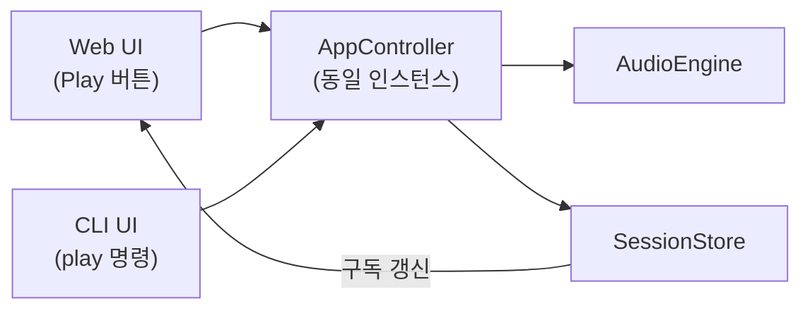

# Drop-AI 재구축 9편: CLI UI — 같은 Controller, 다른 인터페이스

Web UI를 만들고 나면 하나의 질문이 생긴다.  
"도메인 로직이 진짜로 UI에 독립적인가?"  
CLI에서 같은 Controller를 쓸 수 있다면 그 답이 증명된다.

## 문제: 무엇이 문제였는가

CLI를 구현할 때 첫 번째 충동은 Web UI 핸들러 코드를 복붙하는 것이다.

```typescript
// Web UI
const handlePlay = async () => {
  await Tone.getTransport().start();
  setIsPlaying(true);
};

// CLI — 복붙 버전
const cliPlay = async () => {
  await Tone.getTransport().start(); // 중복!
  // 상태는 어디에?
};
```

Tone.js 호출이 두 곳에 생긴다.  
CLI에서 재생해도 Web UI 상태가 업데이트되지 않는다.

이건 단순한 중복 코드 문제가 아니다.  
CLI와 Web이 독립적으로 동작하면 같은 세션을 공유할 수 없다.

## 선택: CLI를 어떻게 설계할 것인가

| 방식 | 개념 | 문제 | 판단 |
| --- | --- | --- | --- |
| CLI 전용 로직 구현 | Tone.js를 CLI에서 직접 호출 | 중복 로직, Web과 상태 분리 | 제외 |
| Controller 복사 후 CLI 버전 생성 | 별도 CLI Controller 만들기 | 유지보수 비용 2배 | 제외 |
| 동일 Controller 재사용 | Web과 동일한 AppController 사용 | 없음 | 채택 |

판단 기준은 이 시리즈 처음부터 설정한 제약 조건이었다.  
**Web UI와 CLI가 동일 로직을 공유해야 한다.**  
이 편이 그 제약을 실제로 만족하는지 증명하는 자리다.

## 해결: CLI가 Controller를 어떻게 사용하는가

### 1) createCliCommands가 Controller를 받아서 명령 맵을 만든다

CLI 명령은 Controller 메서드로 1:1 매핑된다.

```typescript
export const createCliCommands = ({ controller }: { controller: AppController }) => ({
  play: {
    description: 'Start audio playback',
    usage: 'play',
    fn: async () => {
      await controller.playback.handlePlay();
      return 'Playback started...';
    },
  },
  stop: {
    description: 'Stop audio playback',
    usage: 'stop',
    fn: () => {
      controller.playback.handleStop();
      return 'Playback stopped.';
    },
  },
  bpm: {
    description: 'Set BPM',
    usage: 'bpm <value>',
    fn: (value: string) => {
      const bpm = parseFloat(value);
      if (isNaN(bpm) || bpm <= 0) return 'Error: BPM must be a positive number.';
      controller.playback.handleBpm(bpm);
      return `BPM set to ${bpm}`;
    },
  },
  // ...
});
```

CLI 레이어의 역할은 두 가지다.  
1. 문자열 입력을 파싱하고 유효성 검증
2. Controller 메서드 호출 후 문자열 응답 반환

Web UI와의 차이는 "어떻게 표현하는가"뿐이다.  
도메인 로직은 Controller 안에 있다.

### 2) status 명령은 세션 전체를 읽어 출력한다

```typescript
status: {
  fn: () => {
    const { isPlaying, tracks, bpm, isLooping, loopStart, loopEnd } =
      controller.session.getState();

    const currentTime = controller.playback.getCurrentTime();

    let output = `Status: ${isPlaying ? 'Playing' : 'Stopped'}\n`;
    output += `Time: ${currentTime.toFixed(2)}s\n`;
    output += `BPM: ${bpm}\n`;
    output += `Loop: ${isLooping ? `ON (${loopStart}s - ${loopEnd}s)` : 'OFF'}\n`;
    output += `Tracks: ${tracks.size}\n`;

    tracks.forEach(track => {
      output += `\n  [${track.id.slice(0, 8)}] ${track.name}`;
      output += ` Vol:${track.volume.toFixed(1)} Pan:${track.pan.toFixed(1)}`;
      output += ` ${track.isMuted ? 'MUTED' : ''} ${track.isSoloed ? 'SOLO' : ''}`;
      track.regions.forEach(r => {
        output += `\n    - region [${r.id.slice(0, 8)}] ${r.startTime.toFixed(1)}s dur:${r.duration.toFixed(1)}s`;
      });
    });

    return output.trim();
  },
},
```

`controller.session.getState()`로 SessionStore에 직접 접근한다.  
Web UI가 `useSession`으로 구독하는 것과 동일한 데이터를 CLI는 직접 읽는다.

### 3) upload 명령은 브라우저 File API를 사용한다

CLI도 브라우저에서 실행되기 때문에 파일 업로드가 가능하다.

```typescript
upload: {
  fn: (trackId?: string) => {
    return new Promise<string>(resolve => {
      const input = document.createElement('input');
      input.type = 'file';
      input.accept = 'audio/*';

      input.onchange = async e => {
        const file = (e.target as HTMLInputElement).files?.[0];
        if (!file) { resolve('Upload cancelled'); return; }

        let targetTrackId = trackId;
        if (!targetTrackId) {
          const { id } = await controller.track.addTrack();
          targetTrackId = id;
        }

        const { regionId } = await controller.track.addRegion(targetTrackId, file, 0);
        resolve(`Added region ${regionId} to track ${targetTrackId}`);
      };

      document.body.appendChild(input);
      input.click();
    });
  },
},
```

CLI가 Web 환경에서 동작하기 때문에 이 패턴이 성립한다.  
순수 Node.js CLI라면 파일 경로를 받아서 `fs.readFile`로 처리해야 한다.

### 4) CliTerminal이 xterm.js를 사용해서 터미널 UI를 렌더링한다

```typescript
export const CliTerminal = () => {
  const { commands } = useCliApp();
  const termRef = useRef<HTMLDivElement>(null);

  useEffect(() => {
    const term = new Terminal({ cursorBlink: true, theme: { background: '#1e1e1e', foreground: '#33ff33' } });
    const fitAddon = new FitAddon();
    term.loadAddon(fitAddon);
    term.open(termRef.current!);
    fitAddon.fit();

    term.write('Welcome to Drop-AI CLI\r\n');
    term.write('drop-ai > ');

    term.onData(async data => {
      if (data === '\r') {
        const output = await executeCommand(inputBuffer, commands);
        term.write(`\r\n${output}\r\ndrop-ai > `);
        inputBuffer = '';
      } else if (data === '\u007F') {
        // Backspace
        if (inputBuffer.length > 0) {
          inputBuffer = inputBuffer.slice(0, -1);
          term.write('\b \b');
        }
      } else {
        inputBuffer += data;
        term.write(data);
      }
    });
  }, []);

  return <div ref={termRef} style={{ width: '100%', height: '100%' }} />;
};
```

## 결과: 동일 Controller 재사용이 증명된다

CLI에서 `play`를 입력하면 Web UI의 Play 버튼을 누른 것과 같은 결과가 나온다.



CLI에서 트랙을 추가하면 Web TrackList에 즉시 반영된다.  
Web에서 BPM을 바꾸면 CLI `status`에서 바뀐 BPM이 보인다.

| 항목 | CLI 이전 | CLI 이후 |
| --- | --- | --- |
| 도메인 로직 위치 | Web UI에 종속 가능성 | Controller에만 존재 증명 |
| 상태 동기화 | Web/CLI 독립 | 동일 SessionStore 공유 확인 |
| 재사용성 검증 | 가정 | 실제 동작으로 검증 |

## 마무리

CLI가 Web과 동일한 Controller를 쓴다는 것은 단순히 코드 재사용 이상의 의미다.  
"UI가 바뀌어도 도메인 로직은 바뀌지 않는다"는 아키텍처 원칙이 실제로 성립한다는 증거다.  
이 시리즈 1편에서 정한 레이어 규칙이 여기서 검증된다.

다음 편에서는 세션을 WAV 파일로 내보내는 방법과 전체 시리즈 품질 검증을 다룬다.

## FAQ

### Q1. CLI와 Web이 같은 페이지에 있는가?

현재 라우팅 구조에서 `/`는 CLI 화면, `/web-daw`는 Web DAW 화면이다.  
`LayerProvider`가 앱 최상위에 있어서 라우트가 달라도 동일한 세션 인스턴스를 공유한다.

### Q2. 순수 Node.js에서 CLI를 만들 수 있나?

Vanilla SessionStore는 Node.js에서도 동작한다.  
AudioEngine은 Web Audio 의존이 있어서 브라우저 전용이다.  
Node.js 환경에서는 Mock 엔진 또는 다른 오디오 처리 라이브러리로 교체해야 한다.

### Q3. xterm.js 없이 CLI를 만들 수 있나?

가능하다. xterm.js는 브라우저에서 터미널 UX를 제공하는 라이브러리다.  
단순한 input/output만 필요하다면 `<input>` 태그로 대체할 수 있다.
