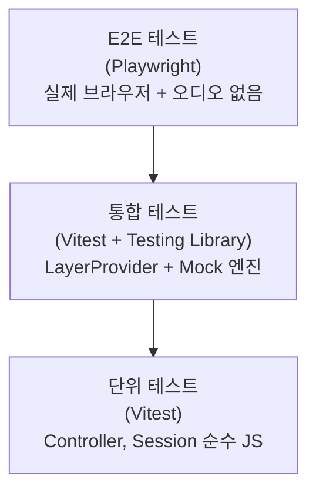
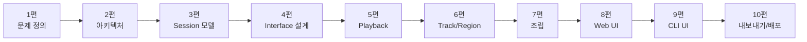

# Drop-AI 재구축 10편: 내보내기, 테스트 전략, 배포

마지막 편이다.  
WAV 내보내기를 완성하고, 전체 테스트 전략을 정리하고, 배포까지 연결한다.  
이 세 가지를 마치면 "실제로 배포 가능한 MVP"가 된다.

## 문제: 무엇이 문제였는가

마지막 단계에서 두 가지 질문이 남았다.

**1. 어떻게 현재 세션의 오디오를 파일로 내보내는가?**  
Web Audio는 실시간으로 소리를 낸다. 그 결과물을 파일로 저장하려면 별도의 렌더링 과정이 필요하다.

**2. "이게 잘 동작한다"는 것을 어떻게 확인하는가?**  
단위 테스트, 통합 테스트, E2E 테스트 중 어디에 무엇을 두어야 하는가.

## 1부: WAV 내보내기

### 문제: 실시간 오디오를 어떻게 파일로 저장하는가

단순히 `MediaRecorder`로 재생 중 오디오를 캡처할 수도 있다.  
그러나 이 방법은 재생 시간만큼 기다려야 한다.  
60초짜리 세션을 내보내려면 60초를 기다린다.

Tone.js의 `Offline` 렌더링을 사용하면 실시간보다 빠르게 렌더링할 수 있다.

| 방식 | 장점 | 단점 | 판단 |
| --- | --- | --- | --- |
| MediaRecorder 실시간 캡처 | 구현 간단 | 재생 시간만큼 대기 | 제외 |
| Tone.Offline 오프라인 렌더링 | 빠른 렌더링, 정밀한 타이밍 | 세션 재구성 필요 | 채택 |

`Tone.Offline`은 AudioContext를 오프라인 모드로 실행한다.  
실시간 제약 없이 렌더링하고, 결과를 `AudioBuffer`로 반환한다.

### 해결: Tone.Offline으로 세션을 렌더링한다

```typescript
async exportSession(
  duration: number,
  tracks: Map<string, { volume: number; isMuted: boolean; isSoloed: boolean; pan: number; regions: RegionState[] }>
): Promise<Blob> {
  const buffer = await Tone.Offline(({ transport }) => {
    // 1. 오프라인 컨텍스트에서 세션 재구성
    transport.bpm.value = Tone.getTransport().bpm.value;

    tracks.forEach(trackState => {
      const channel = new Tone.Channel().toDestination();
      channel.volume.value = trackState.volume <= 0 ? -Infinity : 20 * Math.log10(trackState.volume);
      channel.mute = trackState.isMuted;
      channel.solo = trackState.isSoloed;
      channel.pan.value = trackState.pan;

      trackState.regions.forEach(region => {
        const originalBuffer = this.buffers.get(region.src);
        if (originalBuffer) {
          const player = new Tone.Player(originalBuffer).connect(channel);
          player.sync().start(region.startTime, region.offset, region.duration);
        }
      });
    });

    // 2. 트랜스포트 시작
    transport.start();
  }, duration);

  // 3. AudioBuffer → WAV 변환
  return encodeWav(buffer.get() as AudioBuffer);
}
```

오프라인 컨텍스트 안에서 세션을 재구성하는 이유는  
실시간 컨텍스트의 AudioNode는 오프라인 컨텍스트와 공유할 수 없기 때문이다.  
버퍼(`this.buffers`)만 재사용하고, 나머지는 새로 생성한다.

### WAV 인코딩

`Tone.Offline`이 반환하는 `ToneAudioBuffer`에서 네이티브 `AudioBuffer`를 꺼내 WAV로 변환한다.

```typescript
export function encodeWav(buffer: AudioBuffer): Blob {
  const numChannels = buffer.numberOfChannels;
  const sampleRate = buffer.sampleRate;
  const numSamples = buffer.length;
  const dataLength = numSamples * numChannels * 2; // 16-bit PCM

  const arrayBuffer = new ArrayBuffer(44 + dataLength);
  const view = new DataView(arrayBuffer);

  // WAV 헤더 작성
  writeString(view, 0, 'RIFF');
  view.setUint32(4, 36 + dataLength, true);
  writeString(view, 8, 'WAVE');
  writeString(view, 12, 'fmt ');
  view.setUint32(16, 16, true);
  view.setUint16(20, 1, true);          // PCM
  view.setUint16(22, numChannels, true);
  view.setUint32(24, sampleRate, true);
  view.setUint32(28, sampleRate * numChannels * 2, true);
  view.setUint16(32, numChannels * 2, true);
  view.setUint16(34, 16, true);
  writeString(view, 36, 'data');
  view.setUint32(40, dataLength, true);

  // PCM 샘플 작성 (인터리브)
  let offset = 44;
  for (let i = 0; i < numSamples; i++) {
    for (let ch = 0; ch < numChannels; ch++) {
      const sample = Math.max(-1, Math.min(1, buffer.getChannelData(ch)[i]));
      view.setInt16(offset, sample * 0x7fff, true);
      offset += 2;
    }
  }

  return new Blob([arrayBuffer], { type: 'audio/wav' });
}
```

WAV 포맷을 선택한 이유는 추가 라이브러리 없이 웹 표준 API만으로 구현 가능하기 때문이다.

---

## 2부: 테스트 전략

### 세 레이어로 나눈다



| 레이어 | 도구 | 대상 | 목적 |
| --- | --- | --- | --- |
| 단위 | Vitest | Controller, Session | 도메인 로직, 경계값 |
| 통합 | Vitest + Testing Library | UI + Mock 엔진 | 컴포넌트 동작 |
| E2E | Playwright | 실제 앱 | 사용자 시나리오 |

### 단위 테스트: Controller와 Session

```typescript
// Session 액션 테스트
it('removeRegion이 해당 리전만 제거한다', () => {
  const store = createSessionStore();
  store.getState().addTrack({ id: 't1', ...defaults });
  store.getState().addRegion('t1', { id: 'r1', trackId: 't1', ...regionDefaults });
  store.getState().addRegion('t1', { id: 'r2', trackId: 't1', ...regionDefaults });

  store.getState().removeRegion('t1', 'r1');

  const track = store.getState().tracks.get('t1')!;
  expect(track.regions.length).toBe(1);
  expect(track.regions[0].id).toBe('r2');
});

// Controller 도메인 규칙 테스트
it('splitRegion이 리전 밖 시간에서 에러를 던진다', () => {
  const { controller } = setupWithRegion({ startTime: 0, duration: 10 });

  expect(() => controller.track.splitRegion('t1', 'r1', 15))
    .toThrow('Split time must be within region duration');
});
```

### 통합 테스트: UI + Mock 엔진

```typescript
it('Play 버튼 클릭이 AudioEngine.play를 호출하고 UI를 갱신한다', async () => {
  const engine = new MockAudioEngine();
  render(
    <LayerProvider engine={engine}>
      <TransportControls />
    </LayerProvider>
  );

  await userEvent.click(screen.getByText('Play'));

  expect(engine.calls[0].method).toBe('play');
  expect(screen.getByText('Pause')).not.toBeDisabled();
});
```

### E2E 테스트: 사용자 시나리오 검증

```typescript
// 1편에서 정의한 시나리오 1 검증
test('트랙을 추가하고 재생할 수 있다', async ({ page }) => {
  await page.goto('/web-daw');
  await page.getByText('+ Add Track').click();
  await expect(page.getByTestId('track-item')).toBeVisible();

  await page.getByText('Play').click();
  // Tone.js Transport 상태를 window 객체를 통해 확인
  const transportState = await page.evaluate(() =>
    (window as any).Tone.getTransport().state
  );
  expect(transportState).toBe('started');
});
```

---

## 3부: 배포

### 품질 게이트 순서

배포 전 반드시 통과해야 하는 순서:

```bash
pnpm typecheck   # 타입 에러 없음
pnpm lint        # ESLint 규칙 통과
pnpm test:unit   # 단위/통합 테스트 통과
pnpm test:e2e    # E2E 시나리오 통과
pnpm build       # 빌드 성공
```

이 순서는 빠른 것부터 실행한다.  
타입 에러가 있으면 테스트를 실행할 이유가 없다.

### 빌드와 배포

```bash
pnpm build   # dist/ 생성
```

`dist/`를 정적 파일 서버에 올리면 된다.  
현재 Netlify로 배포한다.

```bash
pnpm net-deploy  # pnpm build && netlify deploy --prod --dir=dist
```

Docker로 배포할 경우:

```bash
pnpm docker:build         # 이미지 빌드
pnpm docker:run           # 포트 80으로 실행
pnpm docker:compose:prod  # docker-compose로 실행
```

---

## 전체 시리즈 회고

10편에 걸쳐 하나의 Web DAW MVP를 완성했다.



각 편에서 가장 중요했던 결정 하나씩:

| 편 | 핵심 결정 |
| --- | --- |
| 1편 | 기능 목록보다 사용자 시나리오 3개를 먼저 고정 |
| 2편 | Apps → Controllers → Session/Engine 단방향 의존성 |
| 3편 | Vanilla Zustand Store로 React 바깥 공유 가능 |
| 4편 | IAudioEngine 인터페이스로 테스트 격리 |
| 5편 | 엔진 호출 → 세션 갱신 순서 일관성 |
| 6편 | 도메인 규칙은 Controller에서 throw |
| 7편 | createApp이 유일한 조립 지점 |
| 8편 | 컴포넌트에 로컬 상태 없이 useSession만 구독 |
| 9편 | 동일 Controller를 CLI가 재사용해서 아키텍처 검증 |
| 10편 | Tone.Offline으로 실시간보다 빠른 내보내기 |

## 마무리

처음부터 완벽한 설계를 하려고 하지 않았다.  
문제를 고정하고, 경계를 그리고, 한 계층씩 쌓았다.  
타임라인 UI, 자동화, 플러그인은 아직 없다.  
하지만 지금 구조는 그것들을 추가할 준비가 되어 있다.

## FAQ

### Q1. 오프라인 렌더링 중 UI가 멈추는가?

`Tone.Offline`은 `Promise`를 반환한다.  
렌더링 중 `await`로 기다리는 동안 UI 스레드가 블로킹된다.  
긴 세션은 `Web Worker`로 분리하는 것이 사용자 경험에 유리하다.

### Q2. 단위 테스트만으로 부족한가?

단위 테스트는 로직 검증에 강하고 빠르다.  
하지만 컴포넌트 연결, 실제 오디오 동작, 사용자 시나리오는 통합/E2E 테스트가 필요하다.  
세 레이어가 서로 다른 역할을 커버한다.

### Q3. 시리즈 이후 다음 단계는?

- 타임라인 편집 UI (클립 드래그 앤 드롭)
- undo/redo 시스템 (세션 히스토리)
- 오디오 이펙트 체인 (Tone.js Effect 노드)
- 클라우드 프로젝트 저장
