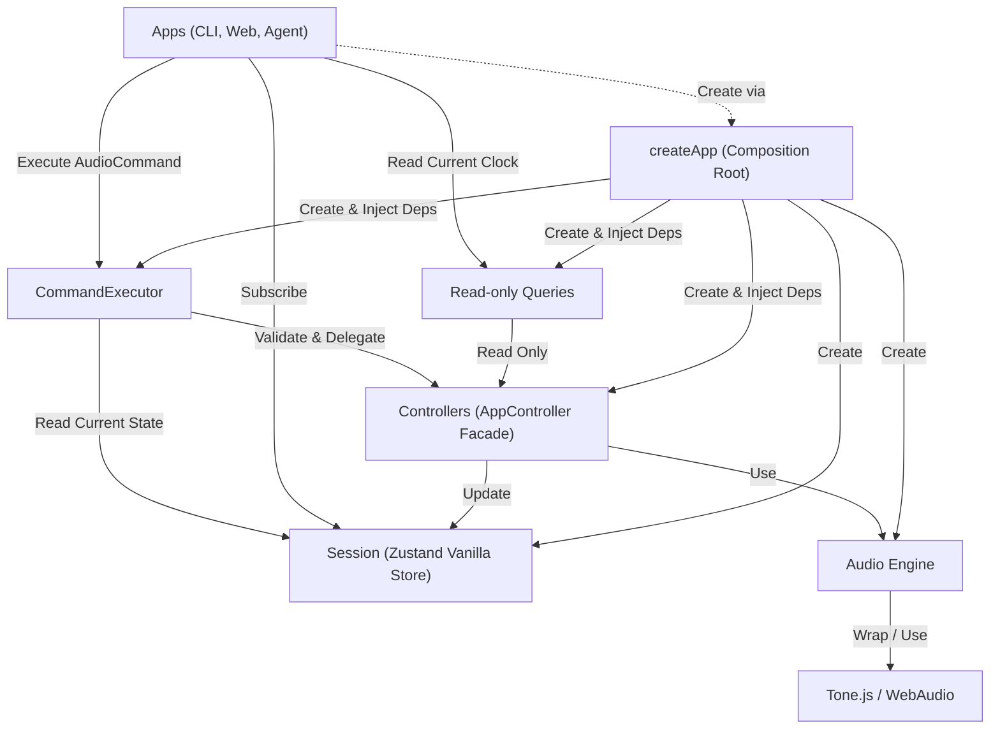

# 규칙

1. AudioEngine은 Controllers에서만 접근한다.
2. AudioCommand로 표현되는 작업은 CommandExecutor에서 Zod 검증 후 실행한다.
3. 검증된 명령은 CommandExecutor의 단일 대기열에서 접수 순서대로 하나씩 실행한다.
4. CommandExecutor는 실행 시점의 Session을 읽고 Controllers에 작업을 위임한다.
5. Apps는 Session을 구독해 화면을 갱신한다.
6. Tone.js와 Web Audio API는 AudioEngine에서만 접근한다.

재생 중 현재 시각처럼 Session 구독만으로 갱신되지 않는 값은 읽기 전용 Query로 조회한다. Apps에는 Controller나
AudioEngine 객체를 노출하지 않는다. 현재 `PlaybackClockQuery`는 `PlaybackController.getCurrentTime()`만 노출한다.

`executeMany`는 묶음 전체를 먼저 검증하고, 다른 명령이 끼어들지 않게 순서대로 실행한다. 실행 중 첫 오류가 나면
남은 명령은 실행하지 않는다. 이미 완료된 변경은 되돌리지 않으므로 묶음 실행은 원자적 트랜잭션이 아니다.
실패 오류는 0부터 시작하는 실패 위치, 실패 명령, 앞선 실행 결과와 원인을 보존한다. 실패한 실행 뒤에 대기 중인
요청은 계속 실행한다.
`EXPORT_AUDIO`는 현재 완료될 때까지 대기열을 점유한다. 별도 작업 모델을 도입하기 전의 알려진 제한이다.

Agent 응답은 JSON 배열 전체를 엄격하게 검증한다. 빈 배열은 명령 없음으로 허용한다. 알 수 없는 명령, 잘못된
필드, 누락·추가 필드, JSON 밖의 텍스트가 하나라도 있으면 전체를 실행하지 않는다. Agent 응답에 없는 명령을
실행 단계에서 추가하지 않는다. 검증된 배열은 `executeMany` 한 번으로 실행하며, 중간 실패 뒤 남은 명령은
실행하지 않는다.

Agent Prompt는 현재 AudioCommand 전체의 필드와 범위를 설명하고 실제 Track·Region ID, 시간 범위, 오디오 소스
사용 가능 여부를 전달한다. 예시 출력은 엄격한 Agent Schema로 테스트한다. 앱이 예약한 새 ID와 허용 파일 목록이
아직 없으므로 Agent는 `ADD_TRACK`을 만들지 않는다. `LOAD_REGION`은 기존 Track의 첫 Region 소스를 재사용할 수
있을 때만 ID 생성과 기존 URL 선택을 실행기에 맡겨 제한적으로 사용한다. 프로젝트 컨텍스트는 모델 입력 한도를
넘길 위험을 줄이도록 길이를 제한하고 잘림 여부를 표시한다.

현재 Region의 `startTime`과 `endTime`은 절대 초 단위다. 음악 시간(musical time) 모델을 도입하기 전까지 Session의
tempo 변경은 AudioEngine의 Transport BPM과 Region 예약을 변경하지 않는다.

브라우저 오디오 API 노출 여부는 AudioEngine 계층에서만 읽고, 순수한 전제조건 판정은 Shared에서 수행한다.
`createApp`은 판정 결과를 한 번 조립해 Apps에 읽기 전용 값으로 노출한다. 프로젝트나 오디오 상태를 변경하지 않으므로
Session과 AudioCommand에는 저장하지 않는다. API 존재 확인은 실제 AudioWorklet 모듈 로딩이나 WebAssembly 컴파일
성공을 보장하지 않는다.

영구 저장 형식은 Shared의 `ProjectDocumentSchema`로 검증한다. v1은 Track·Region과 오디오 Source 메타데이터를
절대 초 단위로 저장하고, Region은 임시 URL이 아닌 안정적인 Source ID를 참조한다. `File`, `Blob`, Object URL,
AudioBuffer, 함수, 재생 중 상태, Agent·UI 상태는 ProjectDocument에 넣지 않는다. 현재는 문서 계약과 metadata
Adapter까지만 있으며 Session 변환, 마이그레이션, Undo는 각각 후속 목적 단위에서 추가한다.
신뢰할 수 없는 JSON은 `readProjectDocumentJson`으로 문법을 확인하고, `readProjectDocument`로 식별자·버전·본문 순서로
검증한다. 객체 입력은 자기 소유 열거 가능 데이터 속성만 문서 필드로 인정한다. 현재 지원 버전은 실제 형식이 정의된
v1뿐이며, 정의되지 않은 버전을 임의 변환하지 않는다.

`IProjectRepository`는 ProjectDocument snapshot 저장 계약이다. Repository 계층은 Shared만 참조하며, 구체 구현은
Composition Root에서만 조립한다. 저장과 삭제는 expected revision 비교로 오래된 탭의 덮어쓰기와 삭제를 거부한다.
`InMemoryProjectRepository`는 계약 검증용 구현이다. `IndexedDbProjectRepository`는 문서와 목록 요약을 별도 Store에 두되,
두 값을 하나의 transaction으로 갱신한다. 아직 Composition Root와 사용자 진입점에는 연결하지 않는다.

Web UI의 Region 분할은 현재 시각에 정확히 하나의 Region이 있을 때 그 ID로 `SPLIT_REGION`을 실행한다. Region
삭제도 사용자가 확인한 정확한 ID로 `UNLOAD_REGION`을 실행한다. 내부 CLI의 변경 작업은 CommandExecutor를
사용한다. Region 이동은 드래그 중 로컬 미리보기만 갱신하고 포인터를 놓을 때 정확한 ID로 `MOVE_REGION`을 한 번
실행한다. Track 삭제는 사용자가 확인한 정확한 ID로 `REMOVE_TRACK`을 한 번 실행하고 처리 중 중복 입력을 막는다. Web
UI의 Mute·Solo는 Session 상태의 반대 값을 정확한 Track ID와 함께 `SET_TRACK_MUTE`·`SET_TRACK_SOLO`로 실행한다.
Web UI의 Tempo 입력은 `SET_TEMPO`로 Session 메타데이터만 변경한다. Web 파일 가져오기는 Track 생성과 Region 등록을
`executeMany` 한 번으로 실행한다. Web JSON CLI도 파싱된 명령 배열을 `executeMany` 한 번으로 실행하고, 중간 실패 전
결과만 후처리한다. 기존 Track의 `Region 추가`는 브라우저가 파일을 검증·변환한 뒤 선택한 Track ID와 현재 시각으로
`LOAD_REGION`을 한 번 실행한다. 성공한 파일만 Session에 보관하고 실패한 Blob URL은 해제한다.

## Architecture (Layers)

## 자동 검사

`architecture.test.ts`가 다음 경계를 검사한다.

- Apps는 Composition Root 밖에서 Controller를 import하지 않는다.
- Command와 Query는 AudioEngine 계층을 import하지 않는다.
- Controllers는 `IAudioEngine` 계약과 오류 타입만 import한다.
- ProjectRepository는 Shared 외 다른 계층을 import하지 않는다.
- 하위 계층은 상위 계층을 역참조하지 않는다.
- Tone.js import와 대표 Web Audio 생성자·팩토리의 직접 호출은 AudioEngine 계층에서만 수행한다.

> **Note:** `records/` 디렉터리의 문서들은 마이그레이션 이전 구현 기록이다. 현재 아키텍처 가이드로 참고하지 않는다.
