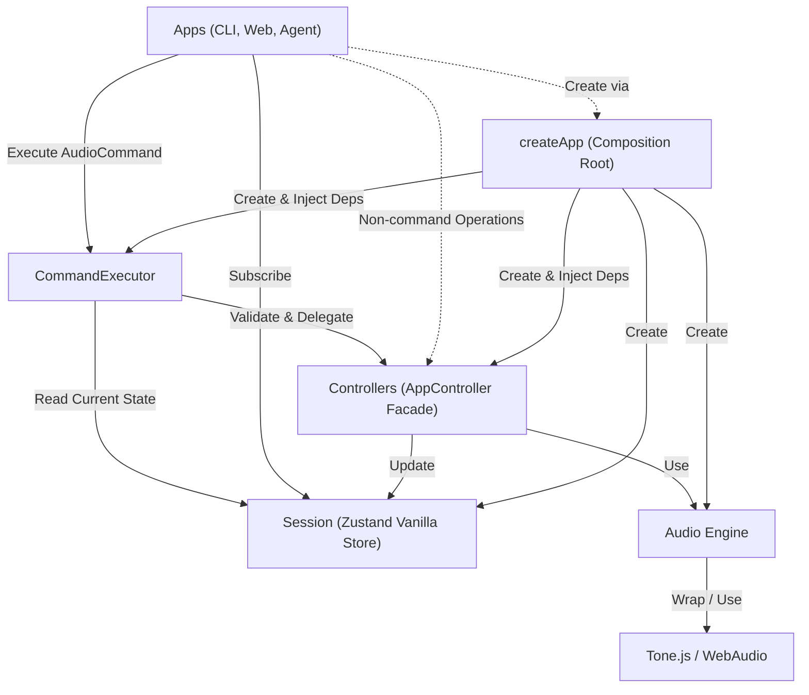

# 규칙

1. AudioEngine은 Controllers에서만 접근한다.
2. AudioCommand로 표현되는 작업은 CommandExecutor에서 Zod 검증 후 실행한다.
3. 검증된 명령은 CommandExecutor의 단일 대기열에서 접수 순서대로 하나씩 실행한다.
4. CommandExecutor는 실행 시점의 Session을 읽고 Controllers에 작업을 위임한다.
5. Apps는 Session을 구독해 화면을 갱신한다.
6. Tone.js와 Web Audio API는 AudioEngine에서만 접근한다.

`executeMany`는 묶음 전체를 먼저 검증하고, 다른 명령이 끼어들지 않게 순서대로 실행한다. 실행 중 첫 오류가 나면
남은 명령은 실행하지 않는다. 이미 완료된 변경은 되돌리지 않으므로 묶음 실행은 원자적 트랜잭션이 아니다.
실패 오류는 0부터 시작하는 실패 위치, 실패 명령, 앞선 실행 결과와 원인을 보존한다. 실패한 실행 뒤에 대기 중인
요청은 계속 실행한다.
`EXPORT_AUDIO`는 현재 완료될 때까지 대기열을 점유한다. 별도 작업 모델을 도입하기 전의 알려진 제한이다.

Agent 응답은 JSON 배열 전체를 엄격하게 검증한다. 빈 배열은 명령 없음으로 허용한다. 알 수 없는 명령, 잘못된
필드, 누락·추가 필드, JSON 밖의 텍스트가 하나라도 있으면 전체를 실행하지 않는다. Agent 응답에 없는 명령을
실행 단계에서 추가하지 않는다. 검증된 배열은 `executeMany` 한 번으로 실행하며, 중간 실패 뒤 남은 명령은
실행하지 않는다.

현재 Region의 `startTime`과 `endTime`은 절대 초 단위다. 음악 시간(musical time) 모델을 도입하기 전까지 Session의
tempo 변경은 AudioEngine의 Transport BPM과 Region 예약을 변경하지 않는다.

현재 Web UI의 Region 분할은 실행 경로 이전이 끝나지 않아 Controller를 직접 호출한다. 내부 CLI의 변경 작업은
CommandExecutor를 사용한다.

## Architecture (Layers)

> **Note:** `records/` 디렉터리의 문서들은 마이그레이션 이전 구현 기록이다. 현재 아키텍처 가이드로 참고하지 않는다.
