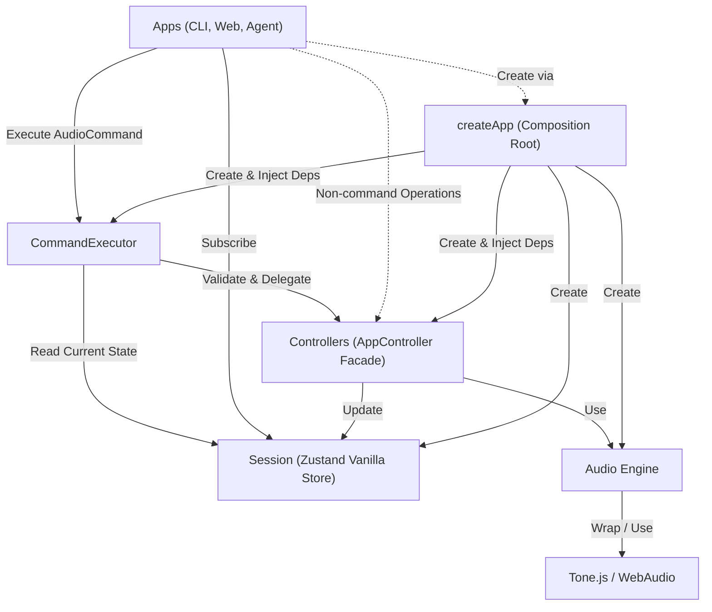

# 규칙

1. AudioEngine은 Controllers에서만 접근한다.
2. AudioCommand로 표현되는 작업은 CommandExecutor에서 Zod 검증 후 실행한다.
3. CommandExecutor는 실행 시점의 Session을 읽고 Controllers에 작업을 위임한다.
4. Apps는 Session을 구독해 화면을 갱신한다.
5. Tone.js와 Web Audio API는 AudioEngine에서만 접근한다.

현재 AudioCommand가 없는 Region 분할과 내부 CLI 전용 작업은 Controllers를 직접 호출한다.

## Architecture (Layers)

> **Note:** `records/` 디렉터리의 문서들은 마이그레이션 이전 구현 기록이다. 현재 아키텍처 가이드로 참고하지 않는다.
