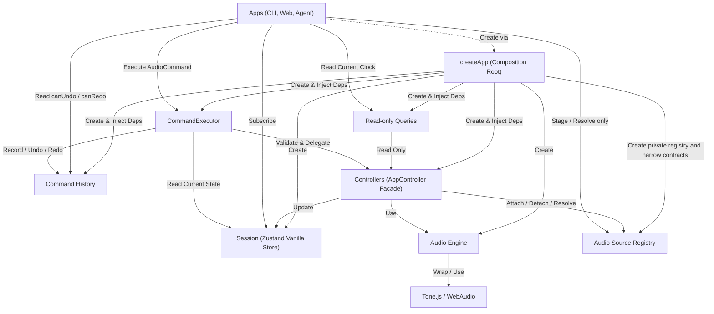

# 규칙

1. AudioEngine은 Controllers에서만 접근한다.
2. AudioCommand로 표현되는 작업은 CommandExecutor에서 Zod 검증 후 실행한다.
3. 검증된 명령은 CommandExecutor의 단일 대기열에서 접수 순서대로 하나씩 실행한다.
4. CommandExecutor는 실행 시점의 Session을 읽고 Controllers에 작업을 위임한다.
5. Apps는 Session을 구독해 화면을 갱신한다.
6. Tone.js와 Web Audio API는 AudioEngine에서만 접근한다.

`SET_EXPORT_RANGE`는 `0 <= startTime <= endTime`만 허용하며, `ExportController`도 Session 변경 전에 같은 조건을
검증한다. 실제 오디오 내보내기는 별도로 `startTime < endTime`을 요구한다.

재생 중 현재 시각처럼 Session 구독만으로 갱신되지 않는 값은 읽기 전용 Query로 조회한다. Apps에는 Controller나
AudioEngine 객체를 노출하지 않는다. 현재 `PlaybackClockQuery`는 `PlaybackController.getCurrentTime()`만 노출한다.

`executeMany`는 묶음 전체를 먼저 검증하고, 다른 명령이 끼어들지 않게 순서대로 실행한다. 실행 중 첫 오류가 나면
남은 명령은 실행하지 않는다. 이미 완료된 변경은 되돌리지 않으므로 묶음 실행은 원자적 트랜잭션이 아니다.
실패 오류는 0부터 시작하는 실패 위치, 실패 명령, 앞선 실행 결과와 원인을 보존한다. 실패한 실행 뒤에 대기 중인
요청은 계속 실행한다.
`EXPORT_AUDIO`, `SAVE_PROJECT`, `LOAD_PROJECT`는 현재 완료될 때까지 대기열을 점유한다. 별도 작업 모델을 도입하기
전의 알려진 제한이다.

`CommandHistory`는 현재 앱 실행 중에만 유지하는 최대 100개의 역명령 기록이다. `CommandExecutor`가 성공한 편집의 실행 전후
Session을 비교해 Undo·Redo 명령을 만들고, `UNDO`와 `REDO`도 같은 대기열에서 실행한다. Undo·Redo가 실패하면 해당 기록을
반대쪽 스택으로 옮기지 않는다. 새 편집은 Redo 기록을 제거한다. 지원 범위는 Track 추가, Region 추가·삭제·이동, tempo,
Track volume·pan·mute·solo, Export 범위 설정·해제다. 재생·playhead·저장·내보내기는 기록하지 않는다. Track 삭제와 Region
분할은 손실 없는 복원 명령이 아직 없으므로 Session 변경이 확인되면 기존 기록을 제거한다. 프로젝트 불러오기도 다른
프로젝트의 명령을 재사용하지 않도록 기록을 제거한다. Session 구독자 예외가 상태 반영 뒤 발생한 경우에는 반영된 편집을
기록하고 원래 예외를 호출자에게 전달한다. Apps에는 `canUndo`·`canRedo` 조회와 구독만 노출한다. 이 기록은
`ProjectDocument`에 저장하지 않는다.

Agent 응답은 JSON 배열 전체를 엄격하게 검증한다. 빈 배열은 명령 없음으로 허용한다. 알 수 없는 명령, 잘못된
필드, 누락·추가 필드, JSON 밖의 텍스트가 하나라도 있으면 전체를 실행하지 않는다. Agent 응답에 없는 명령을
실행 단계에서 추가하지 않는다. 검증된 배열은 `executeMany` 한 번으로 실행하며, 중간 실패 뒤 남은 명령은
실행하지 않는다.
편집과 저장을 함께 요청하면 `SAVE_PROJECT`를 편집 명령 뒤에 둔다.

Agent Prompt는 현재 AudioCommand 전체의 필드와 범위를 설명하고 실제 Track·Region ID, 시간 범위, 오디오 소스
사용 가능 여부를 전달한다. 예시 출력은 엄격한 Agent Schema로 테스트한다. 앱이 예약한 새 ID와 허용 파일 목록이
아직 없으므로 Agent는 `ADD_TRACK`을 만들지 않는다. `LOAD_REGION`은 기존 Track의 첫 등록 Source Region을 재사용할 수
있을 때만 제한적으로 사용한다. 등록 Source Region은 목록의 실제 `sourceId`를 사용한다. Agent 명령의 `url` 필드는
금지하며 `sourceId`를 만들거나 추측하지 않는다. 프로젝트 컨텍스트는
모델 입력 한도를 넘길 위험을 줄이도록 길이를 제한하고 잘림 여부를 표시한다.

현재 Region의 `startTime`과 `endTime`은 절대 초 단위다. 음악 시간(musical time) 모델을 도입하기 전까지 Session의
tempo 변경은 AudioEngine의 Transport BPM과 Region 예약을 변경하지 않는다.

Region 타임라인 범위는 `startTime`과 `duration`이 유한한 0 이상 숫자이고, 두 값의 합인 `endTime`도 유한해야 한다.
Session에 저장된 `endTime`은 이 합과 일치해야 하며, 비교할 때는 절대 오차 `1e-9`초와
`Number.EPSILON * magnitude * 4` 중 큰 값을 허용한다. Command와 ProjectDocument Schema가 계산 가능한 입력을 먼저
검증하고, Region Controller도 추가·이동·분할의 Registry·AudioEngine·Session 변경 전에 같은 규칙을 다시 검증한다.
분할 경계는 저장된 `endTime`이 아니라 검증 후 다시 계산한 끝 시각을 사용한다.

브라우저 오디오 API 노출 여부는 AudioEngine 계층에서만 읽고, 순수한 전제조건 판정은 Shared에서 수행한다.
`createApp`은 판정 결과를 한 번 조립해 Apps에 읽기 전용 값으로 노출한다. 프로젝트나 오디오 상태를 변경하지 않으므로
Session과 AudioCommand에는 저장하지 않는다. API 존재 확인은 실제 AudioWorklet 모듈 로딩이나 WebAssembly 컴파일
성공을 보장하지 않는다.

Session의 Plugin 런타임 상태는 Track별 Plugin 인스턴스, Plugin 카탈로그, manifest 검증 결과, 런타임 로그로 나눈다.
Plugin 인스턴스는 ID, manifest 요약, 활성 여부, boolean·number·string 매개변수 값을 가진다. 카탈로그·검증 결과·로그
Action은 입력 객체를 복제해 저장하며, 프로젝트 상태 교체 시 Track의 Plugin 인스턴스도 깊은 복사한다. 이 기반은 아직
Plugin 설치, 오디오 처리, AudioCommand, UI를 제공하지 않는다.

영구 저장 형식은 Shared의 `ProjectDocumentSchema`로 검증한다. v1은 Track·Region과 오디오 Source 메타데이터를
절대 초 단위로 저장하고, Region은 임시 URL이 아닌 안정적인 Source ID를 참조한다. `File`, `Blob`, Object URL,
AudioBuffer, 함수, 재생 중 상태, Agent·UI 상태는 ProjectDocument에 넣지 않는다. `ProjectDocumentMapper`는 Store나
Repository를 호출하지 않고 Session의 저장 대상 snapshot과 committed Source metadata를 ProjectDocument로 변환한다.
역변환은 Session용 snapshot과 Source metadata를 분리해 반환한다. Track은 Map 삽입 순서, Region과 Source는 입력 배열
순서를 유지한다. Region `endTime`은 저장하지 않고 검증된 `startTime + duration`으로 복원하며, Track·Region status는 빈
배열로 초기화한다. Export 범위의 한쪽만 `null`인 상태, Track Map key와 Track ID 불일치, 유한한 `endTime`을 만들 수 없는
Region, 허용 오차를 초과한 Region 끝 시각 불일치는 손실을 숨기지 않고 오류로 거부한다. Mapper는 Session과 Shared만
의존하며 Controllers 밖의 production 계층에서 직접 사용하지 않는다.
ProjectDocument v1에는 Plugin 런타임 상태 필드가 없다. Mapper는 저장할 때 해당 상태를 포함하지 않고, v1 복원 Track의
Plugin 인스턴스를 빈 배열로 초기화한다. Plugin 상태 영구 저장은 새 문서 버전과 명시적 마이그레이션이 필요하다.

`createApp`은 새 프로젝트의 UUID·이름·revision 0을 만들거나 검증을 마친 기존 metadata를 Session에 주입한다.
`project.revision`은 편집 횟수나 저장 여부가 아니라 마지막 성공 저장 snapshot의 동시성 제어 값이다. 일반 편집과
Undo에서는 바꾸지 않으며, Project Controller가 Repository의 성공 결과를 받았을 때만 교체한다. 프로젝트 불러오기용
`replaceProjectState`는 project, tempo, master volume, Export 범위, Track·Region을 한 번의 Store 변경으로 교체하고
재생 상태와 playhead를 초기화한다. Agent 상태는 프로젝트 문서에 속하지 않으므로 유지한다. 문서 마이그레이션은 후속
목적 단위에서 추가한다.
신뢰할 수 없는 JSON은 `readProjectDocumentJson`으로 문법을 확인하고, `readProjectDocument`로 식별자·버전·본문 순서로
검증한다. 객체 입력은 자기 소유 열거 가능 데이터 속성만 문서 필드로 인정한다. 현재 지원 버전은 실제 형식이 정의된
v1뿐이며, 정의되지 않은 버전을 임의 변환하지 않는다.

`IProjectRepository`는 ProjectDocument snapshot 저장 계약이다. Repository 계층은 Shared만 참조하며, 구체 구현은
Composition Root에서만 조립한다. 저장과 삭제는 expected revision 비교로 오래된 탭의 덮어쓰기와 삭제를 거부한다.
`InMemoryProjectRepository`는 계약 검증용 구현이다. `IndexedDbProjectRepository`는 문서와 목록 요약을 별도 Store에 두되,
두 값을 하나의 transaction으로 갱신한다. IndexedDB에서 읽은 문서 본문은 `readProjectDocument`로 판독하고, 손상된
데이터와 현재 앱보다 새로운 문서 버전을 서로 다른 Repository 오류로 분류한다. `createApp`은 브라우저용
`IndexedDbProjectRepository`를 조립하고 Project Controller에만 주입한다.
IndexedDB가 없는 환경에서도 앱 조립은 완료하며 실제 저장소 작업에서 `STORAGE_UNAVAILABLE`을 반환한다.

Session의 `replaceProjectMetadata`는 저장 성공 metadata만 반영하고, `replaceProjectState`는 불러오기 성공 결과 전체를
반영하는 내부 상태 교체 동작이다. Apps는 두 동작을 직접 호출하지 않는다. 프로젝트를 불러올 때 metadata만 먼저 바꾸지
않고, Source와 AudioEngine 준비가 모두 성공한 뒤 전체 프로젝트 상태를 한 번에 반영한다.

`AudioSourceRegistry`는 재생에 쓰는 Source Object URL의 생성과 해제를 한곳에서 관리한다. 파일 길이 판독용 임시 URL과
Export 다운로드 URL은 이 범위가 아니다. Source UUID는 프로젝트에 저장하는 고정 식별자이고 Object URL은 현재 앱 실행
중에만 유효한 값이다. 등록 직후 Source는 pending이며 Region을 연결하면 committed가 된다. Region을 모두 분리해도
committed Source와 URL은 Undo와 미디어 재사용을 위해 유지한다. pending 실패 정리, 명시적 미사용 Source 정리, 프로젝트
종료와 실패한 임시 프로젝트 복원 정리에서만 URL을 해제한다. 저장용 목록은 pending을 제외하고 Region이 없는 committed
Source는 포함한다.
URL 해제가 실패하면 해당 Source를 Registry에 남겨 다음 정리 호출에서 다시 시도할 수 있게 한다.
Registry는 저장 시 OPFS에 전달할 원본 Blob도 Source 수명 동안 보관한다. 저장용 Blob 목록은
`ICommittedAudioSourceReader`로 Project Controller에만 제공하고, Apps에는 기존 Stager와 Resolver만 노출한다. Blob은
내용을 변경할 수 없는 브라우저 객체이므로 같은 참조를 전달하되 metadata는 복사해서 반환한다.

Session의 Region은 `sourceId`만 저장하고 Object URL을 저장하지 않는다. `LOAD_REGION`은 폐기된 `url` 필드를 일반·Agent
Schema에서 명시적으로 거부한다. 새 Region은 등록된 `sourceId`를 명시하거나 같은 Track의 첫 Region Source를 재사용한다.
`trackId`를 생략하면 Controller가 첫 Track을 선택한다. 유효한 `LOAD_REGION`이 Controller에 전달된 뒤 Track 선택이나
검증이 실패하면 명시된 pending Source도 Controller가 정리한다. Controller는 Registry 등록과 Region 연결을 확인한
Object URL만 AudioEngine에 전달한다. Web 파형, Agent context, Export도 같은 등록·연결 조건을 사용한다. 연결이 없으면
Web 파형은 오류를 표시하고 Agent context는 `unavailable`, Export는 typed 오류를 반환한다. URL을 추측하거나 Region을
조용히 제외하지 않는다.

Controller는 Source 길이를 알지 못해도 `sourceStartTime`과 `duration`이 유한한 0 이상 숫자이고 두 값의 합도 유한한지
연결 전에 검증한다. Source 길이를 알면 계산한 원본 끝 시각이 그 길이를 넘지 않는지도 확인한다. `duration` 생략 시
Source의 남은 길이로 정규화하고, Source 길이가 `null`이면 실제 파일 경계를 계산할 수 없으므로 `duration`을 요구한다.
끝 시각 비교는 타임라인과 같은 절대 오차 `1e-9`초와 `Number.EPSILON * magnitude * 4` 중 큰 값을 사용한다. Region
분할도 기존 Region과 두 결과 Region의 원본 범위를 Source 연결과 AudioEngine 교체 전에 같은 규칙으로 검증한다.

등록 Source를 사용하는 Region 추가·삭제·분할과 Track 삭제는 Registry 변경, AudioEngine 호출, Session 반영 순서로
실행하고 Controller 진입 뒤 실패 시 완료한 Registry 변경을 역순으로 보상한다. 처음 연결된 pending Source의 추가가
실패하면 URL까지 정리하고, 이미 committed였던 Source는 Undo와 재사용을 위해 유지한다. Region이 Session에 반영된 뒤
구독자 예외가 발생하면 이미 반영된 Region 객체를 확인해 Engine·Registry를 보상하지 않고 예외만 전달한다. `stage` 뒤 Command 검증이나
dispatch 전에 실패하면 stage 호출자가 `discardPending`을 실행한다. 보상도 실패하면 원래 오류와 실패한 보상 단계를
`ProjectMutationCompensationError`에 함께 보존한다. 이 절차는 여러 객체의 원자적 transaction은 아니다. 일반 진입점은
CommandExecutor 대기열로 Command 간 동시 변경을 막는다. 프로젝트 불러오기 준비 중 Web `stage`처럼 대기열 밖의
Registry 변경이 들어올 수 있으므로, 준비된 Registry와 AudioEngine 그래프는 시작 시점의 active revision을 확인한 뒤에만
활성화한다.

등록 Source Region 분할은 새 연결을 예약한 뒤에도 기존 연결을 AudioEngine 교체 완료까지 유지한다. 성공 후 기존
연결과 Session을 바꾼다. 재검증 시 Session 대상이 사라졌다면 새 Engine Region과 남은 Source 연결을 제거하고,
Source 전환만 실패했다면 Engine과 Registry를 기존 Region 상태로 되돌린다.

단건 `restoreCommitted`는 원자적인 프로젝트 불러오기 API가 아니다. `beginReplacement`는 분리된 Registry에 Source와
Region 연결을 준비하고, `prepareProjectGraph`는 출력 gate가 닫힌 새 Channel과 Player를 디코딩·예약한다. 준비 실패나
active revision 변경에서는 기존 Registry와 AudioEngine 그래프를 유지한다. Controller는 두 prepared 대상의
`assertActivatable`을 먼저 모두 통과시킨 뒤, 중간 `await` 없이 Engine → Registry → Session 순서로 활성화해야 한다.
Engine 활성화 중 Transport나 출력 gate 변경이 실패하면 기존 재생 상태와 gate를 보상하고 교체를 거부한다. 이전 그래프와
URL은 성공 상태를 공개한 뒤 정리하며, 정리 실패는 새 프로젝트를 되돌리는 불러오기 실패로 분류하지 않는다. `discard`를
시작한 prepared 대상은 정리가 일부 실패해도 다시 활성화할 수 없다. 실패 자원은 소유자가 보관하고 다음 정리에서 재시도한다.
보상도 실패하면 Engine이 즉시 재시도한다. 계속 실패하는 동안은 `PROJECT_RUNTIME_RECOVERY_PENDING`을 반환하고 실시간 오디오
변경을 중단한 뒤 다음 호출에서 복원을 먼저 재시도한다. 이 오류 상태는 기존 Runtime이 아직 완전히 복원되지 않았음을 뜻한다.
`LOAD_PROJECT`는 ProjectDocument와 모든 Source Blob을 읽어 분리된 Registry·AudioEngine 그래프를 준비한다. Engine
활성화가 실패하면 두 prepared 대상을 폐기하고 Session·Registry는 교체하지 않는다. Engine 오류가 Runtime 복원 대기
상태를 표시하면 기존 오디오 그래프의 복원이 아직 완료되지 않은 상태다. Session 구독자 예외는 Zustand 상태 반영 뒤에
발생하므로 이미 활성화한 Runtime을 되돌리지 않고 이전 Runtime 정리를 끝낸 뒤 그대로 전달한다. Registry는 영구 저장소가
아니다.
`OpfsAudioSourceRepository`는 Source UUID를 키로 `drop-ai/audio-sources/v1/<Source UUID>`에 원본 바이트를 보존한다.
`create`는 metadata와 Blob 크기를 확인하고 쓰기를 닫은 뒤 저장 크기를 다시 확인한다. `load`도 ProjectDocument metadata의
크기를 확인하고 `mimeType`을 Blob 생성 옵션으로 전달한다. 반환된 Blob의 `type`은 브라우저 Blob 규칙에 따라 정규화될 수
있다. `delete`는 반복 호출을 허용한다. 같은 Source의 `create`, `load`, `delete`는
`drop-ai:audio-source:v1:<Source UUID>` Web Lock으로 동일-origin에서 순서대로 실행한다. Web Locks가 없으면 저장소 사용
불가로 처리한다. 크기 확인은 같은 크기의 바이트 손상을 검출하지 못한다. 후속 문서 버전에서 cryptographic hash를
비교하면 검출 범위를 넓힐 수 있지만, hash 충돌 가능성 때문에 모든 손상을 절대적으로 보장하지는 않는다. 구체 OPFS
구현은 Composition Root와 테스트에서만 import하고, 다른 계층은 Repository 인터페이스와 오류 계약만 참조한다.
`createApp`은 Registry 구현을 한 번 조립하되 Apps에는 등록용 `IAudioSourceStager`와 조회용 `IAudioSourceResolver`만
노출한다. 전체
`IAudioSourceRegistry`와 구체 구현은 Composition Root 밖에 노출하지 않는다. Track·Region Controller에는 같은
Registry의 전체 계약을 주입하고, 조회만 필요한 Export에는 `IAudioSourceResolver`를 주입한다. 기존 업로드가 Blob을
stage하는 Web Adapter는 등록용 계약만 사용한다. 파일 metadata 변환과 Web Adapter 반환값에는 재생용 URL을 넣지 않는다.
Web Adapter는 Registry URL을 반환값에 노출하지 않고 `sourceId` 명령을 만든다. 재생 소비자는 Resolver에 Source UUID를
전달해 런타임 Source를 조회한다.
OPFS와 IndexedDB는 하나의 transaction이 아니다. `SAVE_PROJECT`는 먼저 Session과 committed Source 목록을
ProjectDocument로 검증한다. 그다음 모든 Source를 OPFS에서 load해 크기를 확인하고, 없으면 Registry의 Blob으로 create한
뒤 ProjectDocument를 IndexedDB에 공개한다. Source create가 다른 탭과 겹쳐 `SOURCE_ALREADY_EXISTS`가 되면 다시 load해
검증한다. 프로젝트가 없으면 create하고, 이미 있으면 Session revision을 expected revision으로 save한다. 성공 반환값의
project metadata만 Session에 반영하며, 오류나 revision 충돌에서는 기존 Session metadata를 유지한다.

Source 저장 뒤 ProjectDocument 저장이 실패하면 참조되지 않는 OPFS 파일이 남을 수 있다. 다른 저장이 같은 Source를
참조했을 가능성이 있으므로 저장 실패 경로에서 자동 삭제하지 않는다. 후속 미사용 Source 정리는 모든 ProjectDocument
참조를 확인해야 한다. 현재 Source 삭제는 사용자 진입점에 연결하지 않았지만, 연결하기 전에는 Source 확인과 문서 저장
사이에 삭제가 끼지 않도록 전역 저장 잠금 또는 참조 인식 삭제 규칙이 필요하다. byteLength 검증은 같은 크기의 다른
바이트를 구분하지 못한다.

Web UI의 Region 분할은 현재 시각에 정확히 하나의 Region이 있을 때 그 ID로 `SPLIT_REGION`을 실행한다. Region
삭제도 사용자가 확인한 정확한 ID로 `UNLOAD_REGION`을 실행한다. 내부 CLI의 변경 작업은 CommandExecutor를
사용한다. Region 이동은 드래그 중 로컬 미리보기만 갱신하고 포인터를 놓을 때 정확한 ID로 `MOVE_REGION`을 한 번
실행한다. Track 삭제는 사용자가 확인한 정확한 ID로 `REMOVE_TRACK`을 한 번 실행하고 처리 중 중복 입력을 막는다. Web
UI의 Mute·Solo는 Session 상태의 반대 값을 정확한 Track ID와 함께 `SET_TRACK_MUTE`·`SET_TRACK_SOLO`로 실행한다.
Web UI의 Tempo 입력은 `SET_TEMPO`로 Session 메타데이터만 변경한다. Web 파일 가져오기는 Track 생성과 Region 등록을
`executeMany` 한 번으로 실행한다. `ADD_TRACK`은 Track ID만으로 빈 Track을 만들고 `LOAD_REGION`은 `sourceId`로
오디오 Source를 연결한다. 첫 명령이 실패하면 pending Source를 정리한다. 두 번째 명령이 실패하면 `REMOVE_TRACK`을
CommandExecutor로 실행한 뒤 pending Source 정리를 시도한다. 보상도 실패하면 Web workflow 전용
`AudioImportCompensationError`에 원래 오류와 각 보상 오류를 함께 보존한다.
Web 헤더의 저장 버튼과 내부 CLI의 `save`, Agent의 저장 요청은 모두 인자 없는 `SAVE_PROJECT`를 CommandExecutor에
전달한다. Web 버튼은 처리 중 중복 입력을 막고 성공 또는 실패 결과를 표시한다. Agent는 편집과 저장을 함께 요청받으면
저장 명령을 편집 명령 뒤에 둔다.
Web 헤더의 프로젝트 목록은 읽기 전용 `ProjectCatalogQuery`로 조회한다. 사용자가 목록에서 선택하면 Web은
`LOAD_PROJECT`를 CommandExecutor에 전달한다. 내부 CLI의 `load-project <projectId>`와 Agent의 불러오기 요청도 같은
Command를 사용한다. Agent는 사용자가 제공한 Project UUID만 사용할 수 있고, `LOAD_PROJECT`를 다른 명령과 같은 배열에
넣지 않는다.
Web 헤더의 실행 취소·다시 실행 버튼, 내부 CLI의 `undo`·`redo`, Agent의 명시적인 편집 기록 요청은 모두 `UNDO`·`REDO`를
CommandExecutor에 전달한다. Web은 읽기 전용 `CommandHistory` 상태로 버튼 활성화를 결정한다. Agent는 이 명령을 다른
명령과 같은 배열에 넣지 않는다.
Web JSON CLI도 파싱된 명령 배열을 `executeMany` 한 번으로 실행하고, 중간 실패 전 결과만 후처리한다. 기존 Track의
`Region 추가`는 길이를 확인한 뒤 Blob을 stage하고 선택한 Track ID와 현재 시각으로 `sourceId` 기반 `LOAD_REGION`을 한 번
실행한다. Command가 실패하면 stage 호출자가 `discardPending`을 실행한다. Session은 재생 URL 기반 파일 목록을 보관하지
않으며, Web UI는 Registry가 소유한 재생 URL을 직접 해제하지 않는다. 새 프로젝트 가져오기 성공 뒤 화면 callback이
실패해도 이미 committed인 Source를 정리하지 않는다.

## Architecture (Layers)

## 자동 검사

`architecture.test.ts`가 다음 경계를 검사한다.

- Apps는 Composition Root 밖에서 Controller를 import하지 않는다.
- Command와 Query는 AudioEngine 계층을 import하지 않는다.
- Controllers는 `IAudioEngine` 계약과 오류 타입만 import한다.
- ProjectRepository는 Shared 외 다른 계층을 import하지 않는다.
- AudioSourceRegistry는 Shared 외 다른 계층을 import하지 않는다.
- Audio Source 외부 소비자는 공개 계약과 오류 타입만 import하고, 구현체는 Composition Root에서만 import한다.
- 하위 계층은 상위 계층을 역참조하지 않는다.
- Tone.js import와 대표 Web Audio 생성자·팩토리의 직접 호출은 AudioEngine 계층에서만 수행한다.

> **Note:** `records/` 디렉터리의 문서들은 마이그레이션 이전 구현 기록이다. 현재 아키텍처 가이드로 참고하지 않는다.
