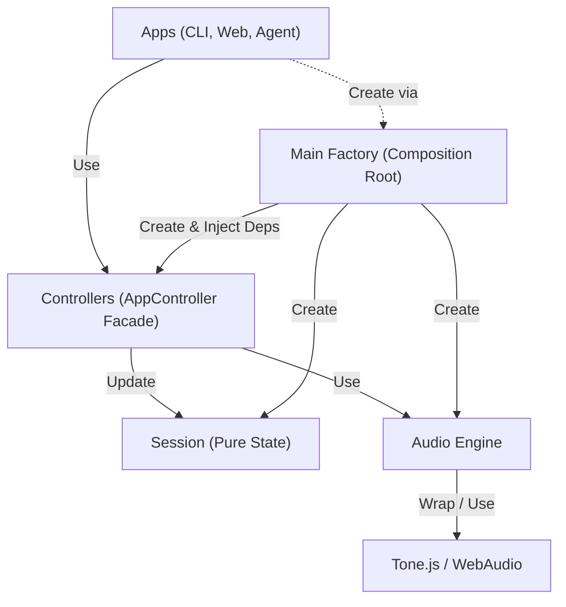

# 규칙
1. audio-engine은 controllers에서만 접근 가능하다
2. session은 controllers에서만 접근 가능하다
3. apps는 controllers만 사용한다. 단, 최초 controllers 객체 생성시에만 session을 주입받는다.
4. tone.js(혹은 그와 유사한 라이브러리)는 audio-engine에서만 접근 가능하다

## Architecture (Layers)

