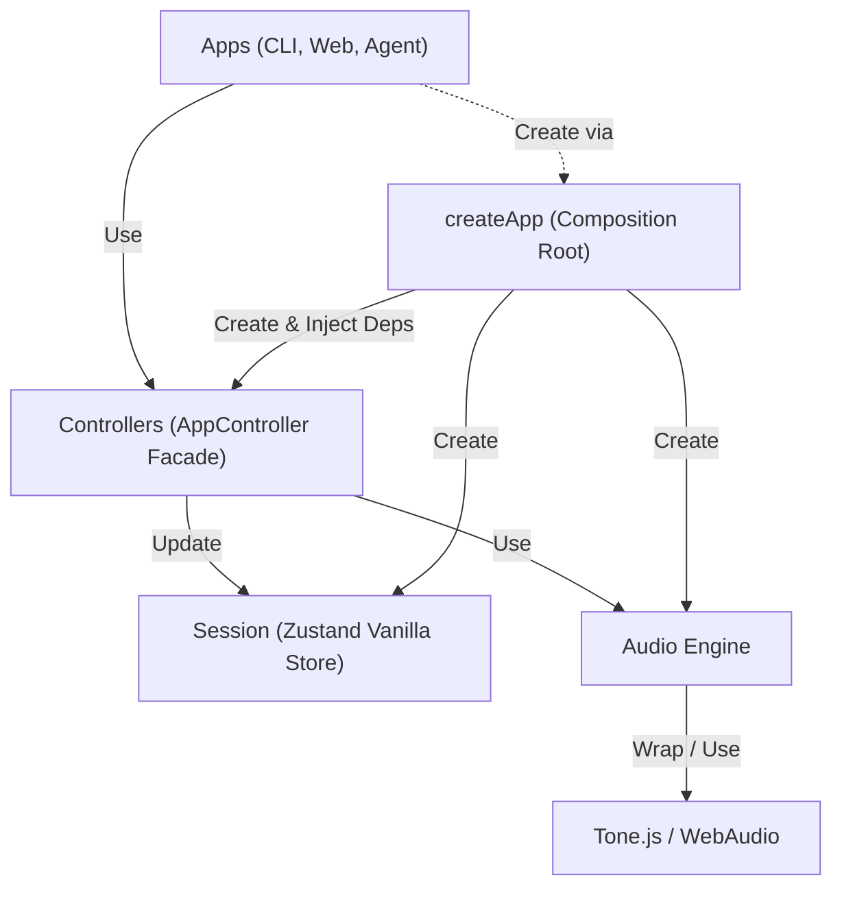

# 규칙

1. Layer Facades: 각 레이어(`controllers`, `audio-engine`, `session`)는 `index.ts`를 통해서만 접근 가능하다. 내부 파일에 직접 접근하는 것은 금지된다.
2. audio-engine은 controllers에서만 접근 가능하다
3. session(Zustand Vanilla Store)은 controllers에서만 접근 가능하다
4. apps는 controllers만 사용한다. 단, 최초 controllers 객체 생성시에만 session을 주입받는다.
5. tone.js(혹은 그와 유사한 라이브러리)는 audio-engine에서만 접근 가능하다

## Architecture (Layers)

> **Note:** `records/` 디렉터리의 문서들은 마이그레이션 이전 구현 기록이다. 현재 아키텍처 가이드로 참고하지 않는다.
